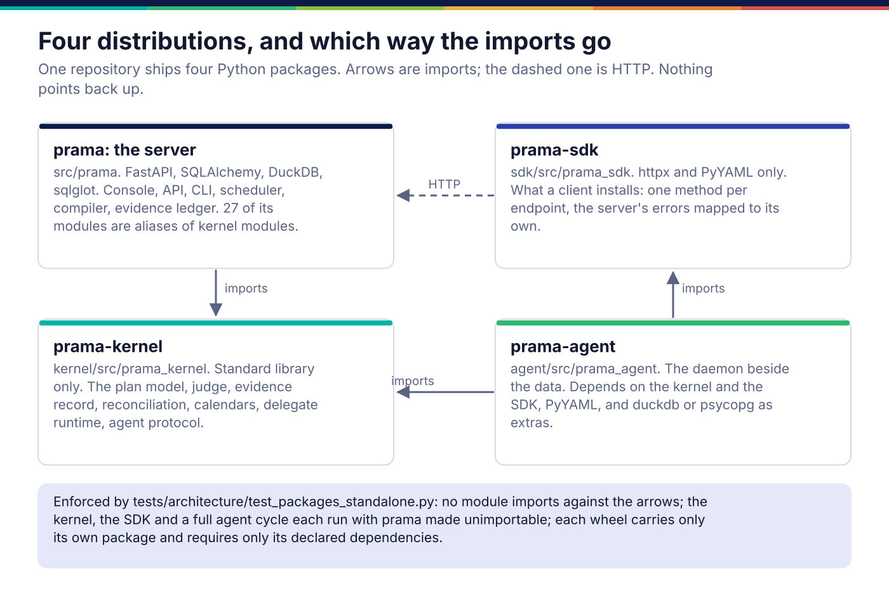
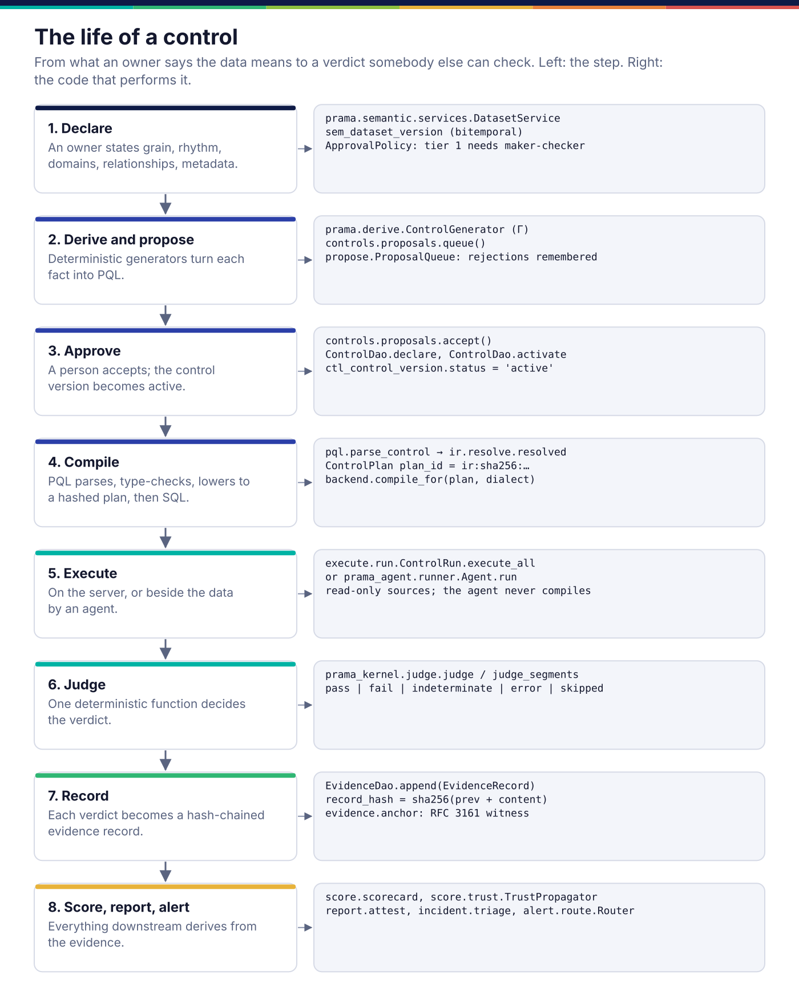
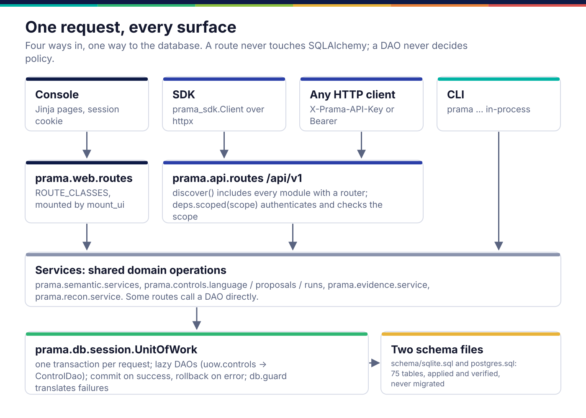

*Copyright © 2026 Ashutosh Sinha <ajsinha@gmail.com>. All rights reserved.*

---

# Prama architecture: how the parts fit

This guide describes Prama **as built**: which package does what, how data and
control flow between them, and why each boundary sits where it does. It is drawn
from the code, and every module it names is checked against the source tree by
`tests/architecture/test_documentation.py`.

It is one of three views, and it does not repeat the other two:

| If you want | Read |
|---|---|
| **What fits where, and why** (this guide) | the pages below |
| **Intent, requirements and rationale**: what Prama is for, the FR-/NFR- catalogue, the decisions and the alternatives they rejected | the design corpus, [corpus/](../corpus/), starting at [06 Reference Architecture](../corpus/06-architecture.md) |
| **How to extend it**: a new connector, PQL function, validator, scorer, importer, model provider, delegate, endpoint | the developer guides, [developer/](../developer/README.md) |

Where the corpus and the code disagree, the code is what this guide describes,
and [19 Implementation Roadmap](../corpus/19-implementation-roadmap.md) is the
authority on what is finished.

---

## Four distributions

One repository ships four Python packages, and the arrows between them only go
one way.

- **`prama`** (`src/prama`) is the server: console, API, CLI, scheduler, PQL
  compiler, evidence ledger. It is a single process and a single package.
- **`prama-kernel`** (`kernel/src/prama_kernel`) is the deterministic code the
  server and the agent must agree on: the plan model, the judge, the evidence
  record, reconciliation, calendars, the delegate runtime and the agent protocol.
  It imports only the standard library, so it installs anywhere.
- **`prama-sdk`** (`sdk/src/prama_sdk`) is what a client installs: one method per
  endpoint, over `httpx`.
- **`prama-agent`** (`agent/src/prama_agent`) is the daemon that runs on a
  customer machine beside the data. It depends on the kernel and the SDK and on
  nothing of the server.

The point of the split is the sentence *a verdict judged beside the data is the
verdict the server would give*. That is only true if there is one copy of the
judging code, so the kernel exists, and the server's older import paths are
aliases of it rather than copies. [packages.md](packages.md) shows the mechanism
and the tests that hold the boundaries.

## Planes and packages

The corpus describes Prama in planes ([06 §2](../corpus/06-architecture.md#2-plane-view)).
This is where each plane landed in the package tree:

| Plane | Packages | Page |
|---|---|---|
| Semantic layer (the declarations) | `prama.semantic`, `prama.discover`, `prama.er`, `prama.curation`, `prama.classify`, `prama.profile` | [semantic-layer.md](semantic-layer.md) |
| Rules and compilation | `prama.pql`, `prama.ir`, `prama.controls`, `prama.derive`, `prama.propose`, `prama.induce`, `prama.mine`, `prama.importers`, `prama.contract` | [controls-and-pql.md](controls-and-pql.md) |
| Execution | `prama.connect`, `prama.backend`, `prama.execute`, `prama.schedule`, `prama.recon`, `prama.delegates`, and the kernel's judge | [execution.md](execution.md) |
| Evidence and assurance | `prama.evidence`, `prama.score`, `prama.calibrate`, `prama.report`, `prama.incident`, `prama.alert`, `prama.monitor`, `prama.learn`, `prama.bench` | [evidence-and-assurance.md](evidence-and-assurance.md) |
| Lineage and code | `prama.lineage`, `prama.codeintake`, `prama.steward`, `prama.integrate` | [lineage-and-code.md](lineage-and-code.md) |
| Intelligence | `prama.llm`, `prama.assistant`, `prama.mcp`, `prama.lsp`, `prama.induce` | [intelligence.md](intelligence.md) |
| Distributed execution | `prama.agent`, the fleet API, `prama_agent`, `prama_kernel.agent` | [agents-and-fleet.md](agents-and-fleet.md) |
| Platform | `prama.core`, `prama.db`, `prama.security`, `prama.secrets`, `prama.telemetry`, `prama.api`, `prama.web`, `prama.cli`, `prama.packs` | [platform.md](platform.md) |

## The life of a control

Everything in Prama is a stage of this one loop, and the loop has one rule:
**derive, never restate**. The meaning lives in the declaration; controls,
scores and reports are computed from it and from the evidence, so there is no
second copy to drift.

1. **Declare.** A data owner states what a dataset is: its grain, when it
   arrives, what its columns mean, how it relates to other datasets. The
   declaration is versioned in two time dimensions, and a Tier-1 declaration
   needs a second person to approve it. [semantic-layer.md](semantic-layer.md)
2. **Derive and propose.** Deterministic generators (Γ, `prama.derive`) turn each
   declared fact into PQL: a grain becomes a uniqueness check, a rhythm a
   freshness check, a value domain a membership check. Lineage, metadata
   templates, imports, mining and model induction feed the same queue.
   [controls-and-pql.md](controls-and-pql.md)
3. **Approve.** A person accepts a proposal and its control version becomes
   `active`. A rejection is stored with a reason, and the same proposal is not
   offered again unless the data changes enough to matter.
4. **Compile.** PQL is parsed, type-checked against the declared estate, lowered
   to an engine-neutral plan whose identity is a content hash, and compiled to SQL
   for one engine. A function an engine cannot express is refused, not
   approximated.
5. **Execute.** The server runs the SQL against a connection, on a schedule or on
   request, or an agent runs it beside the data. [execution.md](execution.md),
   [agents-and-fleet.md](agents-and-fleet.md)
6. **Judge.** One function in the kernel turns the measured counts and the
   control's threshold into one of five verdicts: `pass`, `fail`,
   `indeterminate`, `error`, `skipped`. Only the first is green.
7. **Record.** The verdict, its metrics and the plan's identity become an evidence
   record that is hash-chained to the one before, rolled into a Merkle root, and
   optionally witnessed by an external time-stamp authority.
   [evidence-and-assurance.md](evidence-and-assurance.md)
8. **Score, report, alert.** Scorecards, trust along lineage, attestations,
   incidents and alerts are all computed from the evidence.

At no step does a model decide a verdict. Models may draft, rank and explain;
the judge is deterministic and versioned. [intelligence.md](intelligence.md)
shows where that line is and which tests hold it.

## The request path

There are four ways in and one way to the database.

- The **console** is server-rendered Jinja (`prama.web`), signed in with a session
  cookie.
- The **SDK** and any other HTTP client call `/api/v1` (`prama.api`) with an API
  key; `prama.api.deps.scoped` checks the key's scope per route.
- The **CLI** runs in-process and calls the same services directly.

Below the surfaces, shared operations live in service modules
(`prama.semantic.services`, `prama.controls`, `prama.evidence.service`), so a
rule is enforced once and every surface gets it. Every database access goes
through a `UnitOfWork` (`prama.db.session`) and a DAO named for its domain; only
`prama.db` imports SQLAlchemy. The schema is two hand-written files that are
applied and verified, never migrated. [platform.md](platform.md) traces one SDK
call through every layer.

A tour of the same estate through the console, page by page, is the
`console-tour` guide under Help.

## Reading order

New to the code: this page, then [packages.md](packages.md) and
[platform.md](platform.md) for the skeleton, then the life of a control in
order: [semantic-layer.md](semantic-layer.md),
[controls-and-pql.md](controls-and-pql.md), [execution.md](execution.md),
[evidence-and-assurance.md](evidence-and-assurance.md). The remaining three pages
stand alone.

| Page | What it covers |
|---|---|
| [packages.md](packages.md) | The four distributions, the kernel alias mechanism, the import rules and their tests |
| [semantic-layer.md](semantic-layer.md) | Declarations, metadata, glossary, relationships, discovery, classification, profiling |
| [controls-and-pql.md](controls-and-pql.md) | PQL to SQL, where proposals come from, the control lifecycle, importers and contracts |
| [execution.md](execution.md) | Connectors, dialects, the scheduled run, the judge, delegates, reconciliation, streaming |
| [evidence-and-assurance.md](evidence-and-assurance.md) | The ledger and its offline verification, scores, trust, calibration, incidents, alerts, reports |
| [lineage-and-code.md](lineage-and-code.md) | Lineage readers and store, code intake, change review, stewards, catalogue write-back |
| [intelligence.md](intelligence.md) | The model gateway, the assistant, MCP, the language server, and the "AI never adjudicates" boundary |
| [agents-and-fleet.md](agents-and-fleet.md) | Agents beside the data: enrolment, signing, assignment, the daemon cycle, the spool, residency |
| [platform.md](platform.md) | Configuration, concurrency, the database layer, security, secrets, telemetry, API, console, CLI, packs |

---

 
<b>PRAMA</b> — <i>Declare it. Prove it. Trust it.</i> 
Copyright © 2026 <b>Ashutosh Sinha</b> &lt;ajsinha@gmail.com&gt; · All rights reserved. 
Proprietary and confidential. No licence is granted except by separate written agreement. 
See <a href="../../LICENSE">LICENSE</a> and <a href="../../NOTICE">NOTICE</a>. Third-party names and marks are the property of their respective owners.

