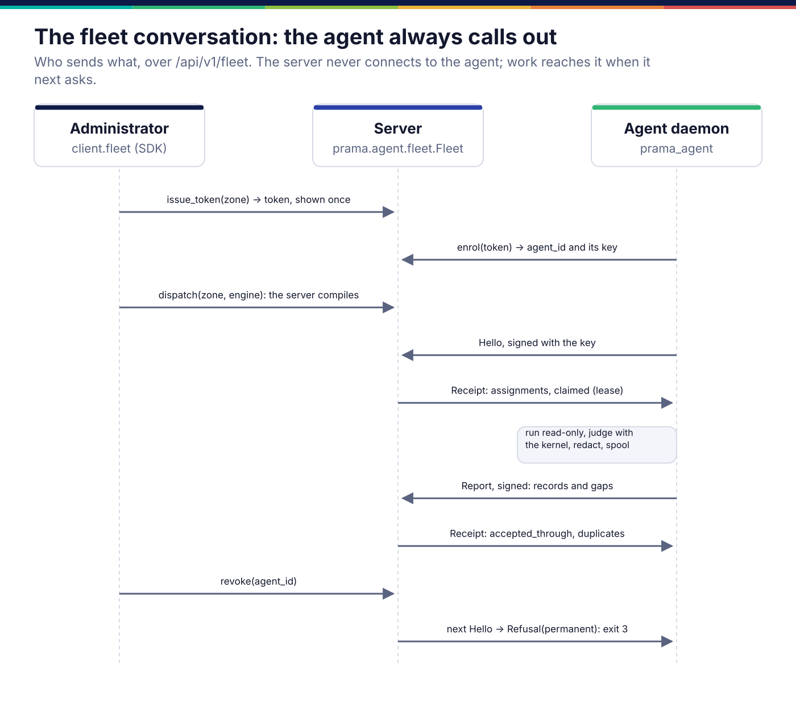
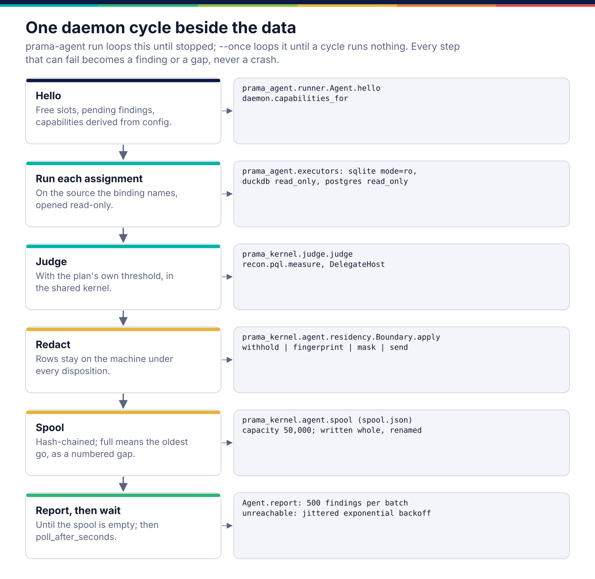

*Copyright © 2026 Ashutosh Sinha <ajsinha@gmail.com>. All rights reserved.*

---

# Agents and the fleet: running controls beside the data

[← Architecture](README.md)

Much of an enterprise's data cannot be reached from the control plane: it sits
behind firewalls, under regulators that forbid it leaving a jurisdiction. A
**fleet agent** runs on a machine beside that data, asks the server for the work
its zone may do, runs it locally, judges it with the same kernel code the server
uses, and reports findings, never data.

Three documents cover this ground, and each has one job. This page shows how the
parts fit. [22 Distributed Execution](../corpus/22-distributed-execution.md)
says why it is built this way (outbound-only, what crosses the boundary, version
skew, what the agent deliberately does not do).
[The fleet over HTTP](../design/agent-fleet-http.md) is the wire contract, every
endpoint and header. [The agent guide](../agent/README.md) is for the operator
who installs, configures and supervises the daemon.

A fleet agent is not a steward: stewards are AI agents inside the server that
propose ([lineage-and-code.md](lineage-and-code.md)); a fleet agent runs no
model at all.

## Three packages, one conversation

| Where | Package | What it holds |
|---|---|---|
| Server | `prama.agent.fleet` | `Fleet`: tokens, enrolment, derived keys, claimed assignments with leases, report ingestion, fleet health; tables `fl_agent`, `fl_token`, `fl_assignment`, `fl_gap` |
| Server | `prama.agent.assign` | `assignment_for`: the server compiles every assignment, so the agent never compiles |
| Server | `src/prama/api/routes/fleet.py` | the ten `/api/v1/fleet/*` endpoints |
| Shared | `prama_kernel.agent` | the protocol messages, capability matching, residency, the spool, signing |
| Client | `prama_sdk.resources.fleet` | `client.fleet`: the administrator's calls and the agent's signed calls |
| Agent | `prama_agent` | the daemon: CLI, config, `Daemon`, `Agent` runner, read-only executors, `SdkFleetLink`, state files |

`prama.agent.coordinator` is the same conversation held in memory, for a single
process and its tests; the server runs the persisted `Fleet`.



**The protocol is four messages**, `Hello`, `Report`, `Receipt` and `Refusal`:
frozen dataclasses in `prama_kernel.agent.protocol`, each with
`to_dict`/`from_dict`. Because the agent always initiates, a `Refusal` is a
response body, not an HTTP error, and work reaches the agent when it next asks.
Enrolment, the derived per-agent keys, the signature headers, and the
deduplication rules for reports are the wire contract, stated once in
[the fleet over HTTP](../design/agent-fleet-http.md). The SDK reimplements the
kernel's canonical JSON so it does not depend on the kernel, and
`tests/sdk/test_fleet_signing.py` proves the two produce the same bytes.

**Work is assigned by zone, and claimed.** `POST /fleet/dispatch` compiles the
active controls on a zone's datasets and queues them. On `hello`, the server
releases expired claims, then hands the agent queued assignments up to its free
slots, each under a lease (`fleet.lease_seconds`, 900 by default). The zone
comes from the agent's enrolment, never from anything it says. Accepted report
records are appended to the tenant's evidence ledger with
`triggered_by: agent:<id>`.

**Capabilities are compared, not assumed.**
`prama_kernel.agent.capability.fits` checks a plan against what the agent
declared (IR version, engine, pushdown, datasets, delegates) and collects
*every* reason it does not fit, so an agent short of three things is upgraded
once. A control no agent can run is reported as unassignable in fleet health,
never silently skipped.

## The daemon's cycle



`prama_agent.daemon.Daemon` loops `cycle()`. In each cycle the runner
(`prama_agent.runner.Agent`) says hello, runs each assignment on the source its
binding names (opened read-only: SQLite `mode=ro`, DuckDB `read_only=True`, a
read-only PostgreSQL session), judges with `prama_kernel.judge`, applies the
zone's residency boundary, spools the finding, and reports until the spool is
empty. A source that fails produces an `error` finding with its reason and the
next assignment runs.

- **Residency.** `prama_kernel.agent.residency.Boundary` applies the zone's
  sample disposition (`withhold`, `fingerprint`, `mask`, `send`); as built, the
  rows themselves stay on the machine under every one. What each disposition
  lets leave is in [the agent guide](../agent/README.md#what-leaves-the-machine-and-what-never-does).
- **The spool** (`prama_kernel.agent.spool`, `spool.json` in the state directory)
  is hash-chained per agent, written whole and renamed into place, and bounded;
  overflow and corruption become numbered gaps
  ([why](../corpus/22-distributed-execution.md#6-surviving-an-outage)).
- **Waiting and exiting.** After a successful cycle the daemon waits
  `poll_after_seconds`, bounded by its config, and backs off with jitter when the
  server is unreachable. `--once` drains, then exits 0; a permanent refusal exits 3.

### Example: the end-to-end test

`tests/agent_daemon/test_end_to_end.py` starts a real server, then plays every
role through public surfaces only:

```python
token = admin.fleet.issue_token("eu-frankfurt", name="frankfurt-01")["token"]
# prama-agent enrol --server … --token … --name frankfurt-01 --state STATE
(agent,) = [a for a in admin.fleet.agents() if a["name"] == "frankfurt-01"]
admin.fleet.dispatch("eu-frankfurt", engine="sqlite", datasets=["trades"])
# prama-agent run --config agent.yaml --once     → exit 0, the defect found
assert admin.evidence.verify()["intact"]         # the chain still verifies
admin.fleet.revoke(agent["id"])
# prama-agent run --config agent.yaml --once     → exit 3
```

with an agent configuration as small as this:

```yaml
server:
  url: http://127.0.0.1:5900
state_dir: /var/lib/prama-agent
sources:
  trades:
    engine: sqlite
    path: /srv/data/book.db
residency:
  samples: withhold
```

The full `agent.yaml` reference, credentials by environment variable, and a
systemd unit are in [the agent guide](../agent/README.md). The fleet has no
console page yet; `GET /api/v1/fleet/health` (and `client.fleet.health()`) lists
stale agents, queued and claimed work per zone, unassignable controls and
reported gaps.

## Where it lives in the code

| Path | Responsibility |
|---|---|
| `src/prama/agent/fleet.py` | the persisted fleet: tokens, enrolment, keys, assignment claims, report ingestion, health |
| `src/prama/agent/assign.py` | compiling a plan into an `Assignment` |
| `src/prama/agent/identity.py`, `src/prama/agent/coordinator.py` | the in-memory registry and coordinator, for one process and tests |
| `src/prama/agent/protocol.py`, `capability.py`, `residency.py`, `spool.py` | aliases of `prama_kernel.agent.*` |
| `src/prama/api/routes/fleet.py` | the fleet endpoints |
| `src/prama/db/models/fleet.py`, `src/prama/db/dao/fleet.py` | `fl_*` tables and `FleetDao` |
| `kernel/src/prama_kernel/agent/` | protocol, capability, residency, spool, signing |
| `sdk/src/prama_sdk/resources/fleet.py`, `sdk/src/prama_sdk/signing.py` | `client.fleet`; canonical JSON and HMAC signing |
| `agent/src/prama_agent/` | the daemon |
| `tests/agent_daemon/` | the daemon's loop, spool, residency, signals, CLI, and the end-to-end test |

To add an engine the agent can run on, see
[agent-executors.md](../developer/agent-executors.md).

## Read more

- Why: [22](../corpus/22-distributed-execution.md), especially
  [§3 what crosses the boundary](../corpus/22-distributed-execution.md#3-what-crosses-the-boundary)
  and [§6 surviving an outage](../corpus/22-distributed-execution.md#6-surviving-an-outage).
- The wire contract: [design/agent-fleet-http.md](../design/agent-fleet-http.md).
- Operating an agent: [agent/README.md](../agent/README.md).

---

<div align="center">
<br/>
<sub><b>PRAMA</b> — <i>Declare it. Prove it. Trust it.</i><br/>
Copyright © 2026 <b>Ashutosh Sinha</b> &lt;ajsinha@gmail.com&gt; · All rights reserved.<br/>
Proprietary and confidential. No licence is granted except by separate written agreement.<br/>
See <a href="../../LICENSE">LICENSE</a> and <a href="../../NOTICE">NOTICE</a>. Third-party names and marks are the property of their respective owners.</sub>
</div>
