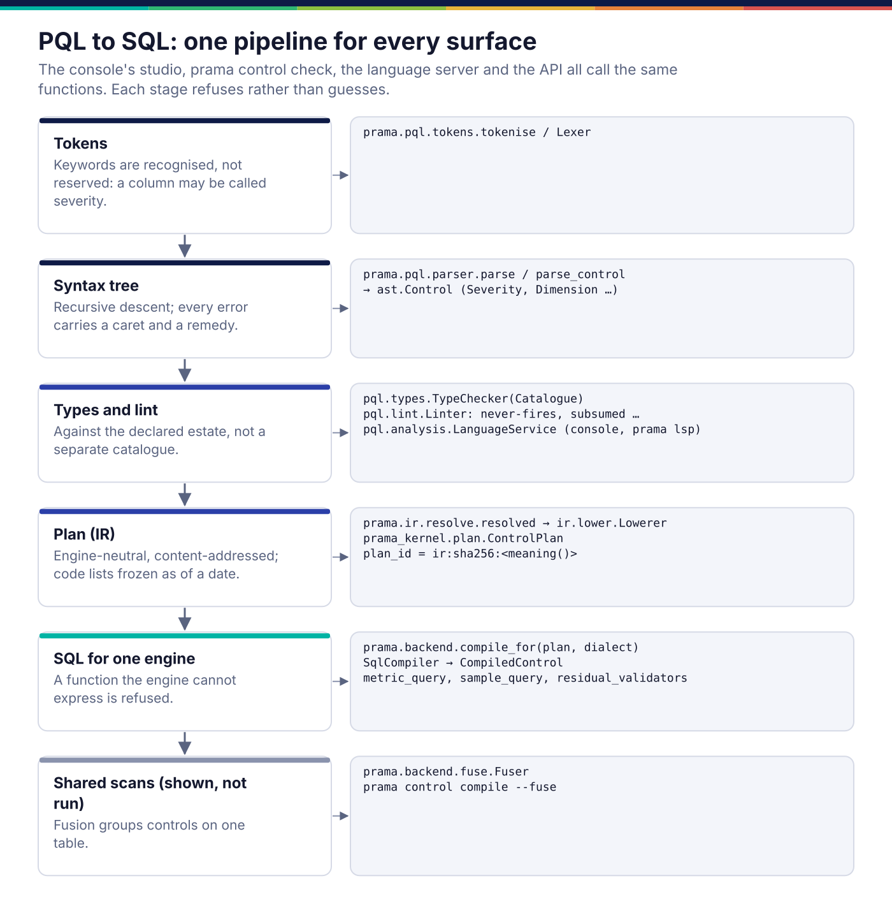
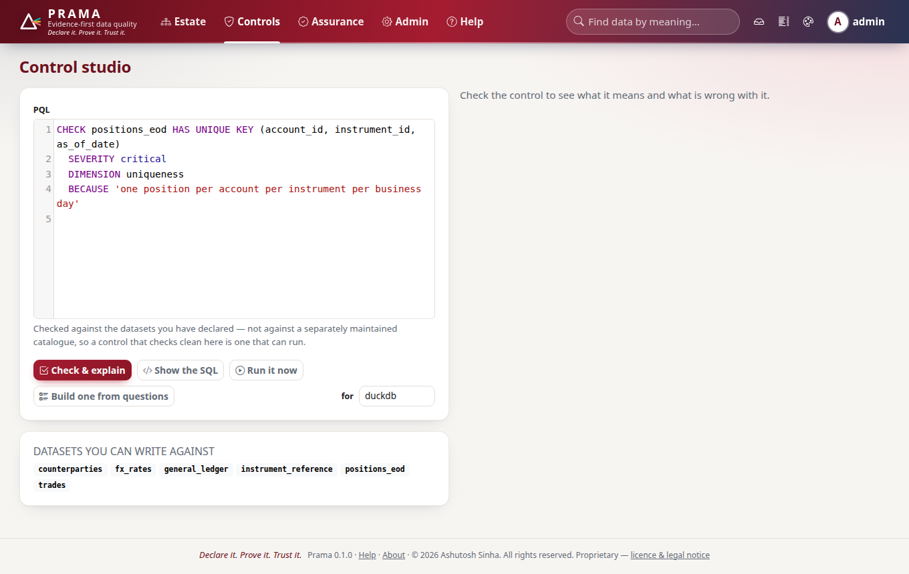
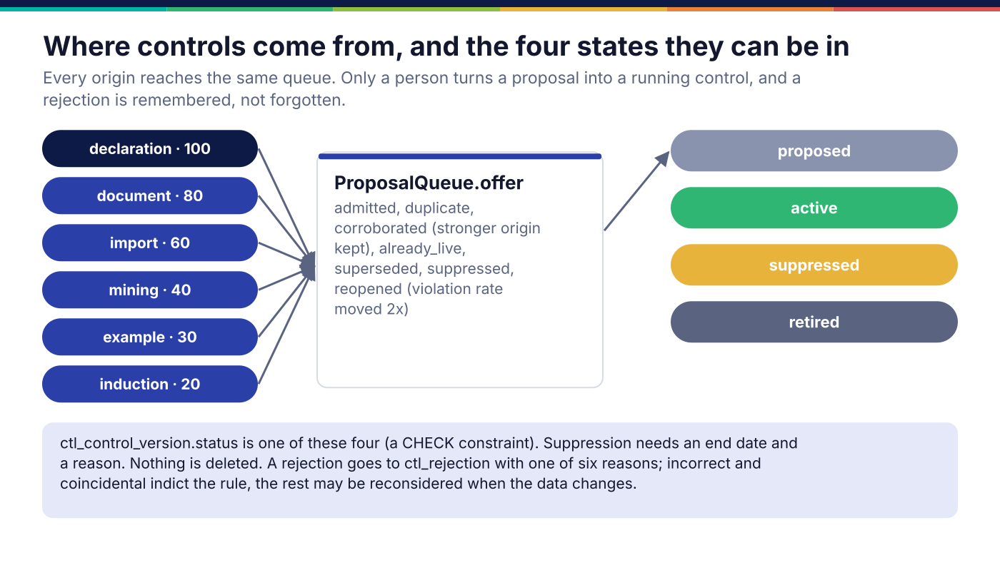
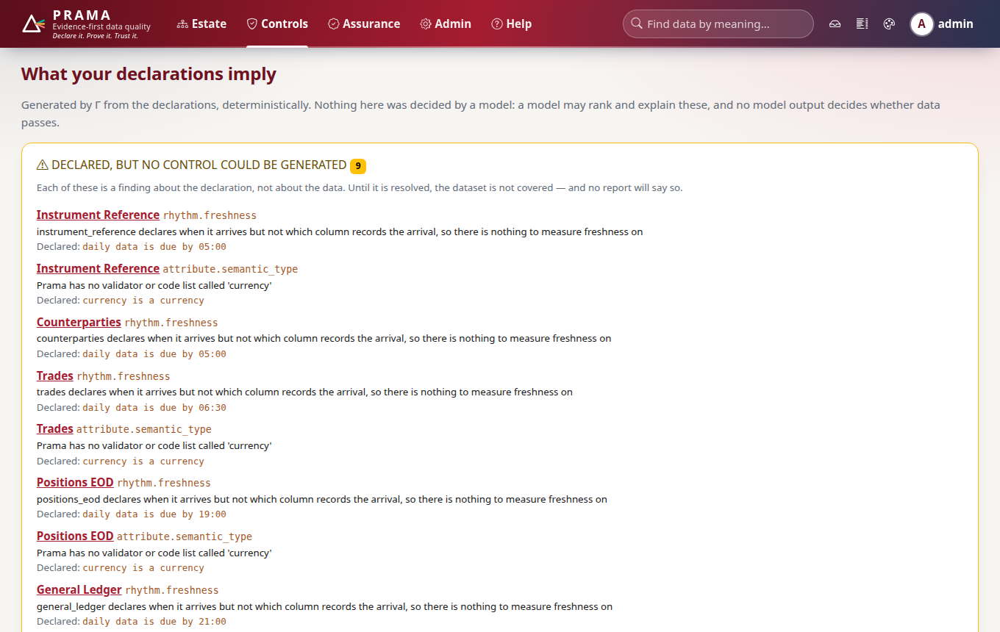
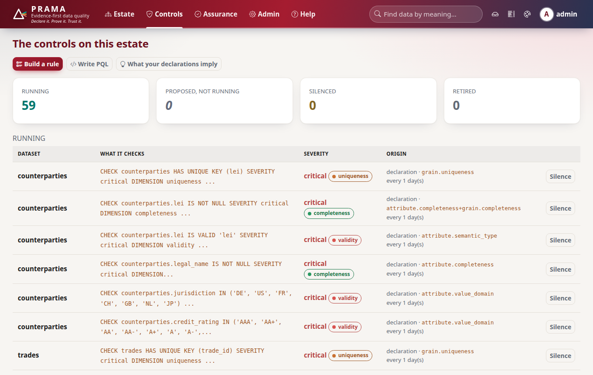

*Copyright © 2026 Ashutosh Sinha <ajsinha@gmail.com>. All rights reserved.*

---

# Controls and PQL: from a sentence to SQL

[← Architecture](README.md)

A control is a PQL statement with a reason attached. It is stored as text, and
the text is the authority: its plan, its identity, its severity and its
dimensions are all derived from it, so no column in the database can disagree
with what the control says. This page follows a control from where it comes
from, through the compiler, to the SQL that runs.

## One pipeline, every surface



The console's control studio, `prama control check`, the PQL language server,
the API and the scheduler all call the same functions, in this order:

1. **Tokens.** `prama.pql.tokens.tokenise`. Keywords are recognised but not
   reserved, so a column may be called `severity`.
2. **Syntax tree.** `prama.pql.parser.parse` (a suite) or `parse_control` (one
   control), hand-written recursive descent producing `prama.pql.ast` nodes.
   Every node carries its source position, so every error carries a caret and a
   remedy. A PQL formula written the Excel way (`SATISFIES EXCEL '=…'`) is
   parsed by `prama.pql.excel` into the same tree: one language, two surfaces.
3. **Types and lint.** `prama.pql.types.TypeChecker` checks names, types and
   function calls against a `Catalogue` built from the declared estate
   (`prama.controls.language.catalogue_of`), not from a separately maintained
   list, so a control that checks clean in the studio is one that can run.
   `prama.pql.lint.Linter` flags controls that can never fire, always fire, have
   no `BECAUSE`, or are subsumed by another. `prama.pql.analysis.LanguageService`
   wraps both for editors.
4. **Plan.** `prama.ir.resolve.resolved` lowers the tree through
   `prama.ir.lower.Lowerer` to a `ControlPlan` from the kernel: a row predicate,
   the metrics to compute, and a threshold. Code lists are frozen as of a date.
   The plan's identity is `ir:sha256:` over its *meaning*, so rewording the
   `BECAUSE` does not change it and changing the threshold does.
5. **SQL.** `prama.backend.sql.compile_for(plan, dialect)` produces a
   `CompiledControl`: a `metric_query` that returns counts, a `sample_query` for
   failing rows, and the `residual_validators` the SQL could only screen for.
   Three dialects are compile targets: PostgreSQL, DuckDB and SQLite.

The layering is enforced: `prama.pql` may not import the IR or a backend, and
the IR may not import a backend (`tests/architecture/test_layering.py`). That is
what lets the language service run in an editor with no database, and the
compiler be tested against a reference interpreter
(`prama.backend.reference.ReferenceEvaluator`) on every engine.

### Example: four controls, explained and compiled

```text
CHECK positions_eod HAS UNIQUE KEY (account_id, instrument_id, as_of_date)
  SEVERITY critical
  DIMENSION uniqueness
  BECAUSE 'one position per account per instrument per business day'

CHECK trade_feed.isin REFERENCES instrument_master.isin
  SEVERITY major DIMENSION integrity
  BECAUSE 'records here point at records there'

RECONCILE subledger AGAINST general_ledger
  ON (account, cost_centre, posting_date)
  COMPARING amount = balance_eur WITHIN 0.01 EUR
  NORMALISING currency TO 'EUR' USING RATES fx_rates
  OFFSET BY 1 DAY
  SEVERITY critical DIMENSION accuracy
  BECAUSE 'the month does not close until the subledger agrees with the ledger'

CHECK trade_blotter USING DELEGATE 'acme.settlement_cycle@1'
  (us_cycle = 1, eu_cycle = 2, uk_cycle = 2)
  SEVERITY critical DIMENSION timeliness, consistency
  BECAUSE 'a trade that settles off-cycle is a failed or mis-booked settlement'
```

These come from the control studio, case study 03 (mixed estate), case study 06
(month-end close) and case study 05 (delegates). `prama control explain` turns
each into the sentence a data owner reads:

```text
· In positions_eod, there is at most one row for each combination of account_id,
  instrument_id, as_of_date. A failure is critical. This exists because: one position
  per account per instrument per business day.
· In trade_feed, every isin exists in instrument_master.isin. No violations are allowed.
  A failure is major. This exists because: records here point at records there.
```

and `prama control compile` shows the SQL that will run (PostgreSQL by default):

```sql
-- In trade_feed, every isin exists in instrument_master.isin. …
SELECT COUNT(*) AS "scanned_rows", COUNT(*) FILTER (WHERE NOT COALESCE((EXISTS (
  SELECT 1 FROM "instrument_master" WHERE "instrument_master"."isin" = "trade_feed"."isin")),
  FALSE)) AS "violating_rows"
FROM "trade_feed"
```

The query returns counts, not rows: the verdict is decided later, by the judge,
from those counts and the control's threshold. The reconciliation and the
delegate compile to a plain `SELECT` of the columns they need, because their
measurement is done by kernel code over the rows rather than by SQL
([execution.md](execution.md)).

**Shared scans.** `prama control compile --fuse` groups controls over the same
table into one query:

```sql
-- 2 control(s) in 1 scan(s) — 1 fewer passes over the data than running them separately.
SELECT COUNT(*) AS "c0__scanned_rows",
       COUNT(*) FILTER (WHERE NOT COALESCE(("notional" IS NOT NULL), FALSE)) AS "c0__violating_rows",
       COUNT(*) FILTER (WHERE NOT COALESCE(("notional" >= 0), FALSE)) AS "c1__violating_rows"
FROM "trades"
```

As built, fusion (`prama.backend.fuse.Fuser`) is used to show and cost the plan;
the scheduled run executes one compiled query per control.

**Pushdown coverage** is published rather than hidden:

```text
$ prama control functions
33 function(s) in the catalogue.

  duckdb       33/33 (100%)
  postgresql   33/33 (100%)
  sqlite       32/33 (97%)
      refused: ROUND

A refused function is refused, never approximated: the same control
meaning two things on two engines is the failure this prevents.
```



## Where controls come from



Every control reaches the estate through one queue, `prama.propose.queue.ProposalQueue`,
whatever produced it. The origins are ranked by authority (the numbers in the
diagram); when two origins propose the same content, the stronger is kept and
the other is recorded as corroboration.

| Origin | Produced by |
|---|---|
| `declaration` | Γ, `prama.derive.generator.ControlGenerator`: `_from_grain`, `_from_business_key`, `_from_rhythm`, `_from_temporality`, `_from_attributes`, `_from_authoritativeness`; and `prama.derive.relationships.RelationshipGenerator` for relationships. It builds syntax-tree nodes and renders them, never concatenates strings, and type-checks its own output: a declared column that does not exist is `Unsatisfiable`, not a guess |
| `document` | `prama.induce.documents`: a rule extracted from a policy document, rejected unless its citation appears verbatim in the document |
| `import` | `prama.importers` (dbt, Great Expectations, Soda) and `prama.contract` (ODCS) |
| `mining` | `prama.mine`: keys, functional and inclusion dependencies, ordering and identity invariants found in a sample; and `prama.derive.lineage_controls` from lineage |
| `example` | `prama.induce.examples`: rules generalised deterministically from labelled rows |
| `induction` | `prama.induce.llm`: a model drafts PQL; `prama.induce.validate.Validator` must pass it through five gates first ([intelligence.md](intelligence.md)) |

Metadata rules ([semantic-layer.md](semantic-layer.md)) and correlation
proposals join the same queue through `prama.controls.proposals.queue`.

**What the queue remembers.** `ProposalQueue.offer` returns one of: admitted,
duplicate, corroborated, already live, superseded, suppressed, or reopened. A
rejection is stored in `ctl_rejection` with one of six reasons. `incorrect` and
`coincidental` indict the rule and are permanent for that content; `not_material`,
`too_noisy` and `pending_remediation` may be reconsidered, and the proposal is
reopened only if its backtest violation rate moves by at least a factor of two.
Without this, a rejected proposal comes back every night and the reviewer stops
reading the queue.

**The four states.** A control version's `status` is `proposed`, `active`,
`suppressed` or `retired` (a CHECK constraint on `ctl_control_version`).
Suppression needs an end date and a reason. Nothing is deleted: a retired control
keeps its history, because evidence refers to it.

**Who may activate.** Accepting a proposal or activating a control needs the
`control:approve` scope; a steward proposes, an owner approves. Only the
`declaration` origin may ever be auto-activated (`prama.core.provenance`), and
only when its backtest is actionable.





### Example: authoring and activating through the SDK

```python
check = client.pql.check(pql)                       # diagnostics against the declared estate
declared = client.controls.declare(pql, identity="positions-eod-key", criticality=1)
control = declared.get("control", declared)
client.controls.activate(control["id"], reason="reviewed with the risk desk")

# or: take what the declarations imply
for item in client.metadata.proposals():
    client.proposals.accept(item["identity"], item["pql"], rule=item["rule"])
```

The first form is what the case-study harness does for a hand-written control
(`case-studies/_common/harness.py`); the second is case study 07.

## Importers and contracts

`prama control import schema.yml --from dbt` (also `soda` and
`great_expectations`) reads another tool's checks into PQL and reports each one
as exact, caveated, or not imported with a reason. A dbt `unique` test is not
treated as a grain, and Great Expectations' `mostly` becomes a tolerance rather
than being dropped. The point is that nothing is silently lost in translation.

`prama.contract` reads and writes Open Data Contract Standard documents
(`prama.contract.odcs`), turns their quality blocks into PQL where they are
expressible and refuses the rest by name (`prama.contract.quality`), and gates a
pipeline:

```bash
prama contract check contract.json --data rows.json   # exit 3 on breach, 1 on failure
prama contract diff before.csv after.csv --key id     # what changed, not how many
```

## Where it lives in the code

| Path | Responsibility |
|---|---|
| `src/prama/pql/` | lexer, parser, syntax tree, type checker, linter, language service, function catalogue, Excel surface, no-code builder, custom SQL guard |
| `src/prama/ir/lower.py`, `src/prama/ir/resolve.py` | syntax tree to plan; `resolved` is the one correct way to lower |
| `kernel/src/prama_kernel/plan.py` | the plan model (`prama.ir.model` is its alias) |
| `src/prama/backend/sql.py`, `src/prama/backend/dialect.py` | `compile_for`, `SqlCompiler`, the three dialects |
| `src/prama/backend/fuse.py`, `src/prama/backend/reference.py`, `src/prama/backend/conformance.py` | fusion; the reference interpreter; cross-engine conformance |
| `src/prama/controls/language.py` | check, explain, format, compile, function coverage: what every surface calls |
| `src/prama/controls/proposals.py` | the merged queue, accept, reject |
| `src/prama/derive/` | Γ for datasets and relationships, lineage-derived proposals, coverage |
| `src/prama/propose/` | `ProposalQueue`, rejection memory, utility ranking |
| `src/prama/induce/`, `src/prama/mine/` | induction from documents, examples and models; constraint mining |
| `src/prama/importers/`, `src/prama/contract/` | dbt, Soda, Great Expectations, catalogues; ODCS contracts |
| `src/prama/db/dao/control.py` | `ControlDao`: declare, activate, suppress, retire; `RejectionDao` |

To add a PQL function, see [pql-functions.md](../developer/pql-functions.md); a
validator, [validators.md](../developer/validators.md); an importer,
[importers.md](../developer/importers.md); a dialect,
[backends-and-dialects.md](../developer/backends-and-dialects.md).

## Read more

- The language, its semantics and its grammar:
  [07 PQL](../corpus/07-rule-language-spec.md), in particular
  [§7 the IR](../corpus/07-rule-language-spec.md#7-the-intermediate-representation)
  and [§10 the worked example](../corpus/07-rule-language-spec.md#10-worked-example--one-business-declaration-to-a-running-control-estate).
- From declarations to conclusions:
  [03 §5](../corpus/03-business-semantic-layer.md#5-from-declarations-to-conclusions).
- Induction and its safety contract:
  [08 §3](../corpus/08-ai-ml-capabilities.md#3-constraint-mining-and-rule-induction).

---

<div align="center">
<br/>
<sub><b>PRAMA</b> — <i>Declare it. Prove it. Trust it.</i><br/>
Copyright © 2026 <b>Ashutosh Sinha</b> &lt;ajsinha@gmail.com&gt; · All rights reserved.<br/>
Proprietary and confidential. No licence is granted except by separate written agreement.<br/>
See <a href="../../LICENSE">LICENSE</a> and <a href="../../NOTICE">NOTICE</a>. Third-party names and marks are the property of their respective owners.</sub>
</div>
