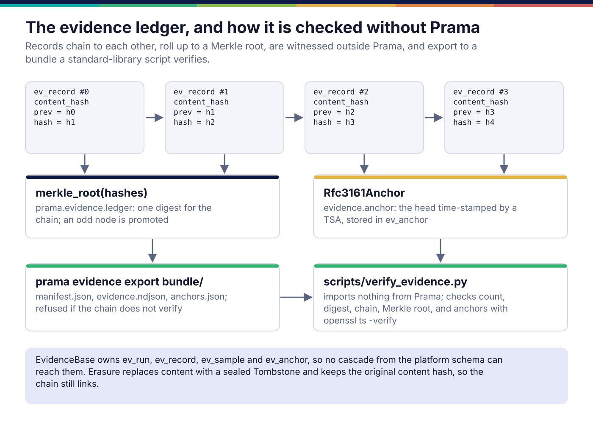
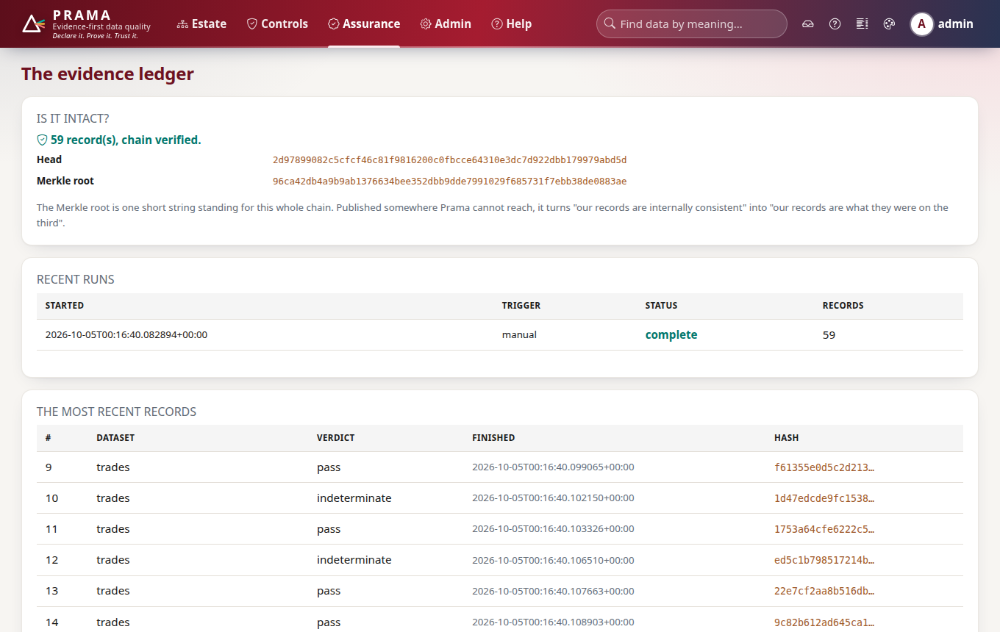
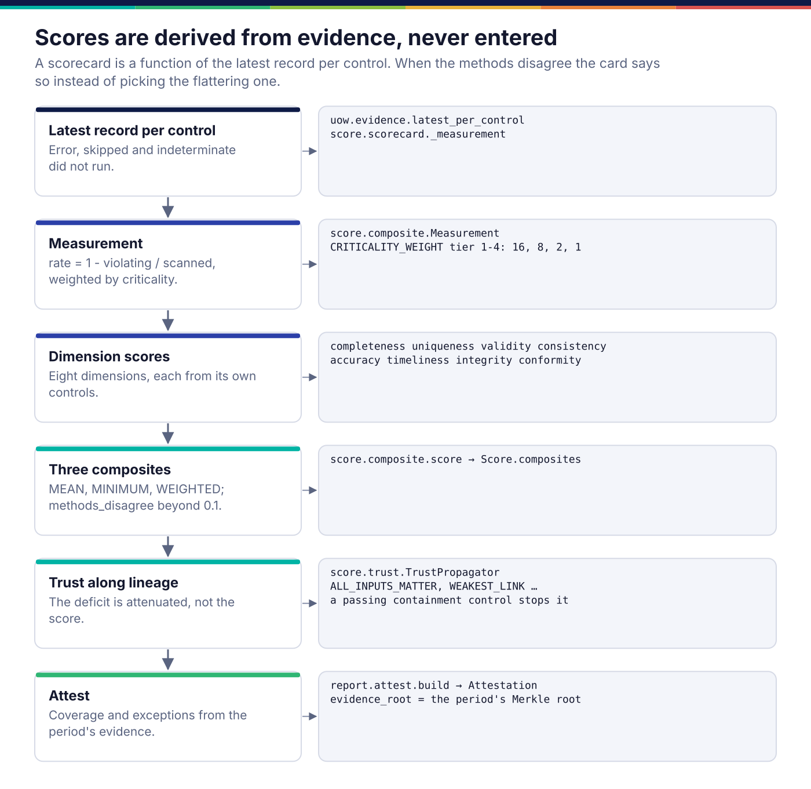
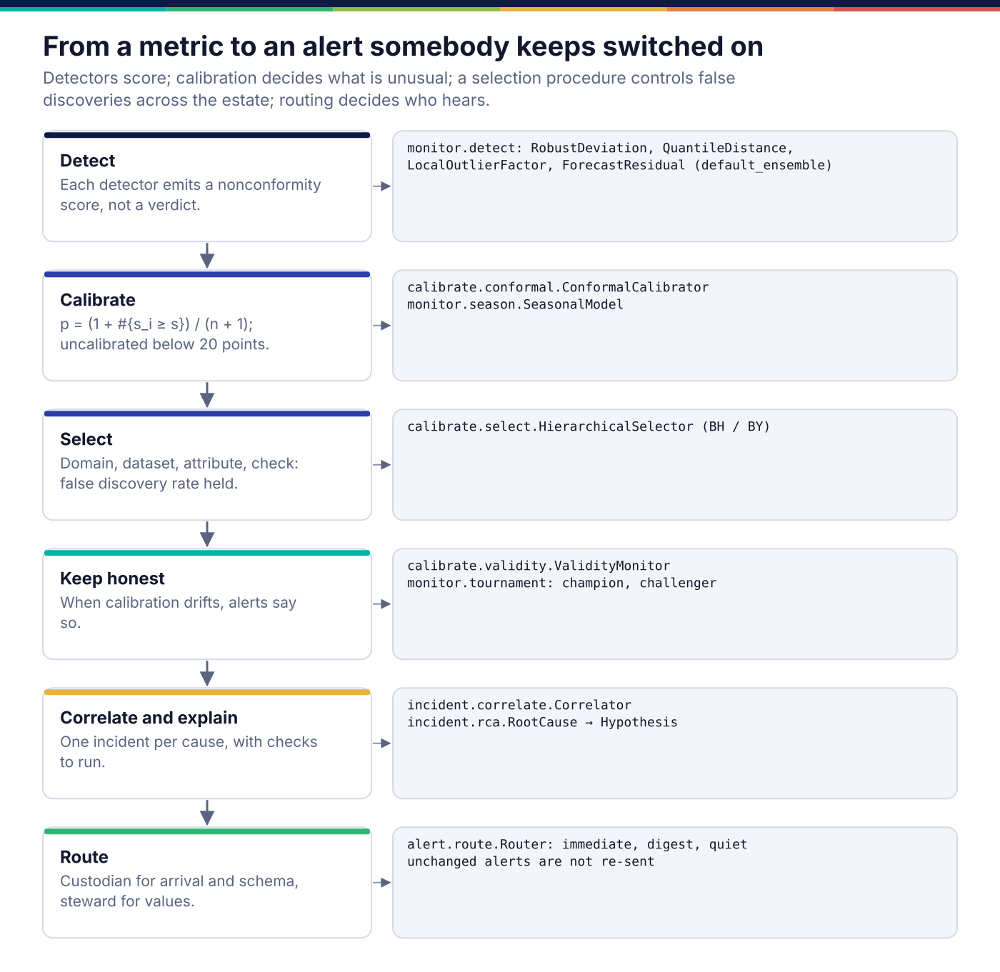
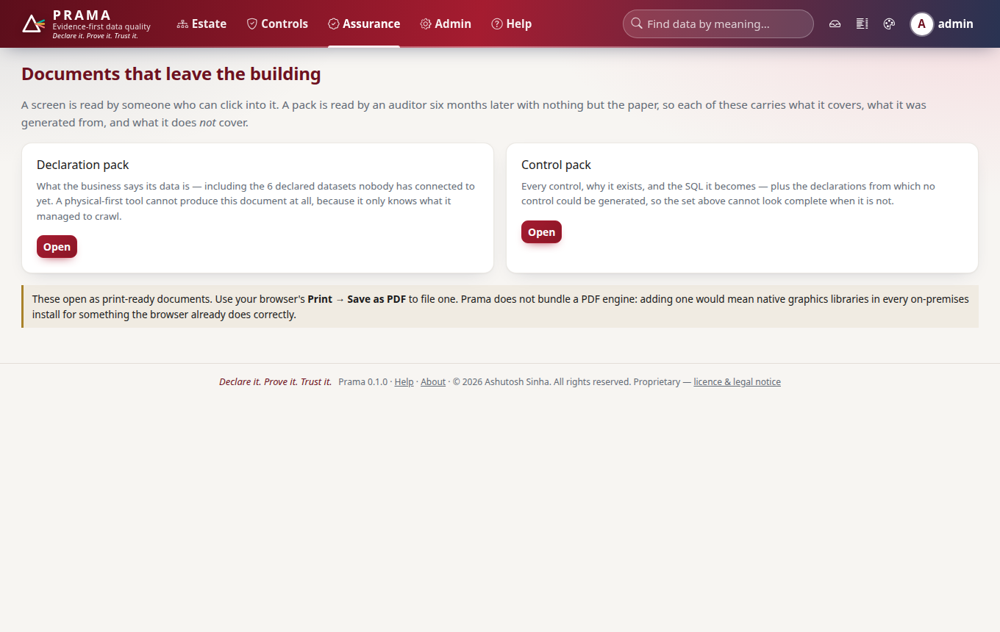

*Copyright © 2026 Ashutosh Sinha <ajsinha@gmail.com>. All rights reserved.*

---

# Evidence and assurance: what was found, and how anyone can check it

[← Architecture](README.md)

A verdict is only worth what somebody else can verify about it. Every run leaves
an evidence record; everything a person reads afterwards (scorecards, trust,
incidents, attestations, packs) is computed from those records rather than
stored beside them. This page covers the ledger and its offline verification,
then each thing derived from it.

## The ledger



An `EvidenceRecord` (`prama_kernel.record`, evidence format 1.1) holds what was
run and what was found, and nothing that would let it be confused with
something else:

- **what**: `plan_id` (the plan's content hash), `control_id`, `control_version`,
  `dataset`, `binding`, `engine`, `parameters` (including the threshold);
- **against what**: a `snapshot` reference saying whether the read was exact or
  wall-clock, and the `coverage` (`full`, `incremental`, `forward_only`);
- **the finding**: `verdict`, `metrics` (`scanned_rows`, `violating_rows`, …),
  `samples_digest` and `sample_count`, `detail`;
- **context**: timings, `triggered_by`, `tenant_id`, `dimensions`, `criticality`;
- **the chain**: `sequence` and `previous_hash`.

`content_hash` is SHA-256 over the canonical JSON of the content, and
`record_hash` is SHA-256 over `previous_hash + content_hash`. The ledger sets
`sequence` and `previous_hash` itself, so no caller can choose where a record
sits. A field the record's version does not define counts as tampering in
verification, which is why new fields are versioned (`FIELDS_SINCE`) rather than
added.

Failing rows are not in the record. They are stored separately, addressed by
hash (`ev_sample`), so a record can be exported and verified without exporting
data, and erased rows do not break the chain: erasure replaces a record's
content with a sealed `Tombstone` that keeps the original content hash, so the
next record still links.

**Why a separate declarative base.** The ledger's tables (`ev_run`, `ev_record`,
`ev_sample`, `ev_anchor`) belong to `EvidenceBase`, not to `Base`. They have no
foreign key into the platform schema and no `updated_at`, so no cascade, no
"tidy-up" and no ORM convenience on the platform side can reach them. They still
share the unit of work, so a run's record and its run row commit together.

**Witnessing.** A chain that verifies proves internal consistency; somebody with
write access could rebuild it. `prama.evidence.anchor.Rfc3161Anchor` sends the
chain head (32 bytes, through the residency gate) to an RFC 3161 time-stamp
authority after each run and stores the receipt. A rebuilt chain will not agree
with a receipt its builder cannot forge.

```yaml
evidence:
  anchor:
    kind: rfc3161                   # none | rfc3161
    url: https://freetsa.org/tsr    # the time-stamp authority
    region: ""                      # where it is, for the residency gate
```

### Example: verifying without Prama

```bash
prama evidence anchor                 # exit 3 if the head could not be anchored
prama evidence export bundle/         # manifest.json, evidence.ndjson, anchors.json
python3 scripts/verify_evidence.py bundle/                  # standard library only
python3 scripts/verify_evidence.py bundle/ --tsa-ca ca.pem  # ...and the anchors' signatures
```

`scripts/verify_evidence.py` re-implements canonical JSON, the chain, the Merkle
root and the manifest check from the documented algorithm, and checks anchor
tokens with `openssl ts -verify`. It exits 0 when every check passes, 1 when one
fails, 2 when the bundle cannot be read. `tests/evidence/test_independent_verifier.py`
requires it to agree with the in-package verifier, so the two cannot drift.

The same through the SDK:

```python
status = client.evidence.verify()       # the stored chain, recomputed by the server
bundle = client.evidence.export()       # the zip, as bytes
```



**Replay.** `prama.evidence.replay.compare` sets a replayed record beside the original and
classifies any difference: identical, stable, data changed, control changed, engine changed,
parameters changed, snapshot not exact, coverage changed, or unexplained. An
engine change and an unexplained difference are escalated, because those are the
two an auditor cannot explain away.

## Scores are derived from evidence



A scorecard is a function of the latest evidence record per control
(`prama.score.scorecard`). Nothing about it is entered by hand.

- A control that errored, was skipped, was indeterminate or scanned nothing
  **did not run**, and the card says what share of what was meant to be checked
  it describes ("1 of 6 controls did not run — this describes 83%").
- Each control contributes a pass rate, `1 − violating / scanned`, to its
  dimension: completeness, uniqueness, validity, consistency, accuracy,
  timeliness, integrity or conformity.
- Three composites are computed (`MEAN`, `MINIMUM`, `WEIGHTED`, where weighting is
  by criticality tier: 16, 8, 2, 1). When they differ by more than 0.1, the card
  says the composites disagree rather than choosing the flattering one: "most of
  the dataset is fine and something in it is not".

**Trust along lineage** (`prama.score.trust.TrustPropagator`) carries a dataset's
deficit downstream through the lineage graph. The deficit is attenuated per
transform, not the score; the default rule is that every input matters (product
along a path, minimum across paths); and a passing containment control
downstream stops the propagation, because that is what it is for.
`prama.lineage.trust` feeds it from the persisted graph.


## Calibration and monitoring



Statistical monitors (volume, null rate, distinct count, freshness, schema,
distribution) are the place an alerting tool usually loses its users, by firing
on noise. Prama's design separates the three jobs that a single "sensitivity"
setting usually conflates:

- **Detectors score.** `prama.monitor.detect` holds several detectors; each emits
  a nonconformity score, never a verdict.
- **Calibration decides what is unusual.**
  `prama.calibrate.conformal.ConformalCalibrator` turns a score into a p-value
  against the metric's own history (with seasonality from
  `prama.monitor.season`), and refuses to calibrate below 20 points.
- **Selection controls false discoveries across the estate.**
  `prama.calibrate.select.HierarchicalSelector` tests domain, then dataset, then
  attribute, then check, holding the false discovery rate, and rolls many
  related findings up into one.

`prama.calibrate.validity.ValidityMonitor` checks that the calibration still
holds, and stamps alerts when it does not. A challenger detector runs in shadow
and is promoted only on measured precision (`prama.monitor.tournament`).

## Incidents and alerts

The incidents page is one row per control, not per run: a control failing every
hour for a week is one problem. `prama.incident.triage` treats the latest record
per control with an unresolved verdict as open, and distinguishes rows never
collected, rows no longer held, a partial sample and a complete one.
`prama.incident.correlate.Correlator` groups findings by shared change, lineage,
dataset and time, and `prama.incident.rca.RootCause` proposes hypotheses, each
with the check that would confirm it.

`prama.alert.route.Router` decides who hears and when: arrival, schema and
calibration faults go to the custodian; value, definition and reconciliation
faults to the steward, falling back to the owner. An unchanged alert is not
re-sent within the quiet period, low-urgency ones go to a daily digest, and the
residency gate withholds an alert whose channel delivers outside the tenant's
residency.

After every run commits (the scheduler, `prama control run`, the API and agent
reports), `prama.alert.pipeline` turns each failing record into an alert, takes
the recipients from the dataset's declared owner, steward and custodian, and
routes it with a router seeded from the database (`alr_state`), so an open
incident is not announced again after a restart or from another server. The
immediate ones go out through a `prama.alert.notify.Notifier` (`log`,
`webhook`, `email`, or one a distribution adds on `"prama.notifiers"`), the rest
wait in `alr_digest` for the scheduler's daily digest, and a control that passes
again sends its resolution. Alerting is off until `alerts.enabled` is set, and a
delivery failure is recorded on the alert and never fails the run: the evidence
is the product, the alert a courtesy.


## Reports and attestations

A screen is read by somebody who can click into it; a pack is read by an auditor
six months later with nothing but the paper. `prama.report.render` produces the
declaration pack and control pack as print-ready HTML that carries its own
provenance and coverage, including what it does *not* cover. There is no
server-side PDF engine: the browser's print does that correctly, and a native
graphics stack in every on-premises install would not be worth it.

An **attestation** (`prama.report.attest`) is built from the evidence of a
period: coverage, exceptions, and `evidence_root`, the period's Merkle root, so
the signed statement names exactly the records it rests on. A correction is a
new attestation that supersedes the old one; the old one is never edited.



## The feedback loop and the benchmark

`prama.learn.loop` treats reviewers' accept and reject decisions as labels for
re-ranking proposals, holds back a control arm by hashing each item, and
promotes a new ranking only on a measured, significant uplift.
`prama.bench` is the labelled defect corpus behind `prama bench run`: seeded
defects in six families, baselines from detect-nothing to alert-on-everything,
exact scoring by dataset, column and time window, and a shadow mode with blinded
adjudication. What it has and has not measured is in
[15](../corpus/15-evaluation-benchmark-methodology.md).

## Where it lives in the code

| Path | Responsibility |
|---|---|
| `kernel/src/prama_kernel/record.py` | `EvidenceRecord`, `SnapshotRef`, `Tombstone`, the hash definitions (`prama.evidence.record` is its alias) |
| `src/prama/evidence/ledger.py` | append, verify (`Breach` kinds: content, link, gap, order, genesis), Merkle root, NDJSON export |
| `src/prama/evidence/anchor.py`, `src/prama/evidence/tsp.py` | RFC 3161 anchoring; a standard-library time-stamp protocol codec |
| `src/prama/evidence/retention.py`, `src/prama/evidence/replay.py`, `src/prama/evidence/service.py` | tiers, bundles, erasure; replay comparison; the operations every surface shares |
| `src/prama/db/models/evidence.py` | `ev_*` tables under `EvidenceBase` |
| `scripts/verify_evidence.py` | offline verification, standard library only |
| `src/prama/score/` | composites, scorecards, trust propagation |
| `src/prama/calibrate/`, `src/prama/monitor/` | conformal calibration, selection, validity; detectors, drift, seasonality, cold start, tournament |
| `src/prama/incident/`, `src/prama/alert/` | triage, correlation, root cause; routing (`route.py`), delivery after a run (`pipeline.py`), notifiers (`notify.py`, `channels.py`) |
| `src/prama/report/` | packs, attestations, BCBS 239 pack, deterministic SVG charts, themes |
| `src/prama/learn/loop.py`, `src/prama/bench/` | the feedback loop; the benchmark |

Extending: [scorers.md](../developer/scorers.md),
[monitors-and-notifiers.md](../developer/monitors-and-notifiers.md).

## Read more

- The evidence model and its guarantees:
  [13 §6](../corpus/13-security-governance-compliance.md#6-the-evidence-model--the-heart-of-auditability).
- Scores, trust propagation, the report catalogue, alerting and incidents:
  [11](../corpus/11-reporting-alerting-learning.md).
- Calibrated monitoring:
  [08 §4](../corpus/08-ai-ml-capabilities.md#4-calibrated-monitoring--the-core-research-contribution).
- How the claims are measured: [15](../corpus/15-evaluation-benchmark-methodology.md).

---

<div align="center">
<br/>
<sub><b>PRAMA</b> — <i>Declare it. Prove it. Trust it.</i><br/>
Copyright © 2026 <b>Ashutosh Sinha</b> &lt;ajsinha@gmail.com&gt; · All rights reserved.<br/>
Proprietary and confidential. No licence is granted except by separate written agreement.<br/>
See <a href="../../LICENSE">LICENSE</a> and <a href="../../NOTICE">NOTICE</a>. Third-party names and marks are the property of their respective owners.</sub>
</div>
