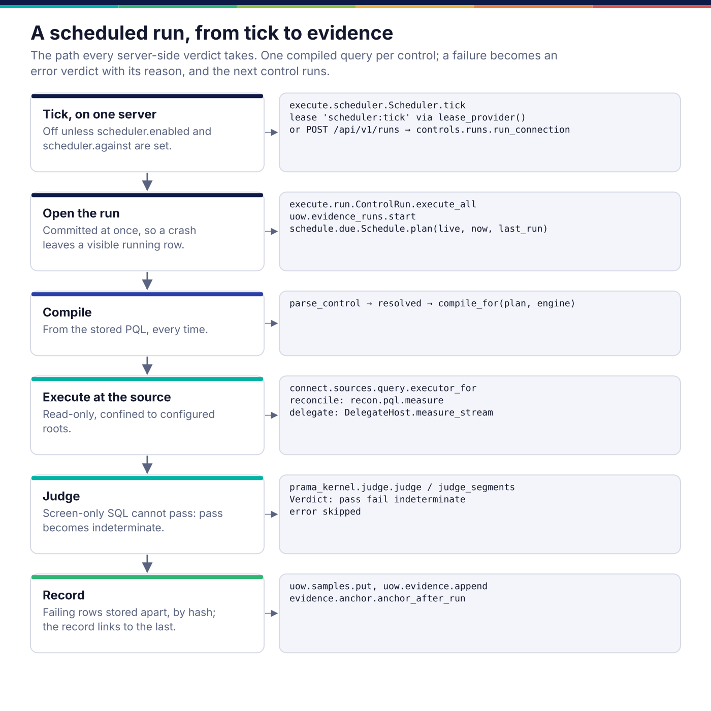
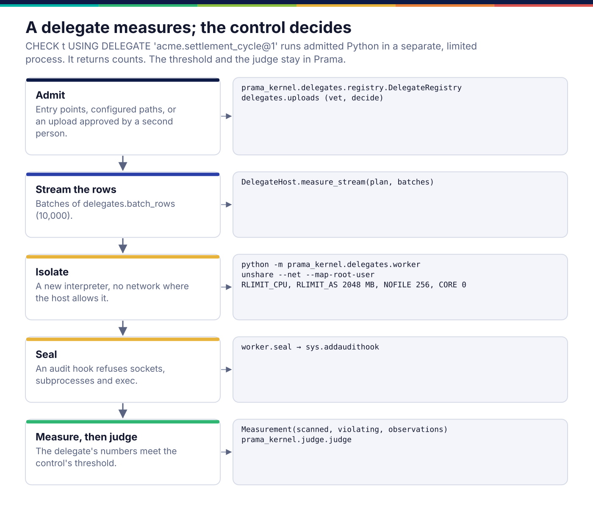
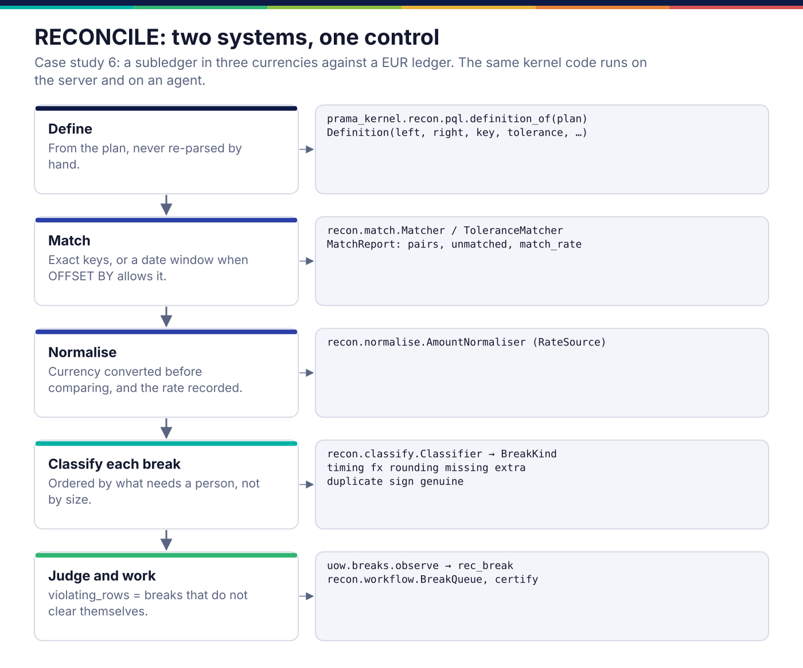
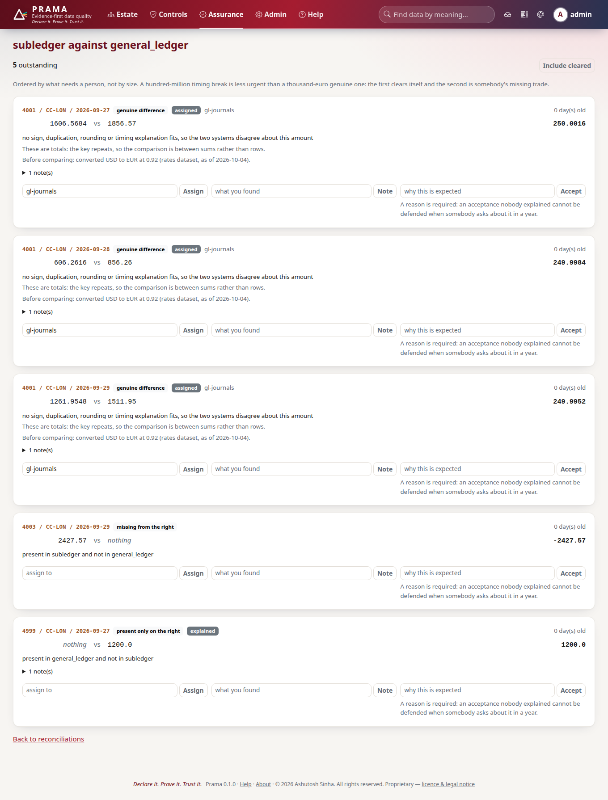

*Copyright © 2026 Ashutosh Sinha <ajsinha@gmail.com>. All rights reserved.*

---

# Execution: running a control where the data is

[← Architecture](README.md)

Prama is a control plane, not a data plane. It sends a query to the data and
reads back counts; rows travel only when a failing sample is kept, and then
under the source's read policy. This page covers how a source is reached
(connectors), how a compiled control is run and judged (the run, the scheduler,
the kernel's judge), and the two kinds of control whose measurement is code
rather than SQL (delegates and reconciliations). Running beside the data on a
customer machine is [agents-and-fleet.md](agents-and-fleet.md).

## Connectors: reaching a source

A connector is a class behind one ABC, `prama.connect.spi.Connector`. Every
connector answers five questions: `health()`, `discover(path)`, `describe(path)`,
`snapshot(path)` and `read(...)`; one that can run controls also answers
`run_metric_query(sql)` and declares its `pushdown_capabilities()`. Nine are
built in (`prama.connect.builtin.BUILTIN`): filesystem, SQLite, PostgreSQL,
object store, REST, JDBC (Oracle, SQL Server, DB2, Teradata, MySQL, Redshift,
Databricks, Synapse, Trino, BigQuery as dialects), Snowflake, ClickHouse and
MongoDB. Third-party connectors register through the prama.connectors entry
point.

Three design choices recur across the package:

- **The configuration form is derived from the connector's code.**
  `prama.connect.config_schema.ConfigSchemaDeriver` reads the fields a connector
  actually reads; a curated overlay may add presentation (secret, required, help
  text) but not invent a field. So the console's connection form cannot drift
  from what the connector accepts.
- **Capabilities are declared, not discovered by failure.**
  `prama.connect.capability.CapabilityMatrix` names what a connector can push
  down (aggregation, filter, window, regex, sampling, time travel …), so the
  compiler and the agent's capability matching speak the same vocabulary.
- **The source is protected from Prama.** `prama.connect.cost` estimates a scan
  before it runs, and `prama.connect.pacing.LoadPacer` keeps Prama's share of a
  source's time under its declared ceiling.

A connector that has never met the real system says so: the Snowflake
connector's own docstring states it has not been run against an account, and
[09 As built](../corpus/09-connectivity-and-formats.md) keeps the list.

**What a server-side run can open.** A run requested over the API opens its
connection through `prama.connect.sources.confined.open_confined`, which reads
three kinds of source: one SQLite file, one DuckDB file, or a directory of CSV,
Parquet and JSON-lines files. The path must lie under `runs.roots`, Prama's own
database may not, and DuckDB is fenced to those directories with external access
switched off, so a custom-SQL control cannot read `/etc` either. A source the
server cannot reach (a production PostgreSQL inside a customer network, say) is
run by an agent.

```yaml
# config/application.yaml (shipped for development)
runs:
  roots: [case-studies]             # e.g. [/data/landing, /data/warehouse]
```

```python
connection = client.connections.create(
    "warehouse (SQLite)", "sqlite",
    description="Case study 03: warehouse (SQLite)",
    config={"path": "/data/warehouse/warehouse.db"},
)
report = client.runs.start(connection["id"], datasets=["instrument_master"])
```

## A run, from tick to evidence



There is one definition of "run a control": `prama.execute.run.ControlRun`. The
CLI (`prama control run`), the API (`POST /api/v1/runs`), the scheduler and the
case studies all drive it, so there is one evidence format and one hash chain.

1. **Tick.** `Scheduler.tick` (`prama.execute.scheduler`) runs inside `prama serve`
   under the task supervisor. It first takes the database lease
   `scheduler:tick`, so with several servers exactly one runs each tick; the
   others record the tick as skipped. The scheduler is off unless configured:

   ```yaml
   scheduler:
     enabled: true
     interval: 60s
     against: /data/warehouse.duckdb   # a local .duckdb or .sqlite file
     dialect: duckdb
   tenancy:
     default_tenant: <your estate id>
   ```

2. **Open the run.** `ControlRun.execute_all` writes an `ev_run` row and commits
   it before doing anything else, so a crash leaves a visible `running` row
   instead of nothing. It reads the live controls and asks
   `prama.schedule.due.Schedule` which are due; a control is skipped with a
   reason (`not_due`, `waits_for_arrival`, `manual`, `unreadable`) rather than
   silently.
3. **Compile** each control from its stored PQL, every time. A compile failure is
   an `error` verdict with the reason, and the next control runs.
4. **Execute** the `metric_query` on the source. A reconciliation also runs its
   counterpart and rates queries; a delegate streams rows to its sandbox.
5. **Judge.** `prama_kernel.judge.judge` (or `judge_segments` for a segmented
   control, which fails if any segment fails) turns metrics and threshold into a
   verdict.
6. **Record.** Failing samples go to the sample store by content hash; the
   verdict becomes an `EvidenceRecord` appended to the chain; after the run, the
   chain head is anchored if an anchor is configured
   ([evidence-and-assurance.md](evidence-and-assurance.md)).


### Five verdicts, because two would lie

| Verdict | Meaning |
|---|---|
| `pass` | the exact test ran and found nothing above the threshold |
| `fail` | violations above the threshold, with counts and a sample where policy allows |
| `indeterminate` | the result cannot support a pass: for example, the SQL could only screen for a validator (an ISIN check digit, say) and the residual check has not run, so a zero is a lower bound |
| `error` | the control could not run, and says why |
| `skipped` | not run in this pass, with the reason |

The `indeterminate` rule is the one that most often surprises people.
`CompiledControl.is_complete` is false when a check could not be pushed down in
full; the judge then rewrites a `pass` to `indeterminate`, because a screen that
found nothing has not shown that nothing is wrong. The incidents page shows
these with that reason, not as passes.

### Not every engine, and not approximately

The compile targets are PostgreSQL, DuckDB and SQLite
(`prama.backend.dialect`), and a dialect never approximates: a function it
cannot express is refused at compile time. The conformance suite
(`prama.backend.conformance`) runs the same corpus of controls on every engine
and against the reference interpreter, and requires the same verdict, the same
metrics to nine decimal places and the same segments.

SQLite needs one switch to keep that promise. It reads a double-quoted column
name it cannot find as a string, so a control on a misspelled column would test
a constant and pass every row; DuckDB and PostgreSQL refuse it. Every SQLite
connection that runs a control, on the server or an agent, is opened through
`prama_kernel.strict_sqlite`, which turns that off (Python 3.12 or newer) or
refuses the connection.

### Built and not wired

`prama.execute.claim` (claims with fencing tokens) and
`prama.execute.worker.Worker` model a fleet of workers taking units from a queue,
and are exercised by `tests/execute/test_worker.py` and the soak tests. The
scheduler does not use them: it runs controls in-process, one query per control.
Assertion fusion likewise is used to show and cost plans, not by the scheduled
run ([controls-and-pql.md](controls-and-pql.md)).

## Delegates: when the check is code

Some checks are not expressible as a predicate: "each trade settles exactly its
market's cycle of business days after trading" needs a holiday calendar per
market. A **delegate** is a Python class that measures, named from PQL
(`CHECK trade_blotter USING DELEGATE 'acme.settlement_cycle@1' (…)`).



The division of labour is the whole design. The delegate returns a
`Measurement` (rows scanned, rows violating, named observations, samples); the
control's threshold and the kernel's judge decide the verdict. So a delegate
cannot pass a control, only count. It runs in a separate interpreter
(`python -m prama_kernel.delegates.worker`) with CPU, memory, file and core
limits, no network where the host allows `unshare`, a minimal environment, and
an audit hook that refuses sockets, subprocesses and `exec`. Which isolation
was used is recorded in the evidence.

A delegate reaches a host from an installed entry point, a configured directory,
or a console upload approved by **someone other than the uploader**, and each host
(the server and every agent) runs only what its own `delegates:` configuration
admits. The three ways in and every setting are in
[developer/delegates.md](../developer/delegates.md#registration-and-configuration).


```bash
prama delegate list                       # what this server admits
prama delegate test acme.x --rows s.csv   # run one exactly as a control would, sandboxed
```

## Reconciliation: two systems, one control



`RECONCILE subledger AGAINST general_ledger ON (…) COMPARING amount = balance_eur
WITHIN 0.01 EUR NORMALISING currency TO 'EUR' USING RATES fx_rates OFFSET BY 1
DAY` (case study 06) compiles to queries that fetch the two sides and the
rates. The comparison itself is kernel code (`prama_kernel.recon`), so an agent
reconciles exactly as the server does.

Each difference is classified as a `BreakKind`: `timing`, `fx`, `rounding`,
`missing`, `extra`, `duplicate`, `sign` or `genuine`. Only a timing break clears
itself, so the control's violating count is the breaks that need a person, and
the workbench orders breaks by that rather than by size: a hundred-million
timing break is less urgent than a thousand-euro genuine one. Breaks persist in
`rec_break` and move through open, assigned, explained, cleared or accepted; an
acceptance needs a written reason, and a period can be certified
(`prama.recon.workflow.certify`).



```python
(reconciliation,) = client.reconciliation.list()          # case study 06
bench = client.breaks.workbench(str(reconciliation["definition"]))
client.breaks.accept(break_id, "booked late by the Frankfurt desk; reverses on the 1st")
```

## Streaming

`prama.execute.stream` evaluates a control against one message,
`prama.execute.inflight` decides what happens to it (passed, tagged,
quarantined, blocked or unreadable), and `prama.execute.transport` decides when the offset may be
committed: after enforcement, never before. `prama.execute.kafka` is a
transport verified against a live broker. The rule and its trade-offs are set
out once, in [06 §3.4.1](../corpus/06-architecture.md#341-the-broker-seam-and-commit-ordering).

## Where it lives in the code

| Path | Responsibility |
|---|---|
| `src/prama/connect/spi.py`, `src/prama/connect/registry.py`, `src/prama/connect/builtin.py` | the connector ABC, entry-point registry, the nine built-ins |
| `src/prama/connect/sources/` | one module per source; `confined.py` for server-side runs, `query.py` for the CLI and scheduler |
| `src/prama/connect/capability.py`, `src/prama/connect/config_schema.py`, `src/prama/connect/cost.py`, `src/prama/connect/pacing.py` | pushdown vocabulary, derived config forms, scan cost, source load |
| `src/prama/connect/feed/` | feed arrival windows, filename patterns, trailers and manifests |
| `src/prama/backend/` | dialects, compiler, fusion, reference interpreter, conformance corpus |
| `src/prama/execute/run.py`, `src/prama/execute/scheduler.py` | `ControlRun`; the always-on scheduler |
| `src/prama/schedule/` | schedule strings, triggers, due planning, adaptive cadence, budgets |
| `src/prama/execute/stream.py`, `src/prama/execute/inflight.py`, `src/prama/execute/transport.py`, `src/prama/execute/kafka.py` | streaming evaluation, enforcement, commit ordering, Kafka |
| `kernel/src/prama_kernel/judge.py` | the judge (`prama.backend.execute` is its alias) |
| `kernel/src/prama_kernel/delegates/`; `src/prama/delegates/uploads.py`, `src/prama/delegates/vet.py`, `src/prama/delegates/testkit.py` | the delegate runtime; uploads, vetting, the conformance kit |
| `kernel/src/prama_kernel/recon/`; `src/prama/recon/service.py`, `src/prama/recon/workflow.py`, `src/prama/recon/workbench.py` | reconciliation; the break workflow and workbench |
| `src/prama/controls/runs.py` | a run requested over the API against a registered connection |

Extending: [connectors.md](../developer/connectors.md),
[backends-and-dialects.md](../developer/backends-and-dialects.md),
[delegates.md](../developer/delegates.md).

## Read more

- Connectivity, formats and the connector delivery plan:
  [09](../corpus/09-connectivity-and-formats.md).
- Evaluation semantics, nulls and thresholds:
  [07 §6](../corpus/07-rule-language-spec.md#6-semantics).
- Delegates, decisions and what is not built:
  [design/dq-delegates.md](../design/dq-delegates.md).
- Reconciliation in PQL: [07 §4.6](../corpus/07-rule-language-spec.md#46-reconciliation).

---

<div align="center">
<br/>
<sub><b>PRAMA</b> — <i>Declare it. Prove it. Trust it.</i><br/>
Copyright © 2026 <b>Ashutosh Sinha</b> &lt;ajsinha@gmail.com&gt; · All rights reserved.<br/>
Proprietary and confidential. No licence is granted except by separate written agreement.<br/>
See <a href="../../LICENSE">LICENSE</a> and <a href="../../NOTICE">NOTICE</a>. Third-party names and marks are the property of their respective owners.</sub>
</div>
