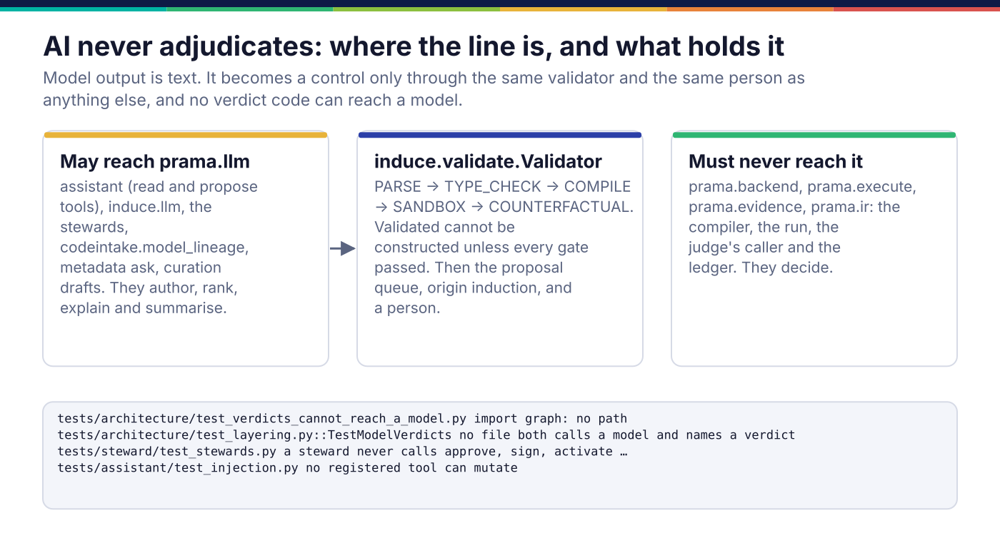
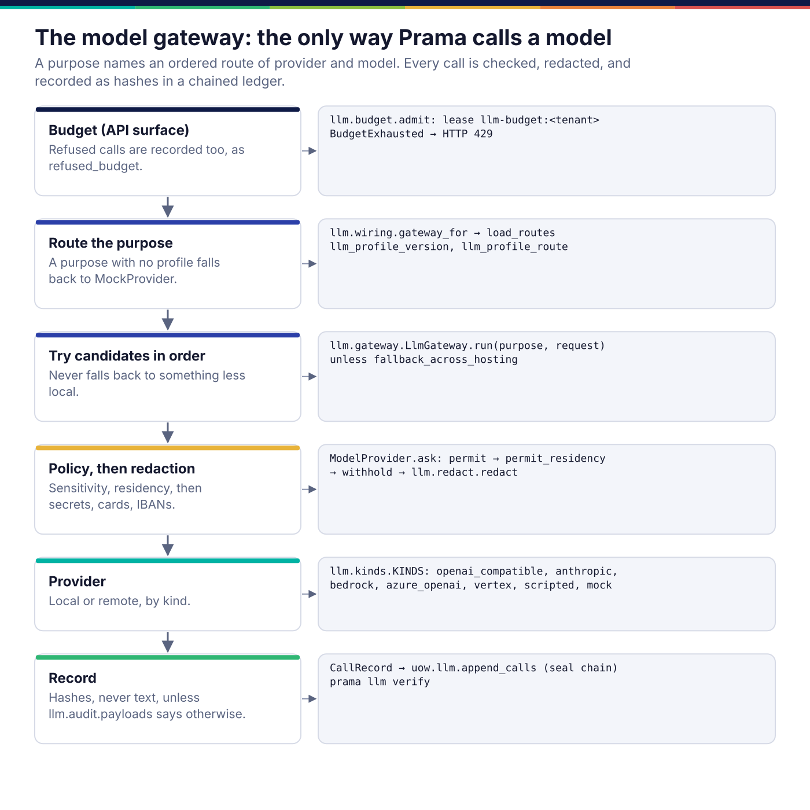

*Copyright © 2026 Ashutosh Sinha <ajsinha@gmail.com>. All rights reserved.*

---

# Intelligence: models that author, and the line they cannot cross

[← Architecture](README.md)

Prama uses language models where they are good: drafting a control from a
sentence, suggesting a lineage edge from a stored procedure, describing an
undocumented column, summarising an incident, ranking datasets by fitness for a
purpose. It never uses one to decide whether data passes. This page covers the
one door through which every model call passes (the gateway), the surfaces that
use it, and the mechanisms that keep model output away from verdicts.

## AI never adjudicates



The rule (`CON-007`, `NFR-AI-002`) is architectural, so it is enforced
architecturally rather than by review:

- **No verdict code can reach a model.**
  `tests/architecture/test_verdicts_cannot_reach_a_model.py` builds the import
  graph of the server and requires that `prama.llm` is unreachable from
  `prama.backend`, `prama.execute`, `prama.evidence` and `prama.ir`. Its
  counterfactual shows that `prama.assistant.agent` does reach it, so the graph is
  real.
- **No file does both.** `tests/architecture/test_layering.py::TestModelVerdicts`
  fails if any source file, docstrings stripped, both names a model client and
  names a verdict. Prose about the rule is ignored; a planted violation is caught.
- **Model output is only text, and text goes through the validator.**
  `prama.induce.validate.Validator` passes a drafted control through five gates:
  parse, type check, compile, a sandbox run over sample rows, and a
  counterfactual run over hostile probe rows the control must catch. The
  `Validated` type cannot be constructed unless every gate passed. A survivor is
  then an ordinary proposal with origin `induction` (the lowest authority, never
  auto-activated), and a person decides.
- **Agents that think cannot approve.** A steward's identity excludes
  `control:approve`, `attestation:sign` and the write scopes
  ([lineage-and-code.md](lineage-and-code.md)); the assistant's tool registry
  refuses any tool whose capability mutates.

The generators (`prama.derive`, `prama.mine`, `prama.classify`, `prama.induce`,
`prama.importers`) also may not import the database or the executor, so the only
way any of them reaches the estate is the proposal queue.

## The gateway



`prama.llm.gateway.LlmGateway` is the only code that calls a model provider. A
caller names a **purpose** (`author`, `lineage`, `curate`, `summarise`, …), not a
model; a **profile** maps the purpose to an ordered route of provider and model,
versioned in the database, so changing which model drafts controls is a reviewed
configuration change rather than a code change.

On each call:

1. **Budget.** Every gateway that `prama.llm.wiring.gateway_for` builds carries
   a `BudgetGuard` (`prama.llm.budget`), whoever built it: the API, stewards,
   code intake, fitness search, the CLI. Tenant, profile, principal and key
   budgets are checked before each call and charged after it; a refusal is
   recorded in the call ledger (HTTP 429 on the API). The API's chat endpoint
   also reserves its estimate under a lease, so concurrent servers see each
   other's in-flight spend.
2. **Route.** `prama.llm.wiring.gateway_for` loads the current profile versions.
   A purpose with no profile falls back to a mock, so a feature that would use a
   model degrades to its deterministic path rather than failing.
3. **Candidates in order.** A refusal by policy moves to the next candidate
   rather than retrying, and the gateway never falls back to a candidate *less
   local* than the first unless the profile says `fallback_across_hosting`.
4. **Policy, then redaction.** `ModelProvider.ask` checks the request's
   sensitivity against the provider's hosting (`hosted`, `tenant`,
   `self_hosted`), checks residency through the egress gate, and redacts secrets,
   Luhn-valid card numbers, valid IBANs and email addresses
   (`prama.llm.redact`) before anything leaves.
5. **Record.** A `CallRecord` of hashes, never text, is sealed into a hash chain
   (`llm_call`). Whether prompts and answers are also kept is
   `llm.audit.payloads`: `none`, `redacted` or `full`, with a retention period.

```bash
prama llm provider add local --kind openai_compatible --hosting self_hosted \
    --dialect ollama --endpoint http://localhost:11434   # no secret stored
prama llm profile set author --route local:qwen2.5-coder
prama llm ask author "a control that every trade has a positive notional"
prama llm verify                     # recompute the call ledger's hash chain
prama llm eval run suite.yaml        # deterministic graders; can gate activation
```

```yaml
llm:
  offline: false                    # true: only self-hosted models on a local or private address
  per_principal_rpm: 60             # requests per minute per principal through /api/v1/llm
  audit:
    payloads: none                  # none | redacted | full
    payload_retention_days: 30
  eval:
    gate_activation: false          # true: a version goes current only after a passing eval
```

A credential is a secret reference (`--credential-ref env://OPENAI_KEY`), never a
value ([platform.md](platform.md)). Provider kinds are OpenAI-compatible (vLLM,
Ollama, llama.cpp, LM Studio, TGI and OpenAI itself), Anthropic, Amazon Bedrock
(signed with a standard-library SigV4), Azure OpenAI and Vertex.


Through the SDK:

```python
client.models.add_provider("local", kind="openai_compatible", hosting="self_hosted",
                           endpoint="http://localhost:11434", dialect="ollama")
client.models.set_profile("author", ["local:qwen2.5-coder"])
answer = client.llm.chat("author", "every trade has a positive notional")
```

## The surfaces that use it

| Surface | What it does with a model | What it cannot do |
|---|---|---|
| Assistant (`prama.assistant`) | answers questions with read tools (datasets, controls, incidents, lineage) and may propose a control through the validator | no tool can mutate; untrusted results are fenced against prompt injection and outputs are scanned for leaks |
| MCP server (`prama mcp serve`) | exposes the assistant's **read** tools to an MCP client over stdio | it serves the read-only registry, with no propose tool, and refuses to start if any tool mutates |
| Induction (`prama.induce.llm`) | drafts PQL with grammar-constrained decoding, retrying with the validator's reason | everything it drafts goes through the validator and the queue |
| Lineage suggestion (`prama.codeintake.model_lineage`) | suggests edges from code the parsers could not read | an edge is kept only if its quote is verbatim, and is `inferred` until confirmed |
| Curation (`prama.curation`) and stewards | draft descriptions; summarise incidents | a person accepts or rejects each draft |
| Finding data (`prama metadata ask`) | ranks and explains a shortlist | the shortlist comes from deterministic retrieval |

The **PQL language server** (`prama lsp serve --catalogue cat.json`,
`prama.lsp`) is not a model surface at all. It speaks LSP over stdio and gives
an editor the same diagnostics, completion and hover as the console's studio,
from `prama.pql.analysis`, against a catalogue file exported with
`prama lsp catalogue`. It never connects to a database.

## Where it lives in the code

| Path | Responsibility |
|---|---|
| `src/prama/llm/spi.py`, `src/prama/llm/providers.py`, `src/prama/llm/kinds.py` | the provider ABC with its policy checks; the provider implementations; building one from a stored spec |
| `src/prama/llm/gateway.py`, `src/prama/llm/wiring.py` | routing, fallback, the call record and its chain; loading routes and persisting calls |
| `src/prama/llm/budget.py`, `src/prama/llm/redact.py`, `src/prama/llm/sigv4.py` | budgets and pricing; redaction; AWS signing |
| `src/prama/llm/templates.py`, `src/prama/llm/evaluation.py` | approved prompt templates; deterministic evaluation suites |
| `src/prama/induce/validate.py` | the five gates between model output and the queue |
| `src/prama/assistant/` | the assistant, its tool registry and its prompt-injection defences |
| `src/prama/mcp/`, `src/prama/lsp/` | MCP over stdio; the PQL language server |
| `tests/architecture/test_verdicts_cannot_reach_a_model.py` | the import-graph guard |

To add a model provider, see [llm-providers.md](../developer/llm-providers.md).

## Read more

- What AI does here, and what it deliberately does not:
  [08 §9](../corpus/08-ai-ml-capabilities.md#9-what-we-deliberately-do-not-do-with-ai)
  and [08 §3.3](../corpus/08-ai-ml-capabilities.md#33-llm-rule-induction--the-safety-contract).
- The gateway's design, its defects fixed and its phases:
  [design/llm-gateway.md](../design/llm-gateway.md).
- LLM and AI-specific security:
  [13 §4](../corpus/13-security-governance-compliance.md#4-llm-and-ai-specific-security).
- The chat interface and its safety contract:
  [10 §6](../corpus/10-ux-and-chat-interface.md#6-the-conversational-interface).

---

<div align="center">
<br/>
<sub><b>PRAMA</b> — <i>Declare it. Prove it. Trust it.</i><br/>
Copyright © 2026 <b>Ashutosh Sinha</b> &lt;ajsinha@gmail.com&gt; · All rights reserved.<br/>
Proprietary and confidential. No licence is granted except by separate written agreement.<br/>
See <a href="../../LICENSE">LICENSE</a> and <a href="../../NOTICE">NOTICE</a>. Third-party names and marks are the property of their respective owners.</sub>
</div>
