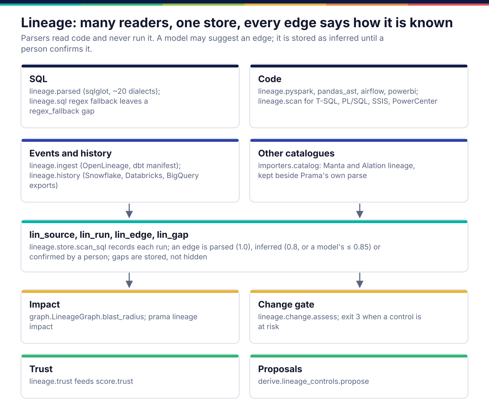
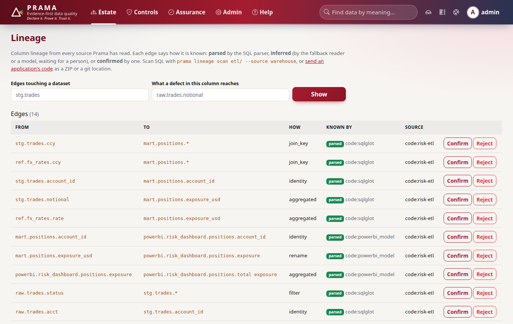
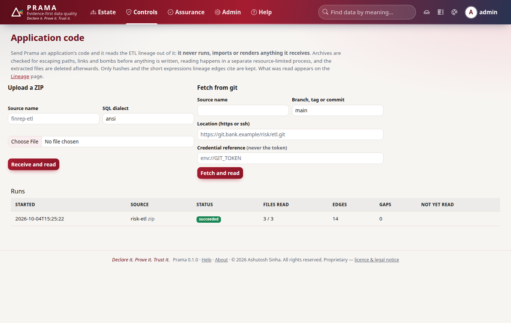
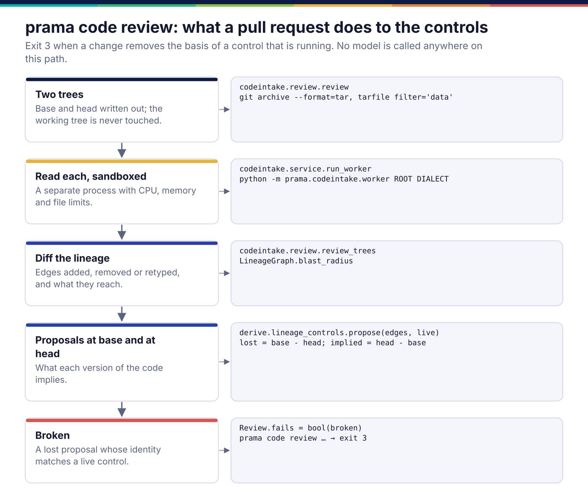
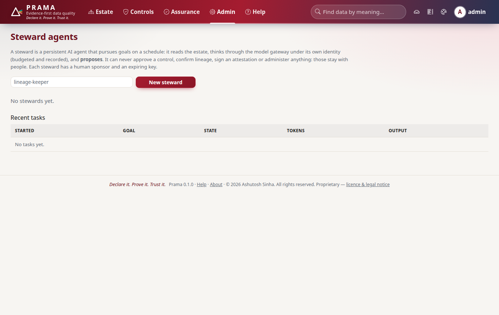

*Copyright © 2026 Ashutosh Sinha <ajsinha@gmail.com>. All rights reserved.*

---

# Lineage and code: what feeds what, and what a change breaks

[← Architecture](README.md)

Lineage answers two questions Prama needs: *where does a defect go* (so trust
propagates and an incident names its upstream suspects) and *what does a code
change break* (so a pull request that removes the basis of a running control is
stopped before it merges). Prama reads lineage out of SQL, application code,
OpenLineage events, dbt manifests, warehouse query history and other catalogues,
and keeps it in one store in which every edge says how it is known.

## One store, many readers



**Every edge carries its provenance.** In `lin_edge` an edge is `parsed` (read
by a deterministic parser), `inferred` (by the fallback reader, or suggested by a
model, waiting for a person) or `confirmed` by a person, and is bitemporal like a
declaration. A model-suggested edge is kept only if the quote it cites appears
verbatim in the cited lines and names both columns
(`prama.codeintake.model_lineage`), and its confidence is capped below a parsed
edge's. What a reader could not understand is stored as a **gap** in `lin_gap`
(an unparsed statement, dynamic SQL, a templated query, a UDF) rather than
silently dropped, so "14 edges" never means "14 edges and an unknown number we
missed".

**SQL first, regex as a named fallback.** `prama.lineage.sql.SqlLineage` splits a
script into statements and hands each to `prama.lineage.parsed`, which uses
sqlglot to follow columns through CTEs and subqueries in about twenty dialects
and emits filter and join-key edges as well as data edges. When sqlglot cannot
parse a statement, the pattern reader takes over and the run records a
`regex_fallback` gap and stores the edges as `inferred` at 0.8, so the
difference between parsed and guessed is visible on every edge.

**Code is read, never run.** The PySpark, pandas and Airflow readers parse the
Python syntax tree; the Power BI reader reads `.pbit` and `model.bim`; the
procedural scanner handles T-SQL, PL/SQL and DB2, flagging dynamic SQL as
opaque; the XML scanners read SSIS and PowerCenter exports. Joins, UDFs and
computed names are gaps, never guesses.

```bash
prama lineage scan etl/ --source warehouse      # SQL files into the store
prama lineage impact raw.trades.notional        # what a defect in this column reaches
prama lineage impact --diff before.sql after.sql   # exit 3 if a control is at risk
prama lineage history snowflake rows.json       # from a query-history export
prama lineage import export.json --from manta   # kept beside Prama's own parse
```



**Usage is a priority, never a score.** `prama.lineage.usage` counts reads from
query history to say which datasets matter most (`prama usage priorities`: most
used, least controlled). It deliberately never changes a score: popularity is not
quality.

## Code intake

A bank's lineage lives in application code it may not want to hand over. Code
intake (`prama.codeintake`) accepts a ZIP or a git location, reads it in a
sandbox, keeps only hashes and the short expressions lineage edges cite, and
deletes the tree afterwards.

- **Archives** are checked from the central directory before anything is
  written: path escapes, absolute paths, symlinks (recorded, never created),
  compression-ratio bombs, too many entries and oversized files are refused.
- **Git** accepts only `https` and `ssh`, refuses private, loopback and metadata
  addresses, clones shallow with hooks, `file`/`ext` transports and submodules
  disabled, and passes a token through the environment, never argv. The token
  is a secret reference (`env://GIT_TOKEN`), never the token.
- **Reading** happens in `python -m prama.codeintake.worker` with CPU, memory and
  file limits.



## Reviewing a change



`prama code review --base origin/main --format markdown` answers the question a
reviewer of an ETL pull request cannot answer by reading the diff: which running
controls does this change remove the basis for? It writes the base and head
trees with `git archive` (the working tree is never touched), reads both in the
sandbox, diffs the edges, and runs `prama.derive.lineage_controls.propose` over
each version. A proposal implied by the base and not by the head, whose identity
matches a live control, is **broken**, and the command exits 3. No model is
called anywhere on the path, so the gate is deterministic and can sit in CI.

```python
result = client.code.review("base.zip", "head.zip")   # paths or bytes
if result["fails"]:
    print(result["markdown"])     # the pull-request comment
```

## Steward agents

A **steward** is a persistent AI agent with a goal and a schedule: summarise
incidents, refresh a code source's lineage, draft descriptions for undescribed
attributes, collect lineage proposals. It reads the estate, thinks through the
model gateway under its own identity (so its calls are budgeted and recorded),
and **proposes**. It is a different thing from a fleet agent
([agents-and-fleet.md](agents-and-fleet.md)), which runs controls and has no
model at all.

What a steward may not do is fixed in its identity, not in its prompt:
`prama.steward.identity.FORBIDDEN` excludes `control:approve`,
`attestation:sign`, `declaration:write`, `relationship:write` and `admin`, and
`check_scopes` refuses to create a steward holding any of them. Each steward has
a human sponsor and a key that expires. A task that needs a person parks
(`prama.steward.protocol.ask`) until somebody decides; a kill switch is read
from the database before every task. `tests/steward/test_stewards.py` fails if
the package ever calls `approve`, `accept`, `activate`, `sign`, `confirm`,
`decide` or `suppress`.



## Integration outward

`prama.integrate.catalog` writes a badge per dataset (healthy, failing, not
established, unproven, uncovered) back to Collibra, Alation or DataHub through
the egress gate. `prama.integrate.operator` holds the reconcile decision for a
Kubernetes `PramaEstate` resource (`deploy/operator/crds/pramaestate.yaml`):
create, amend, unchanged, conflict, orphaned; drift is reported, never
overwritten, and nothing is deleted or activated. As built, the decision and the
CRD exist and are tested; the controller loop that watches a cluster is not
built.

## Where it lives in the code

| Path | Responsibility |
|---|---|
| `src/prama/lineage/sql.py`, `src/prama/lineage/parsed.py` | statement splitting, the regex reader and dispatch; the sqlglot reader |
| `src/prama/lineage/pyspark.py`, `src/prama/lineage/pandas_ast.py`, `src/prama/lineage/airflow.py`, `src/prama/lineage/powerbi.py`, `src/prama/lineage/scan.py` | code readers |
| `src/prama/lineage/ingest.py`, `src/prama/lineage/history.py` | OpenLineage and dbt; warehouse query history |
| `src/prama/lineage/store.py`, `src/prama/lineage/graph.py` | `scan_sql` into the store; the graph and its blast radius |
| `src/prama/lineage/change.py`, `src/prama/lineage/trust.py`, `src/prama/lineage/usage.py` | the change gate; local trust; usage counts |
| `src/prama/codeintake/` | archive and git intake, inventory, the sandboxed worker, model suggestions, change review |
| `src/prama/steward/` | identity and scopes, task protocol, runner, tools, facts |
| `src/prama/integrate/` | catalogue write-back, the operator's reconcile decision |
| `src/prama/derive/lineage_controls.py` | controls implied by lineage |

Extending: [code-readers.md](../developer/code-readers.md),
[importers.md](../developer/importers.md).

## Read more

- The plan, its waves and what lineage deliberately does not do:
  [23](../corpus/23-intelligence-and-lineage-roadmap.md).
- The design of code-to-lineage and stewards:
  [design/code-lineage-and-steward-agents.md](../design/code-lineage-and-steward-agents.md).
- Closing the gap to Manta and Alation:
  [design/gap-manta-alation.md](../design/gap-manta-alation.md).
- Catalogue write-back as built:
  [09 §16.1](../corpus/09-connectivity-and-formats.md#161-catalogue-write-back-as-built).

---

<div align="center">
<br/>
<sub><b>PRAMA</b> — <i>Declare it. Prove it. Trust it.</i><br/>
Copyright © 2026 <b>Ashutosh Sinha</b> &lt;ajsinha@gmail.com&gt; · All rights reserved.<br/>
Proprietary and confidential. No licence is granted except by separate written agreement.<br/>
See <a href="../../LICENSE">LICENSE</a> and <a href="../../NOTICE">NOTICE</a>. Third-party names and marks are the property of their respective owners.</sub>
</div>
