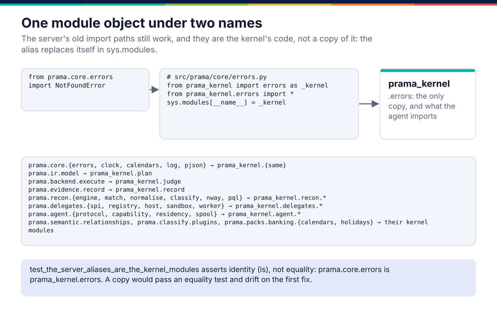

*Copyright © 2026 Ashutosh Sinha <ajsinha@gmail.com>. All rights reserved.*

---

# Packages: four distributions, one direction of import

[← Architecture](README.md)

Prama is one repository and four installable packages. The split is not
organisational tidiness. Each boundary exists because something has to be true
on a machine the server cannot see, and the only reliable way to keep it true is
to make the wrong import fail the build.


| Distribution | Import name | Source | Depends on | Installed where |
|---|---|---|---|---|
| `prama` | `prama` | `src/prama` | FastAPI, SQLAlchemy, DuckDB, pyarrow, sqlglot, Jinja2 … and `prama-kernel` | the control plane |
| `prama-kernel` | `prama_kernel` | `kernel/src/prama_kernel` | the standard library (orjson if present) | everywhere the other two are |
| `prama-sdk` | `prama_sdk` | `sdk/src/prama_sdk` | `httpx`, `PyYAML` | any client |
| `prama-agent` | `prama_agent` | `agent/src/prama_agent` | `prama-kernel`, `prama-sdk`, `PyYAML`; `duckdb` or `psycopg` as extras | a customer machine beside the data |

In a development checkout, `uv sync` installs the three smaller packages
editable from their directories (`[tool.uv.sources]` in `pyproject.toml`), and
the server's `dev` extra pulls in the SDK and the agent so their tests can run
against a real server. The server itself never imports either.

## Why a kernel

An agent judges a control on a machine inside a customer's network and reports
the verdict. The server judges the same control when it runs it itself. If those
two judgements came from two copies of the code, they would agree by intention,
and intention is the thing that rots: the first bug fixed in one copy and not
the other makes the same control mean two things.

So everything a verdict depends on lives once, in `prama_kernel`:

| Kernel module | What it holds |
|---|---|
| `plan` | the IR: `ControlPlan`, `Scope`, `Metric`, `Threshold`, `Verdict`, `IR_VERSION` |
| `judge` | `judge`, `judge_segments`: metrics and threshold in, verdict out |
| `record`, `samples` | `EvidenceRecord`, its hash chain and tombstone; the sample store |
| `recon/` | matching, normalisation, break classification, the RECONCILE measure |
| `delegates/` | the delegate SPI, registry, host, sandbox and worker |
| `agent/` | protocol messages, capability matching, residency, spool, signing |
| `calendars`, `banking_calendars`, `holidays` | business calendars computed from rules |
| `relationships`, `plugins`, `errors`, `clock`, `pjson`, `log` | the primitives these share |

What is deliberately *not* in it: the PQL compiler, the database, the API. An
agent receives compiled SQL and never compiles its own, so it needs no compiler,
and a second compiler in the estate is exactly how one control comes to mean two
things on two machines.

## The alias mechanism



Moving code into the kernel would normally mean rewriting every import in the
server and its tests. Instead each moved module leaves behind a three-line
alias, for example `src/prama/core/errors.py`:

```python
import sys

from prama_kernel import errors as _kernel
from prama_kernel.errors import *  # noqa: F403  (the names, for type checkers)

sys.modules[__name__] = _kernel
```

When Python finishes importing `prama.core.errors`, it returns whatever is in
`sys.modules["prama.core.errors"]`, and the alias has put the kernel's module
object there. So `prama.core.errors is prama_kernel.errors` is true: one module,
two names, one set of class objects. An exception raised as
`prama_kernel.errors.NotFoundError` is caught by an `except` that imported it
from `prama.core.errors`, which would not be true of a copy.

The star import is for type checkers and editors, which read the file rather
than run it. New code imports the kernel path directly; the alias is for the
code that already existed.

There are 27 aliases:

| Server path | Kernel module |
|---|---|
| `prama.core.errors`, `clock`, `calendars`, `log`, `pjson` | `prama_kernel.errors`, `clock`, `calendars`, `log`, `pjson` |
| `prama.ir.model` | `prama_kernel.plan` |
| `prama.backend.execute` | `prama_kernel.judge` |
| `prama.evidence.record` | `prama_kernel.record` |
| `prama.recon.engine`, `match`, `normalise`, `classify`, `nway`, `pql` | `prama_kernel.recon.*` |
| `prama.delegates.spi`, `registry`, `host`, `sandbox`, `worker` | `prama_kernel.delegates.*` |
| `prama.agent.protocol`, `capability`, `residency`, `spool` | `prama_kernel.agent.*` |
| `prama.semantic.relationships`, `prama.classify.plugins` | `prama_kernel.relationships`, `prama_kernel.plugins` |
| `prama.packs.banking.calendars`, `holidays` | `prama_kernel.banking_calendars`, `holidays` |

One consequence to know when reading the code: a class named in an alias
module's path (say, `ControlPlan` "in" `prama.ir.model`) is defined in the
kernel file, so search there.

## What enforces the boundaries

Two test modules turn the package rules into build failures.

**`tests/architecture/test_packages_standalone.py`** holds the four packages
apart:

- *No reverse import.* An AST scan of every module: the SDK never imports
  `prama`, the server never imports `prama_sdk` or `prama_agent`, the kernel
  imports none of the other three, the agent never imports `prama`.
- *Each package runs without the server.* A meta-path finder (`NoServer`) makes
  `prama` unimportable, and the SDK, the kernel, and a full agent cycle (with a
  fake link) are run in that interpreter. `test_the_isolation_can_fail` proves
  the block actually bites, so the test cannot pass by accident.
- *Each wheel is what it says.* The SDK, kernel and agent wheels are built and
  inspected: they carry only their own package and require only their declared
  dependencies (the SDK: `httpx` and `PyYAML`; the kernel: nothing).
- *Aliases are identities.* `test_the_server_aliases_are_the_kernel_modules`
  asserts `is`, not `==`.
- *Errors survive the wire.* Every server error class reaches an SDK caller as
  the SDK class mapped to its HTTP status.

**`tests/architecture/test_layering.py`** holds the layers inside the server:
only `prama.db` imports SQLAlchemy; no module branches on the database dialect
outside `prama.db.dialects` and `prama.db.settings`; no migration tooling and no `create_all`; no bare
threads, unbounded queues or fire-and-forget tasks outside
`prama.core.concurrency`; PQL does not import the IR or a backend; the generators
(`prama.derive`, `prama.mine`, `prama.classify`, `prama.induce`,
`prama.importers`) never import the database or the executor, so a proposal can
only reach the estate through the queue; and no module both calls a model and
produces a verdict. Each guard has a counterfactual test showing it fires.

## Example: proving the boundary yourself

```bash
uv build --wheel sdk        # the SDK alone, as a client installs it
uv build --wheel agent
pytest -q tests/architecture/test_packages_standalone.py
pytest -q tests/agent_daemon   # the daemon's loop, spool, residency, signals, CLI
```

The version string has one authority, `src/prama/version.py`; the copies in the
SDK, kernel and agent are policed by `scripts/check_version_source.py`.

## Where it lives in the code

| Path | Responsibility |
|---|---|
| `pyproject.toml` | the server distribution, its extras, and the editable sources of the other three |
| `kernel/pyproject.toml`, `sdk/pyproject.toml`, `agent/pyproject.toml` | the three smaller distributions and their (short) dependency lists |
| `src/prama/core/errors.py` (and the 26 others above) | aliases of kernel modules |
| `tests/architecture/test_packages_standalone.py` | the package boundaries, by AST scan, isolated interpreter and wheel inspection |
| `tests/architecture/test_layering.py` | the layer rules inside the server |
| `scripts/check_version_source.py` | the version has one authority |

To add a module to the kernel, or a method to the SDK, see the developer guides
([sdk-methods.md](../developer/sdk-methods.md), [README](../developer/README.md)).

## Read more

- Why the agent is a separate package, and what it must never do:
  [22 Distributed Execution](../corpus/22-distributed-execution.md).
- The package layout the stack document originally proposed, and how it differs:
  [18 §8](../corpus/18-technology-stack.md#8-modularity-contract).

---

<div align="center">
<br/>
<sub><b>PRAMA</b> — <i>Declare it. Prove it. Trust it.</i><br/>
Copyright © 2026 <b>Ashutosh Sinha</b> &lt;ajsinha@gmail.com&gt; · All rights reserved.<br/>
Proprietary and confidential. No licence is granted except by separate written agreement.<br/>
See <a href="../../LICENSE">LICENSE</a> and <a href="../../NOTICE">NOTICE</a>. Third-party names and marks are the property of their respective owners.</sub>
</div>
