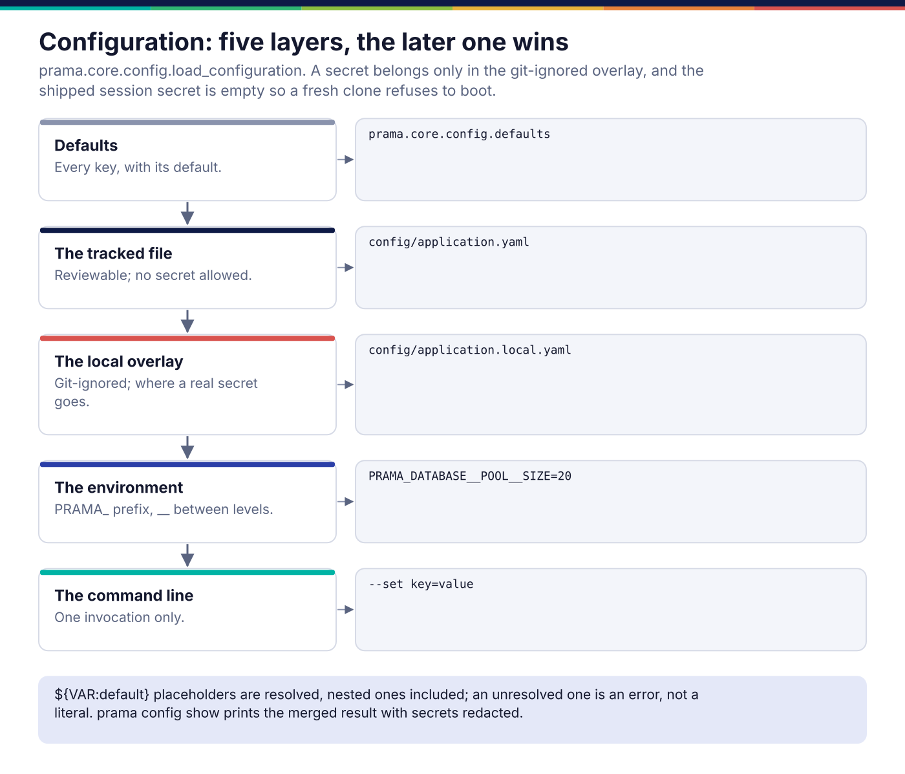
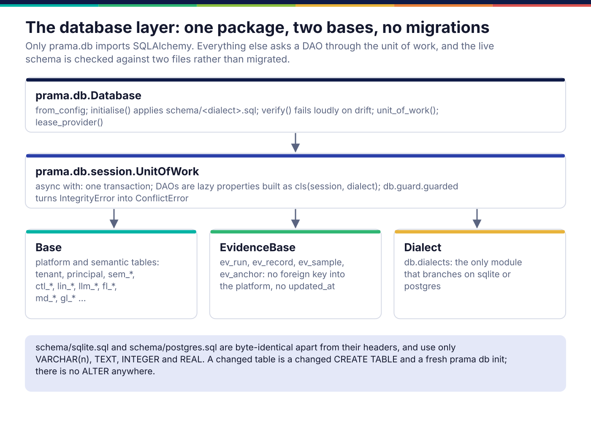
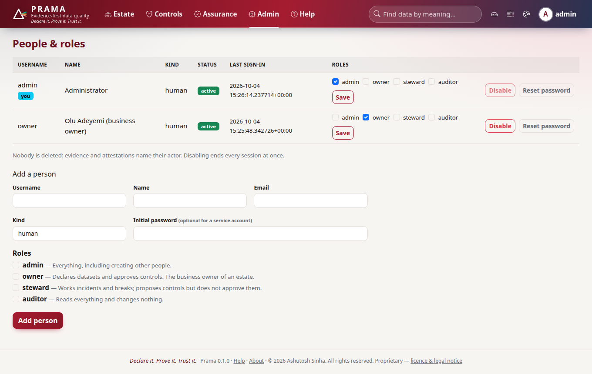

*Copyright © 2026 Ashutosh Sinha <ajsinha@gmail.com>. All rights reserved.*

---

# Platform: configuration, the database, security and the surfaces

[← Architecture](README.md)

This is the skeleton every other page hangs on: how configuration is loaded,
how work is run concurrently, how the database is reached, who may do what, where
secrets come from, and how the API, the console and the CLI are put together.
Most of it is deliberately boring. The few unusual choices (no migrations, two
declarative bases, no bare threads, secrets only by reference) each exist
because the usual choice fails in a way that is expensive to discover late.

## Configuration



`load_configuration` (`prama.core.config`) merges five layers, later winning:
the defaults in `prama.core.config.defaults`, `config/application.yaml`
(tracked), `config/application.local.yaml` (git-ignored, added automatically as
an overlay), `PRAMA_`-prefixed environment variables (`__` between levels:
`PRAMA_DATABASE__POOL__SIZE`), and `--set key=value` on the command line.
`${VAR:default}` placeholders are resolved, nested ones included, and an
unresolved one is an error rather than a literal string.

The shipped session secret is empty on purpose:

```yaml
security:
  # Deliberately empty. Prama refuses to serve without it, so that a fresh
  # clone can never run on a value that is in a public repository.
  session_secret: ""
  cookies_https_only: true          # false only for local http development
  bootstrap_admin: true

tenancy:
  # Name the single tenant here and the console needs no sign-in to read.
  # Empty means multi-tenant: an unauthenticated request is refused, not guessed.
  default_tenant: ""

server:
  host: 127.0.0.1                    # bind address; 0.0.0.0 accepts on every interface
  port: 5900                        # the console and the API share this listener
```

A fresh clone therefore refuses to boot until somebody writes a secret into the
untracked overlay, and the pre-commit hook refuses a non-empty secret in a
tracked file. `prama config show` prints the merged result with secrets
redacted. Every key, with its default, is in the generated
[configuration reference](../operations/configuration-reference.md).

## Concurrency

`prama.core.concurrency` is the only place threads and queues are made:
`TaskSupervisor` (supervised task groups with restart policies),
`BoundedQueue` (bounded by bytes, not item count, so one large item cannot
exhaust memory), `ConcurrencyLimiter` and `RateLimiter`, and `LeaseProvider`.
`tests/architecture/test_layering.py` fails the build on a bare thread, an
unbounded queue or a fire-and-forget task anywhere else. The reason is that each
of those fails silently under load: a thread nobody joins, a queue that grows
until the process is killed, a task whose exception nobody sees.

Leases are how several servers share work without a coordinator.
`prama.db.lease_provider.DatabaseLeaseProvider` takes a lease with an atomic
conditional insert or update on the `lease` table and hands out monotonically
increasing fencing tokens. The scheduler's tick, the LLM budget reservation and
steward tasks all use it. `concurrency.lease.provider` chooses it (`database`) or
an in-process provider (`memory`, one process only), and the lease's `ttl`,
`renew_interval` and `clock_skew_allowance` come from the same block.

## The database layer



**Only `prama.db` imports SQLAlchemy.** Everything else asks a DAO through a
`UnitOfWork`. `Database.unit_of_work()` returns one; used as `async with`, it is
one transaction, committed on success and rolled back on an exception. DAOs are
lazy properties named for their domain (`uow.controls` is a `ControlDao`,
`uow.evidence` an `EvidenceDao`, `uow.fleet` a `FleetDao`), with domain logic
beside the columns it governs. Failures are translated by `prama.db.guard`
(`IntegrityError` becomes `ConflictError`) and propagate; a DAO never returns a
sentinel meaning "something went wrong".

**Two declarative bases.** `Base` owns the platform and semantic schema;
`EvidenceBase` owns the evidence ledger, so nothing done to the platform tables
can cascade into evidence ([evidence-and-assurance.md](evidence-and-assurance.md)).

**No migrations.** The schema is two hand-written files, `schema/sqlite.sql` and
`schema/postgres.sql`, byte-identical apart from their headers
(`tests/db/test_schema.py`), using only `VARCHAR(n)`, `TEXT`, `INTEGER` and
`REAL` so a constraint means the same on both engines. `prama db init` applies
the file idempotently (`CREATE … IF NOT EXISTS`, never `ALTER`); `prama db
verify` compares the live database with the file and fails loudly on drift
(`prama.db.schema.verifier`). A changed table is a changed `CREATE TABLE` and a
fresh database. Identifiers are ULIDs minted client-side, so a worker needs no
round trip to get an id and a retry can reuse one.

The dialect is configuration (`database.dialect: sqlite | postgres`, SQLite by
default), and `prama.db.dialects` is the only module that branches on it.

The 75 tables, by prefix: platform (`tenant`, `principal`, `role`, `api_key`,
`audit_event`, `lease`, `setting`, …), `sem_*` semantic layer, `ctl_*` controls,
`ev_*` evidence, `att_attestation`, `rec_break`, `llm_*` gateway, `lin_*` lineage,
`code_*` code intake, `agt_*` stewards, `fl_*` fleet, `gl_*` glossary, `md_*`
metadata, `cm_comment`, `us_*` usage, `sx_vector`, `dq_delegate_upload`.

### Example: one SDK call, every layer

`client.controls.declare(pql, identity="positions-eod-key")`:

1. `prama_sdk.resources.controls.Controls.declare` posts to `/controls`;
   `prama_sdk.transport.SyncTransport` adds `Authorization: Bearer <key>` and
   maps any error status back to an SDK exception class.
2. `prama.api.routes.controls` handles `POST /api/v1/controls`. Its parameters
   are `caller: ControlProposer` (from `prama.api.deps.scoped("control:propose")`,
   which authenticates the key and checks the scope) and `uow: Uow`
   (`prama.api.deps.get_uow`: one unit of work per request).
3. The route calls `uow.controls.declare(..., status="proposed",
   authored_by=caller.principal_id)`. If the identity exists the DAO amends the
   control with a new version (or leaves it unchanged when the text is
   identical); otherwise it creates it.
4. `ctl_control` and `ctl_control_version` are written; the unit of work commits
   when the request ends.
5. A `PramaError` anywhere becomes a problem document (`prama.api.errors`):
   not found 404, conflict 409, validation 422, unauthorised 401, forbidden 403,
   schema drift 503, budget exhausted 429.

This route calls the DAO directly; most domain operations go through a service
module so the console, CLI and API share them.

## Security

| Module | What it decides |
|---|---|
| `prama.security.accounts`, `prama.security.people` | built-in roles (admin, owner, steward, auditor), role granting; disabling a person ends every session and key at once; nobody is deleted, because evidence names its actor |
| `prama.security.scopes` | the scope vocabulary and the one matcher; a key carries only scopes its holder already has |
| `prama.security.oidc`, `prama.security.scim` | ID-token verification (refuses `alg:none` and HMAC confusion); directory provisioning, where a DELETE deactivates |
| `prama.security.residency`, `prama.security.egress` | whether data may cross a border (refused by default, unknown refused); every place data leaves is registered and passes the residency gate |
| `prama.security.cmk`, `prama.security.bundle` | envelope encryption under a customer-managed key; sealed and signed offline bundles for air-gapped installs |
| `prama.security.siem`, `prama.security.soc2` | audit events as ECS JSON lines or CEF; SOC 2 readiness, gaps first |

The egress registry is derived from imports, not maintained by hand: a module
that can reach the network and is not registered fails the build.




## Secrets

A secret is never a value in configuration or the database; it is a
**reference**, `scheme://location[#key]`, resolved when used:
`env://PRAMA_PG_PASSWORD`, `file:///run/secrets/pg`, or a HashiCorp Vault KV v2
path through the `vault` provider, configured under `secrets.vault` (an address,
and a *reference* to the token). `prama.secrets.resolver.SecretResolver`
caches with expiry and records each access; a resolved `SecretValue` prints as
`<secret>` and yields its text only through `.reveal()`, so it cannot leak into a
log by accident. The connection form, the model provider and git intake all take
a reference.

## Telemetry

`GET /metrics` serves Prama's own metrics in Prometheus text, with a cap on label
cardinality that folds extra series into `other`. Tracing (OTLP over HTTP) and
OpenLineage data-quality facets are off by default and, when on, go through the
egress gate like any other outbound data. See
[observability](../operations/observability.md).

## The surfaces

**API.** `prama.api.app.create_app` builds the FastAPI application: correlation
ids and metrics middleware, the shipped packs installed, health probes at the
root, and every module under `src/prama/api/routes/` that defines a `router`
included under `/api/v1` by `discover()` in
`src/prama/api/routes/__init__.py`. Adding a route module is
enough to publish it; `tests/sdk/test_parity.py` then fails until the SDK has a
method for it.

**Console.** `prama.web.webapp.mount_ui` mounts the console on the same
application when `web.enabled` is set: it refuses to start without a session
secret, sets security headers and a session cookie, and instantiates the page
classes listed in `ROUTE_CLASSES`
(`src/prama/web/routes/__init__.py`). Pages are server-rendered Jinja with
vendored assets and no build step, so the console renders in an air-gapped
install. The help centre (`prama.web.help_catalog`) renders the shipped guides
and the documents under `docs/` from their source files, so help and
documentation cannot disagree.


**CLI.** `prama.cli.main.main` builds every command group (`prama db`,
`prama control`, `prama llm`, `prama lineage` …) from `prama.cli.commands`. Each
inherits `--config`, `--set`, `--log-level` and `--json`, and opens the database
in-process. Exit codes are shared: 0 success, 1 an explained error, 2 usage, 3
a gate that refused (drift, a breached contract, a broken control, an anchor
not taken). The full list is the generated
[CLI reference](../operations/cli-reference.md).

**Plugins.** `prama.plugins.bootstrap` is the one place third-party code is
loaded, called by `create_app` and by the CLI's `Application.run` after the
configuration is known. It installs the shipped packs, then runs the loader for
each group in `plugins.entry_point_groups`: `"prama.connectors"`,
`"prama.monitors"`, `"prama.notifiers"` and `"prama.validators"`, each into the
registry for its base class, once per process. `plugins.disabled` keeps a
plugin out by entry-point name or key (it is never imported), and a plugin
cannot take a shipped plugin's key. A group with no loader fails the build
(`tests/architecture/test_plugin_groups.py`); `"prama.backends"` and
`"prama.scorers"` were removed for having no seam to fill.

**Packs.** `prama.packs.banking` is the first domain pack, installed by
`install_shipped` in `prama.packs`: a concept ontology, message-format parsers (FIX,
ISO 20022, ISO 8583, SWIFT MT, FpML, COBOL copybooks), regulatory obligations
(BCBS 239), reconciliation templates and business calendars. `prama pack claims`
lists what the pack does *not* claim to discharge.

## Where it lives in the code

| Path | Responsibility |
|---|---|
| `src/prama/core/config/` | layered configuration, placeholders, coercion |
| `src/prama/core/concurrency/` | supervisor, bounded queues, limiters, leases |
| `src/prama/core/registry.py`, `src/prama/plugins.py`, `src/prama/core/provenance.py`, `src/prama/core/ids.py` | plugin registry; the plugin bootstrap; origins and provenance; ULIDs |
| `src/prama/db/session.py`, `src/prama/db/dao/`, `src/prama/db/models/` | unit of work, DAOs, ORM models |
| `src/prama/db/schema/` | schema loading, idempotent apply, drift verification |
| `src/prama/db/dialects.py`, `src/prama/db/guard.py`, `src/prama/db/lease_provider.py`, `src/prama/db/temporal.py` | the dialect seam; error translation; leases; bitemporal versioning |
| `schema/sqlite.sql`, `schema/postgres.sql` | the schema, the authority |
| `src/prama/security/`, `src/prama/secrets/`, `src/prama/telemetry/` | access, residency, egress; secret references; metrics and tracing |
| `src/prama/api/app.py`, `src/prama/api/deps.py`, `src/prama/api/errors.py`, `src/prama/api/routes/` | the HTTP API |
| `src/prama/web/` | the console and the help centre |
| `src/prama/cli/` | the command line |
| `src/prama/packs/banking/` | the banking domain pack |

Extending: [schema-and-daos.md](../developer/schema-and-daos.md),
[api-and-console.md](../developer/api-and-console.md),
[sdk-methods.md](../developer/sdk-methods.md),
[secrets-and-leases.md](../developer/secrets-and-leases.md),
[packs.md](../developer/packs.md).

## Read more

- Principles, deployment topologies and the key decisions:
  [06](../corpus/06-architecture.md#1-architectural-principles).
- The stack and what was reused from DishtaYantra:
  [18](../corpus/18-technology-stack.md).
- Identity, residency, secrets, keys and evidence:
  [13](../corpus/13-security-governance-compliance.md).
- Entities and endpoints: [14](../corpus/14-data-model-and-apis.md).

---

<div align="center">
<br/>
<sub><b>PRAMA</b> — <i>Declare it. Prove it. Trust it.</i><br/>
Copyright © 2026 <b>Ashutosh Sinha</b> &lt;ajsinha@gmail.com&gt; · All rights reserved.<br/>
Proprietary and confidential. No licence is granted except by separate written agreement.<br/>
See <a href="../../LICENSE">LICENSE</a> and <a href="../../NOTICE">NOTICE</a>. Third-party names and marks are the property of their respective owners.</sub>
</div>
