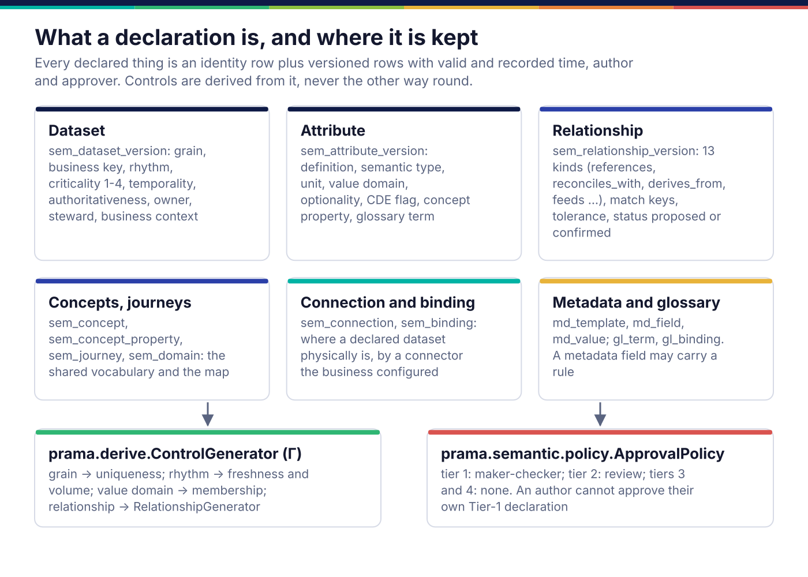
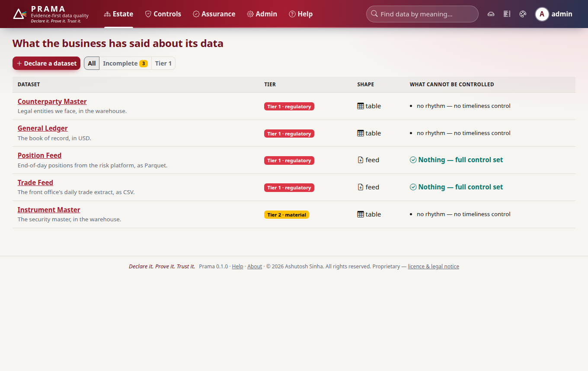
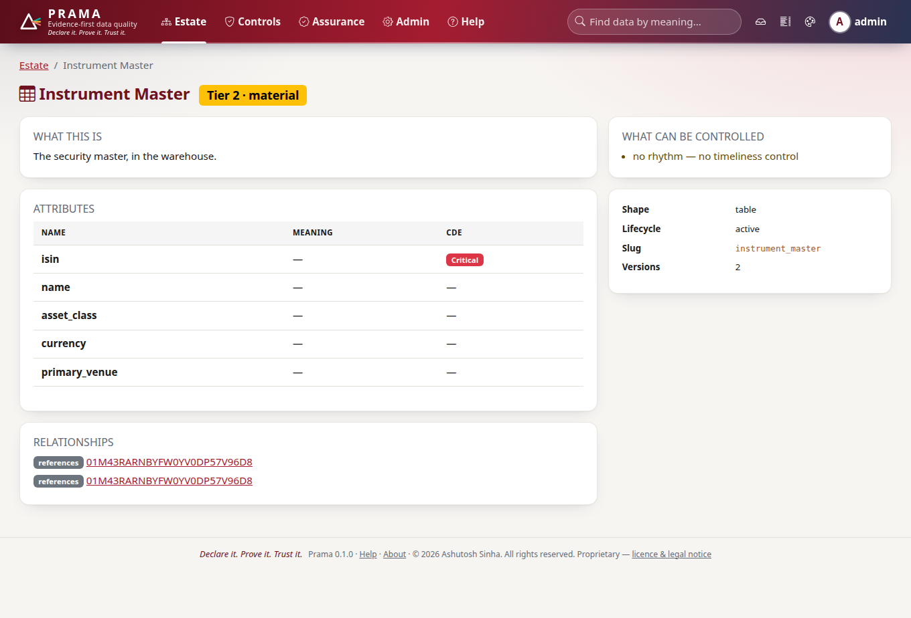
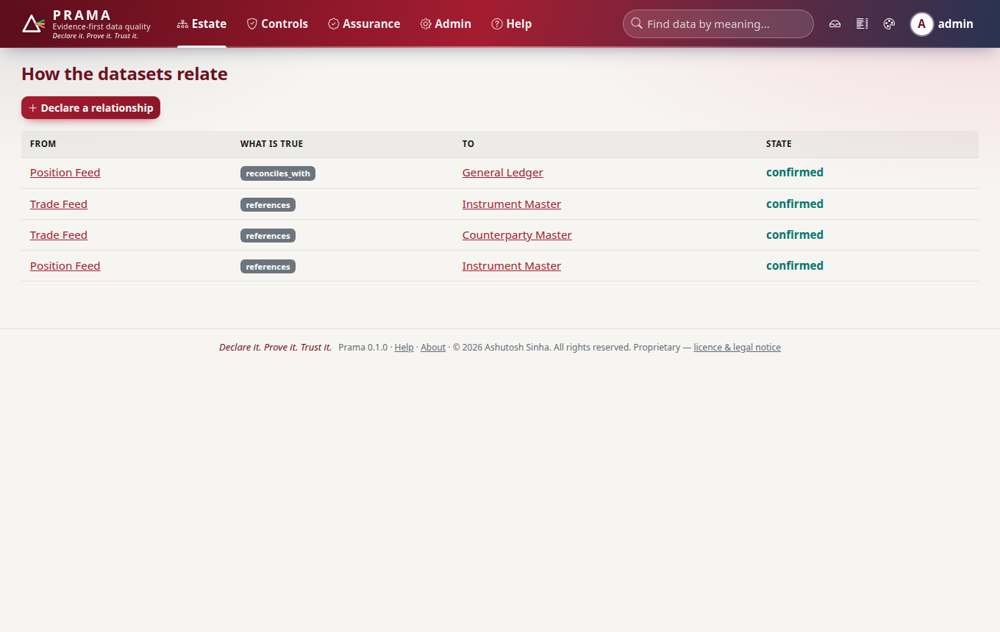
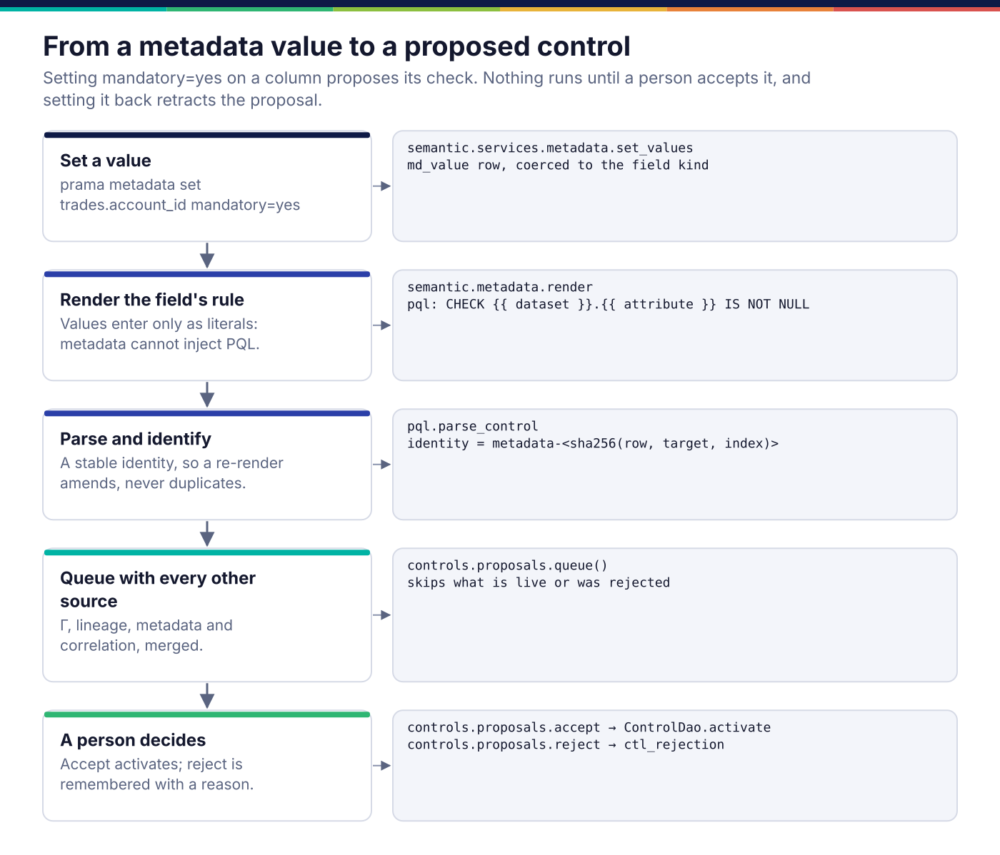
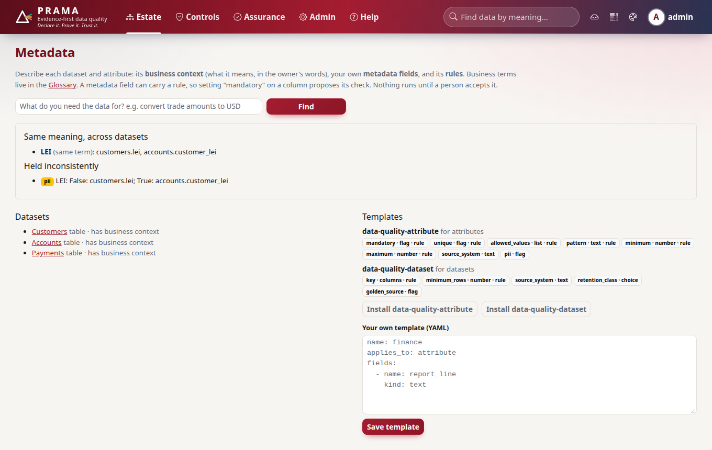
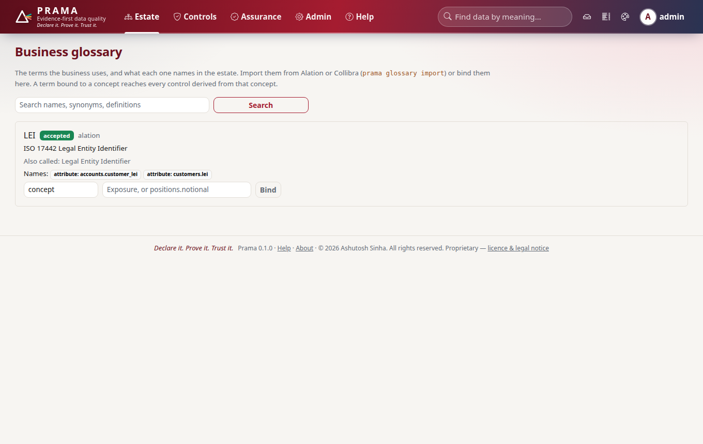
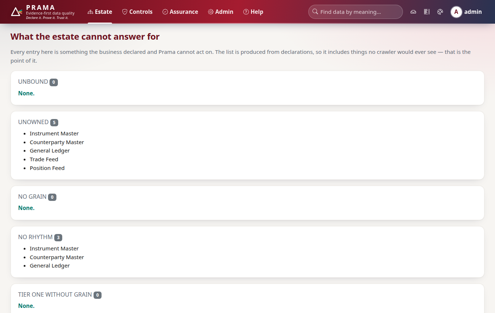

*Copyright © 2026 Ashutosh Sinha <ajsinha@gmail.com>. All rights reserved.*

---

# The semantic layer: what the business says its data is

[← Architecture](README.md)

Every other part of Prama is downstream of this one. A control exists because a
declaration implies it; a score is the evidence those controls left; a report
says what was declared and what of it is covered. If the semantic layer is
wrong, everything derived from it is consistently wrong, which is why it is
versioned, approved and never edited in place.

The corpus explains the model and why it starts from the business rather than
the physical estate ([03](../corpus/03-business-semantic-layer.md)). This page
shows how it is built.

## What a declaration is, and where it is kept



Each declared object is two tables: an identity row (`sem_dataset`) and version
rows (`sem_dataset_version`). A version carries two time dimensions:
`valid_from`/`valid_to` (when the statement is true of the world) and
`recorded_at`/`superseded_at` (when Prama believed it), plus `authored_by`,
`approved_by` and `change_reason`. The current version is the one with neither end
set. This is what lets an auditor ask what the bank *believed* about a dataset on
the day a control ran, separately from what is true of it now.

The vocabulary of a declaration is a set of value objects in
`prama.semantic.values`: `Grain`, `Rhythm`, `ValueDomain`, `Criticality`,
`Temporality`, `Authoritativeness`, `Optionality`. Each one is a control
generator in waiting: a grain implies uniqueness and completeness of its key, a
rhythm implies freshness and volume, a value domain implies membership. That is
the whole of "derive, never restate": the control is not written down a second
time, it is computed from the fact.

Relationships are first-class declarations too, in `sem_relationship_version`,
with one of thirteen kinds (`references`, `reconciles_with`, `derives_from`,
`feeds`, `same_entity_as` …), match keys, a tolerance and a status. A
relationship is what makes the estate a map rather than a list, and what lets
Prama generate cross-dataset controls nobody would write by hand.

**Approval is by tier.** `prama.semantic.policy.ApprovalPolicy` holds a Tier-1
declaration for maker-checker (the author cannot approve it), a Tier-2 one for
review, and lets Tiers 3 and 4 through. The policy applies to declarations and
relationships; a control derived from an approved declaration then goes through
the proposal queue ([controls-and-pql.md](controls-and-pql.md)).

### Example: declaring a dataset through the SDK

From case study 01 (`case-studies/01-trading-book-sqlite`), as the harness sends
it:

```python
import prama_sdk as prama

client = prama.connect(username="admin", password="…")
declared = client.datasets.declare(
    "Instrument Reference",
    description="The security master. Every tradable instrument the firm knows about.",
    criticality=2,
    shape="table",
    grain={"attributes": ["isin"], "statement": "one row per instrument, identified by its ISIN"},
    rhythm={"frequency": "daily", "arrival_by": "05:00"},
    reason="declared for the case study",
)
client.datasets.add_attribute(
    declared["id"], "isin",
    definition="The ISO 6166 identifier for the instrument.",
    semantic_type="isin", optionality="mandatory", is_cde=True,
)
derived = client.derive.dataset(declared["id"], declare=True, accept=True, reason="reviewed")
```

The last call runs Γ over the declaration. What it returns is either a control or
an *unsatisfiable* entry saying why no control could be generated, for example a
rhythm with no column recording arrival. Those entries are findings about the
declaration, and the console lists them rather than letting the dataset look
covered.







## Metadata, business context and the glossary

A bank describes its data with its own fields as well as Prama's: "source
system", "retention class", "PII". These live outside the declaration, in
`md_template`, `md_field` and `md_value`, because they are the bank's schema, not
Prama's. A field may carry a **rule**: the starter template
`data-quality-attribute` has `mandatory`, `unique`, `allowed_values`, `pattern`,
`minimum` and `maximum`, each of which renders a PQL check.



The important property is in the second box: values reach the rule only as
quoted literals (`prama.semantic.metadata.render`), so a value of
`x' OR 1=1` stays a string. Metadata can propose a check; it cannot write PQL.

```bash
prama metadata template install data-quality-attribute
prama metadata set trades.account_id mandatory=yes source_system=Murex
prama metadata context trades --text "Executed trades booked by the desks."
prama metadata correlate        # same meaning across datasets, held inconsistently
```

What the proposals look like is pinned by
`tests/semantic/test_metadata.py`: setting `mandatory=yes` on
`trades.account_id` and `allowed_values=USD,EUR` on `trades.ccy` offers exactly
`CHECK trades.account_id IS NOT NULL DIMENSION completeness` and
`CHECK trades.ccy IN ('USD', 'EUR') DIMENSION validity`; setting it back to `no`
retracts the first, and the history keeps both values.

Business context (what a dataset means, in the owner's words) is not metadata:
it is a declared fact on the dataset and attribute versions, so it is versioned
and approved like the rest.

The **glossary** (`gl_term`, `gl_binding`) holds the business's terms and what
each names in the estate. Terms can be imported from Alation or Collibra
(`prama glossary import terms.json --from alation`, through
`prama.importers.catalog`), which reports every term it dropped and why; a term
whose name matches a concept is bound automatically and marked as such.
**Correlation** (`prama.semantic.correlate`) groups attributes by meaning, by
shared concept property or glossary term rather than by column name, and
reports where the same meaning is held inconsistently.





## Finding data by meaning

`prama metadata find "settlement currency"` and the console's search box rank
datasets by fitness for a purpose, not by a name match inside one dataset.
`prama.semantic.services.fitness` builds a profile per dataset from its
declaration, context and metadata, and ranks with embeddings when a model is
configured and BM25 when not; `prama.semantic.services.finding` can then ask a
model to rank and explain the shortlist. The model orders; it does not decide
what exists.

## What the estate cannot answer for

The estate page counts what is declared, and the gaps page lists what was
declared and cannot be acted on: unbound, unowned, no grain, no rhythm, a
Tier-1 dataset without a grain. Because the list comes from declarations, it
includes things no crawler would see. `prama.semantic.maturity` scores the estate
on how far each dataset has been formalised (named, shaped, interpreted, related,
mapped, journeyed) and names the next action that would raise it.



## The estate as files

`prama estate export --out DIR` writes the semantic layer as reviewable YAML
(`apiVersion: prama/v1`, `kind: Dataset`), and `prama estate diff` reports drift
in both directions and exits 3 when there is any (`prama.semantic.gitops`). This
is how a declaration can live in Git and be changed by pull request without
Prama's database becoming a second source of truth that disagrees.

## Discovery, matching, classification and profiling

These packages produce **candidates**, never declarations:

- `prama.discover.relationships.RelationshipDiscoverer` scores candidate
  relationships from five weak signals (naming, containment, key overlap,
  schema signature, co-access). A candidate with fewer than two corroborating
  signals is reported as weak rather than suppressed. A confirmed candidate is
  stored through `RelationshipService.propose_discovered` as `proposed`, with
  provenance, for a person to confirm.
- `prama.er.match` is Fellegi-Sunter entity resolution with EM-estimated
  weights, blocking keys and a review band between match and non-match.
- `prama.classify.semantic` works out what a column holds by a cascade
  (checksum, code list, pattern, name, embedding, model) and stops at the first
  stage with evidence; only the first three are deterministic and say so.
  `prama.classify.validators` holds the deterministic validators PQL calls
  (`IS VALID 'lei'`, ISIN, IBAN, BIC, …), and `prama.classify.codelists` holds code
  lists as dated snapshots, so a control is judged against the list in force on
  the day it ran.
- `prama.profile` computes profiles with mergeable sketches (HyperLogLog,
  t-digest, count-min, top-k) whose error is stated, segment by segment, so a
  profile is the exact fold of its segments and only changed segments are
  re-read. `prama.derive.suggestions.defaults_from` turns a profile into
  suggested declaration defaults, which are never auto-confirmed.

As built, the relationship discoverer and the entity resolver are exercised by
their tests and harnesses but are not yet called from a console page or API
route.

## Where it lives in the code

| Path | Responsibility |
|---|---|
| `src/prama/semantic/values.py` | the declaration vocabulary as value objects |
| `src/prama/semantic/services/` | `DatasetService`, `RelationshipService`, concepts, journeys, connections, bindings, metadata, glossary, fitness search, collaboration; each takes a `UnitOfWork` and audits every change |
| `src/prama/semantic/policy.py` | approval by tier, maker-checker |
| `src/prama/semantic/metadata.py` | templates, fields, rules, and safe rendering of values into PQL |
| `src/prama/semantic/correlate.py`, `src/prama/semantic/conflict.py` | same meaning across datasets; attributes mapped to one concept that disagree |
| `src/prama/semantic/maturity.py`, `src/prama/semantic/gitops.py` | estate maturity; the estate as YAML, with drift both ways |
| `src/prama/curation/suggestions.py` | model-drafted descriptions a person accepts or rejects |
| `src/prama/discover/relationships.py`, `src/prama/er/match.py` | candidate relationships; entity resolution |
| `src/prama/classify/` | semantic type inference, validators, dated code lists |
| `src/prama/profile/` | profiling, sketches, segments, incremental re-profiling |
| `src/prama/db/models/semantic.py` | the `sem_*` tables as ORM models |
| `src/prama/api/routes/semantic.py`, `src/prama/api/routes/metadata.py`, `src/prama/api/routes/glossary.py`, `src/prama/api/routes/estate.py` | the HTTP surface |

To add a validator or a code list, see [validators.md](../developer/validators.md);
to import from another catalogue, [importers.md](../developer/importers.md).

## Read more

- The model, the personas and why it is defensible:
  [03 §2](../corpus/03-business-semantic-layer.md#2-the-model) and
  [03 §2a](../corpus/03-business-semantic-layer.md#2a-business-context-and-bank-defined-metadata).
- The requirements: [04 §A0](../corpus/04-requirements-functional.md).
- Semantic type inference and constraint mining:
  [08 §2–3](../corpus/08-ai-ml-capabilities.md).

---

<div align="center">
<br/>
<sub><b>PRAMA</b> — <i>Declare it. Prove it. Trust it.</i><br/>
Copyright © 2026 <b>Ashutosh Sinha</b> &lt;ajsinha@gmail.com&gt; · All rights reserved.<br/>
Proprietary and confidential. No licence is granted except by separate written agreement.<br/>
See <a href="../../LICENSE">LICENSE</a> and <a href="../../NOTICE">NOTICE</a>. Third-party names and marks are the property of their respective owners.</sub>
</div>
