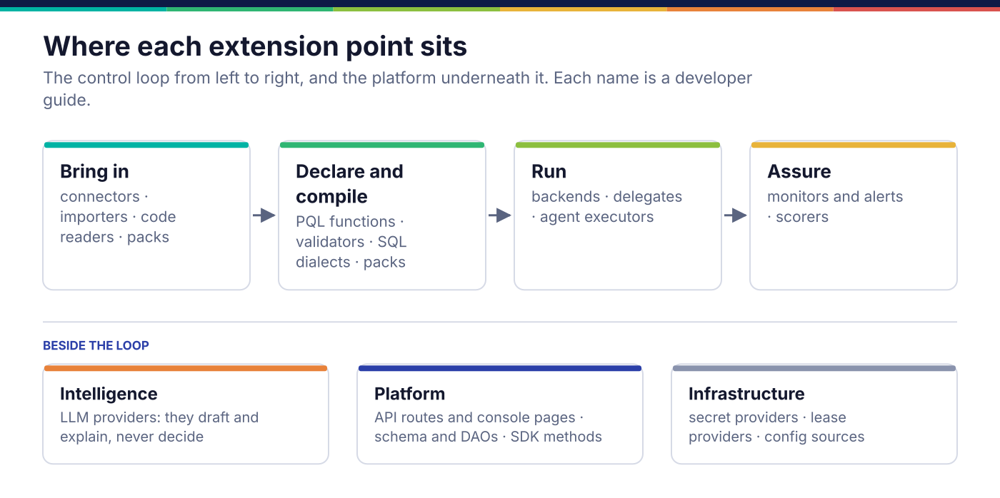
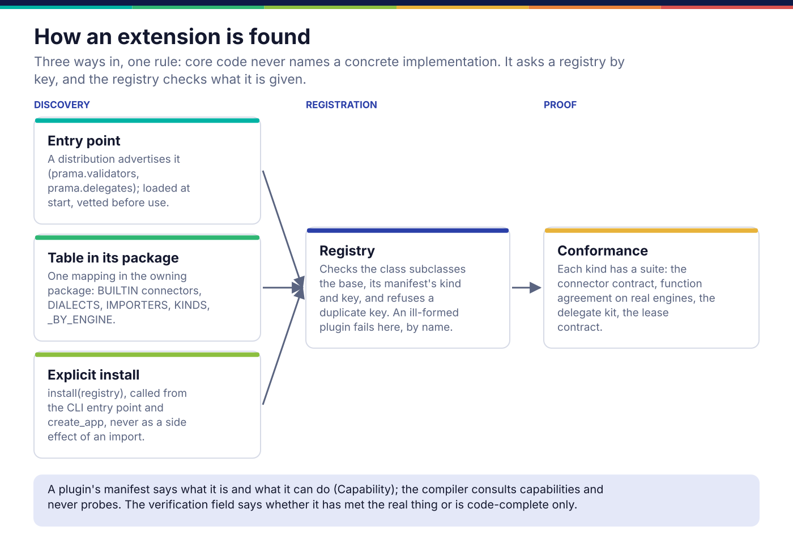

*Copyright © 2026 Ashutosh Sinha <ajsinha@gmail.com>. All rights reserved.*

---

# Developer guides: extending and changing Prama

These guides say **how to add to or change** each part of Prama: a connector, a PQL function,
a validator, an endpoint, a table. They do not explain what each part is for or how the parts
fit; the [architecture guide](../architecture/README.md) does that, and each guide links to the
page it builds on.

Every guide follows the same shape: when you would write one, the interface quoted from the code,
a diagram, a worked example that runs, how it is registered and configured, how it is tested,
and a checklist for the pull request.

## Before you start

- **Set up and run the gate** as [CONTRIBUTING.md](../../CONTRIBUTING.md#the-loop) describes.
  `bash scripts/gate.sh` is the one command; the full list of commands is in `CLAUDE.md`.
- **Read the hard rules** in `CLAUDE.md`. Four of them shape almost every extension: no
  migrations, only `prama.db` imports SQLAlchemy, no file over 1500 code lines, and AI never
  adjudicates.
- **Read the three habits** in [CONTRIBUTING.md](../../CONTRIBUTING.md#three-habits): assert the
  rendered artefact, write the counterfactual, derive rather than restate. Each guide's
  *Testing* section is those habits applied to one extension point.

## The repository, for a developer

| Path | What lives there | Its guide |
|---|---|---|
| `src/prama/connect/` | the connector contract, registry, derived forms, and the connectors | [connectors](connectors.md) |
| `src/prama/backend/` | compiling a plan to SQL per engine, fusion, the reference interpreter | [backends and dialects](backends-and-dialects.md) |
| `src/prama/pql/` | the language: parser, checker, function catalogue | [PQL functions](pql-functions.md) |
| `src/prama/classify/` | semantic-type validators and code lists | [validators](validators.md) |
| `src/prama/monitor/`, `src/prama/alert/` | detectors, calibration, alert routing | [monitors and notifiers](monitors-and-notifiers.md) |
| `src/prama/score/` | scorecards and trust over lineage | [scorers](scorers.md) |
| `src/prama/importers/` | dbt, SodaCL, Great Expectations | [importers](importers.md) |
| `src/prama/llm/` | the model gateway and its providers | [LLM providers](llm-providers.md) |
| `src/prama/lineage/`, `src/prama/codeintake/` | lineage readers and code intake | [code readers](code-readers.md) |
| `src/prama/delegates/`, `kernel/src/prama_kernel/delegates/` | Python DQ delegates | [delegates](delegates.md) |
| `src/prama/packs/` | domain packs; banking is the one shipped | [packs](packs.md) |
| `src/prama/api/`, `src/prama/web/` | the HTTP API and the console | [API and console](api-and-console.md) |
| `schema/`, `src/prama/db/` | the two schema files, models, DAOs, unit of work | [schema and DAOs](schema-and-daos.md) |
| `sdk/` | `prama-sdk`, the Python client | [SDK methods](sdk-methods.md) |
| `agent/` | `prama-agent`, the daemon beside the data | [agent executors](agent-executors.md) |
| `src/prama/secrets/`, `src/prama/core/` | secrets, leases, configuration, concurrency | [secrets and leases](secrets-and-leases.md) |
| `kernel/` | `prama-kernel`: plan, judge, evidence record, plugins, delegates runtime | (shared; see [packages](../architecture/packages.md)) |
| `tests/` | the suite; `tests/architecture/` holds the build's guards | each guide's *Testing* |
| `docs/developer/examples/` | every complete example in these guides, run by `tests/docs/test_developer_examples.py` | |



## The plugin model

Every extension point is an abstract base class, and core code never names a concrete
implementation outside its own package: it asks a registry for one by key. A connector is added
without editing the compiler; a validator is added without editing the parser.



### The registry

`src/prama/core/registry.py` holds the generic machinery:

```python
# src/prama/core/registry.py:80
class Plugin(ABC):
    """Base of every discovered implementation."""

    #: Set by the subclass. Unique within its kind.
    plugin_key: ClassVar[str] = ""

    @classmethod
    @abstractmethod
    def manifest(cls) -> PluginManifest:
        """Describe this plugin. Called without instantiating it."""
```

A `PluginManifest` (line 54) says what the plugin is: `key`, `kind`, `display_name`, `version`,
its `capabilities`, the `conformance_suite` that proves it, and `verification`
(`verified` or `code_complete`, defaulting to the weaker claim). A `Capability` (line 36) is
one declared ability with qualifying attributes, such as `pushdown.regex` with
`regex_flavour=posix`. The compiler consults capabilities and never probes a source to find out.

`Registry` (line 92) validates at registration, so an ill-formed plugin fails by name when it is
added rather than deep inside a run: the class must subclass the base, `manifest()` must return a
`PluginManifest` whose `kind` matches the registry and whose `key` is not empty, and a duplicate
key is refused unless `replace=True` is passed deliberately.

### How a plugin is found

There are three ways in, and each extension point uses one of them:

| Way | Used by | Where it is wired |
|---|---|---|
| **Entry point** advertised by an installed distribution | validators (`"prama.validators"`), delegates (`"prama.delegates"`) | `kernel/src/prama_kernel/plugins.py` `load_entry_points`, called from `install_shipped` in `src/prama/packs/__init__.py`; `DelegateRegistry.load_entry_points` in `kernel/src/prama_kernel/delegates/registry.py` |
| **A table in the owning package** | connectors (`BUILTIN`), compile dialects (`DIALECTS`), importers (`IMPORTERS`), model provider kinds (`KINDS`), code readers (`READ`), agent engines (`_BY_ENGINE`), store dialects (`_DIALECTS`) | one mapping in the package that owns the base class |
| **An explicit install** at start | pack functions and calendars | `install_shipped()` in `src/prama/packs/__init__.py`, called from the CLI entry point and `create_app` |

`config/application.yaml` lists six entry-point groups under `plugins.entry_point_groups`, and
`plugins.disabled` switches one off by name. **Only `"prama.validators"` is loaded from that list
today.** The connector registry has a `discover()` for `"prama.connectors"`
(`src/prama/connect/registry.py`), but nothing calls it, and `"prama.backends"`,
`"prama.monitors"`, `"prama.notifiers"` and `"prama.scorers"` have no registry behind them. Each guide
says which path its extension really takes; do not ship a third-party package that relies on a
group that is not read.

### The rule: name a concrete type only inside its package

A concrete implementation is referenced by name only inside the package that owns it, and
everything else asks a registry by key. That is what makes "add a connector" a change to
`src/prama/connect/` and nothing else. In practice:

- register in the owning package's table or install function, never from a caller;
- look up by key (`registry.get("sqlite")`, `dialect("duckdb")`, `importer("dbt")`);
- if you find yourself importing `SqliteConnector` from the scheduler, the seam is in the wrong
  place.

## The gate a change must pass

`bash scripts/gate.sh` runs ruff, the formatter check, mypy, the file-length ceiling, the
generated-documents check, and pytest; [CONTRIBUTING.md](../../CONTRIBUTING.md#the-loop) explains
why it is one script. The guards that most often stop an extension are in `tests/architecture/`:

| Guard | What it refuses |
|---|---|
| `tests/architecture/test_layering.py` | SQLAlchemy outside `prama.db`, bare threads and unbounded queues, a module that both calls a model and produces a verdict, a file over the ceiling |
| `tests/architecture/test_verdicts_cannot_reach_a_model.py` | a verdict-producing package that can reach `prama.llm` through any import chain |
| `tests/architecture/test_scopes.py` | an API route with no scope, a mutating route with a read scope |
| `tests/architecture/test_packages_standalone.py` | the SDK, kernel or agent importing the server |
| `tests/architecture/test_documentation.py` | a backticked path or `prama.` module in a document that does not exist, a broken link |
| `tests/architecture/test_proprietary_notice.py` | a source file without the copyright line |
| `tests/sdk/test_parity.py` | an endpoint with no SDK method, or an SDK method with no endpoint |

## The testing doctrine, applied

The habits in [CONTRIBUTING.md](../../CONTRIBUTING.md#three-habits) come down to two questions
every extension's tests must answer:

1. **Did it run on the real thing?** Assert the executed result, not the rendering. A PQL
   function's SQL is executed on DuckDB, SQLite and PostgreSQL and compared with its reference
   implementation; a connector is read through, not just constructed.
2. **Can the test fail?** Break the property on purpose and watch the test go red: a lowering
   with its arguments swapped, a validator that imports `time`, a lease provider that grants
   everything. Every worked example here carries one, in
   `tests/docs/test_developer_examples.py`.

## Every extension point

| Extension point | Base class or seam | Found by | Guide |
|---|---|---|---|
| Source connector | `prama.connect.spi.Connector` | `BUILTIN` table | [connectors](connectors.md) |
| SQL dialect for a source | `connect.sources.sql.dialect.SqlDialect` (ABC) | the connector's `dialect` | [backends and dialects](backends-and-dialects.md) |
| Compile dialect (engine) | `prama.backend.dialect.SqlDialect` | `DIALECTS` | [backends and dialects](backends-and-dialects.md) |
| Prama's own store | `prama.db.dialects.Dialect` | `_DIALECTS`, `database.dialect` | [backends and dialects](backends-and-dialects.md) |
| PQL function | `prama.pql.functions.Function` | `install(registry)` | [PQL functions](pql-functions.md) |
| Semantic-type validator | `prama.classify.validators.SemanticValidator` | `"prama.validators"` entry point | [validators](validators.md) |
| Monitor detector | `prama.monitor.detect.Detector` | passed to `Monitor` or `Ensemble` | [monitors and notifiers](monitors-and-notifiers.md) |
| Alert routing | `prama.alert.route.Router` | constructed by the caller | [monitors and notifiers](monitors-and-notifiers.md) |
| Scoring method, trust semiring | `Method`, `Semiring` enums | edited in place | [scorers](scorers.md) |
| Control importer | `prama.importers.spi.Importer` | `IMPORTERS` | [importers](importers.md) |
| Model provider | `prama.llm.spi.ModelProvider` | `KINDS` and `build` | [LLM providers](llm-providers.md) |
| Lineage reader | `prama.lineage.scan.Scanner` | `READ` and the worker's dispatch | [code readers](code-readers.md) |
| DQ delegate | `DqDelegate` in `kernel/src/prama_kernel/delegates/spi.py` | `delegates.paths`, `"prama.delegates"`, upload | [delegates](delegates.md) |
| Domain pack | a package under `src/prama/packs/` | `install_shipped` | [packs](packs.md) |
| API route, console page | a `router` module; `prama.web.routes.base.UiRoutes` | module discovery; `ROUTE_CLASSES` | [API and console](api-and-console.md) |
| Table | `schema/*.sql`, a model, a `Dao` | the unit of work | [schema and DAOs](schema-and-daos.md) |
| SDK method | `@endpoint` in `prama_sdk.base` | module discovery | [SDK methods](sdk-methods.md) |
| Agent engine | `SourceExecutor` in `agent/src/prama_agent/executors.py` | `_BY_ENGINE`, `ENGINES` | [agent executors](agent-executors.md) |
| Secret provider | `prama.secrets.spi.SecretProvider` | `SecretResolver.register` | [secrets and leases](secrets-and-leases.md) |
| Lease provider | `prama.core.concurrency.leases.LeaseProvider` | `Database.lease_provider` | [secrets and leases](secrets-and-leases.md) |
| Configuration source | `prama.core.config.sources.ConfigSource` | `ConfigurationBuilder` | [secrets and leases](secrets-and-leases.md) |

A few seams have an abstract base and no guide, because nothing outside their package is expected
to extend them yet. Each is a class with an interface, and adding one follows the pattern above:

| Seam | Base class |
|---|---|
| A trigger for the schedule | `prama.schedule.trigger.Trigger` |
| An evidence anchor (a time-stamp authority) | `prama.evidence.anchor.Anchor` |
| A customer-managed key | `prama.security.cmk.KeyProvider` |
| A stream transport (Kafka) | `prama.execute.transport.StreamTransport` |
| A catalogue to push to | `prama.integrate.catalog.CatalogTarget` |
| An assistant tool | `prama.assistant.tools.Tool` |
| Tracing and OpenLineage emission | `prama.telemetry.trace.Tracer`, `prama.telemetry.lineage.LineageEmitter` |
| The metric store | `prama.db.metrics.store.MetricStore` |
| A CLI command | `prama.cli.base.Command` |

---

<div align="center">
<br/>
<sub><b>PRAMA</b> — <i>Declare it. Prove it. Trust it.</i><br/>
Copyright © 2026 <b>Ashutosh Sinha</b> &lt;ajsinha@gmail.com&gt; · All rights reserved.<br/>
Proprietary and confidential. No licence is granted except by separate written agreement.<br/>
See <a href="../../LICENSE">LICENSE</a> and <a href="../../NOTICE">NOTICE</a>. Third-party names and marks are the property of their respective owners.</sub>
</div>
