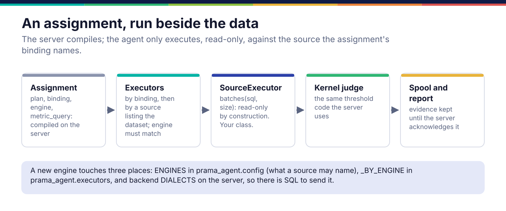

*Copyright © 2026 Ashutosh Sinha <ajsinha@gmail.com>. All rights reserved.*

---

# Adding an engine to the agent

The `prama-agent` daemon runs on a customer's machine beside the data. It claims assignments the
server compiled, runs each compiled query against a local source through an **executor**, judges
the metrics with the kernel's shared code, and reports evidence. Add an executor when an agent
must reach an engine it cannot today. How the fleet is built is in
[Agents and the fleet](../architecture/agents-and-fleet.md); installing and running an agent is
in [the agent guide](../agent/README.md).

## When you would write one

- A new engine for agents: one the agent's configuration does not accept (today `sqlite`,
  `duckdb`, `postgres`).
- A different way of running an engine the agent already has, for an embedder that builds the
  runner itself: a time limit, a connection pool, an instrumented driver.
- **Not** to compile SQL. An agent executes what the control plane compiled for its engine; an
  agent that compiled its own SQL would be a second compiler, and two compilers is how one
  control comes to mean two things.

## The interface

```python
# agent/src/prama_agent/executors.py:37
class SourceExecutor:
    """Runs SQL against one source. Callable, as the runner's `Executor` is."""

    engine = ""

    def __init__(self, source: Source) -> None:
        self.source = source

    def __call__(self, sql: str) -> Rows:
        return [row for batch in self.batches(sql, 10_000) for row in batch]

    def batches(self, sql: str, size: int) -> Iterator[Rows]:   # line 48: implement this
        raise NotImplementedError
```

`batches` yields lists of rows as plain dictionaries, `size` at a time, so a large sample never
has to fit in memory. Two properties are the whole contract:

- **Read-only by construction**, not by convention: SQLite opened with `mode=ro`, DuckDB with
  `read_only=True`, PostgreSQL in a read-only session. The agent runs SQL somebody else
  compiled; if that somebody were wrong or hostile, the source still cannot be written through it.
- **A connection per statement.** An agent runs a few statements a minute, and a connection that
  outlives a replaced file or a restarted database turns one bad night into a daemon that errors
  until somebody restarts it.

A missing optional driver fails when the executor is built, at start, naming the install command
(`_optional`), never on the first assignment at three in the morning. Credentials are read from
the environment variable the source names, at each use, never from `agent.yaml`.

`Executors` (line 144) picks the executor for an assignment: by its binding first, then by a
source that lists the assignment's dataset, and refuses an engine mismatch rather than running a
query against data it was not compiled for.



## A worked example

**The real ones.** `SqliteExecutor`, `DuckdbExecutor` and `PostgresExecutor` in
`agent/src/prama_agent/executors.py`, each about fifteen lines.

**A new one.** `docs/developer/examples/time_limited_executor.py` is a SQLite executor that is
also bounded in time: a statement still running after `seconds` is interrupted by SQLite itself,
through a progress handler, and the assignment fails naming the limit instead of holding the
agent's only worker.

```python
class TimeLimitedSqliteExecutor(SqliteExecutor):
    """A read-only SQLite executor that interrupts a statement after *seconds*."""

    engine = "sqlite"

    def __init__(self, source: Source, *, seconds: float = 30.0) -> None:
        super().__init__(source)
        self.seconds = seconds

    def batches(self, sql: str, size: int) -> Iterator[Rows]:
        path = Path(self.source.path)
        if not path.exists():
            raise FileNotFoundError(f"the sqlite source {self.source.binding} has no file {path}")
        connection = sqlite3.connect(f"{path.resolve().as_uri()}?mode=ro", uri=True)
        deadline = time.monotonic() + self.seconds
        connection.set_progress_handler(lambda: int(time.monotonic() > deadline), CHECK_EVERY)
        try:
            cursor = connection.execute(sql)
            columns = [d[0] for d in cursor.description or ()]
            while chunk := cursor.fetchmany(size):
                yield [dict(zip(columns, row, strict=True)) for row in chunk]
        except sqlite3.OperationalError as exc:
            if "interrupted" in str(exc):
                raise TimeoutError(f"the statement on {self.source.binding} ran past ...") from exc
            raise
        finally:
            connection.close()
```

An embedder that builds the runner itself hands it executors directly, which is what
`Executors.of` is for:

```python
executors = Executors.of({"book": TimeLimitedSqliteExecutor(Source("book", "sqlite", path="/srv/book.db"))})
```

## Registration and configuration

A new engine **for the daemon** is three places, two in the agent and one on the server:

1. `ENGINES` in `agent/src/prama_agent/config.py` (line 33), and any alias in `ENGINE_ALIASES`;
   then the source validation in `_sources`, which says which keys an engine takes (`path` for a
   file, `dsn` or `dsn_env` and `password_env` for a server) and refuses an inline secret;
2. the executor class in `_BY_ENGINE` in `agent/src/prama_agent/executors.py` (line 133), with an
   optional extra in `agent/pyproject.toml` if it needs a driver;
3. a compile dialect for the engine in the server's `DIALECTS`, so there is SQL to send it
   (see [backends and dialects](backends-and-dialects.md)).

The agent then advertises the engine on its own: `capabilities_for` in
`agent/src/prama_agent/daemon.py` derives the engines from the configured sources, never from a
hand-typed list, and the server dispatches work compiled for an engine an agent in that zone has.
A source in `agent.yaml`:

```yaml
sources:
  warehouse:                    # the binding name assignments use
    engine: sqlite              # sqlite | duckdb | postgres (postgresql is accepted)
    path: /srv/data/warehouse.db
    datasets: [trades, positions]
```

The rest of `agent.yaml` (server, zone, residency, spool, delegates) is described in
[the agent guide](../agent/README.md#agentyaml).

## Testing

- `tests/agent_daemon/test_executors.py` holds the executor contract for each engine: rows as
  mappings in batches; a write refused (`DELETE` raising `readonly`) with the counterfactual that
  the same statement on an ordinary connection works; a missing file named; a missing optional
  driver failing at start with the install command; a credential read from the environment at
  use; the executor chosen by binding then dataset; an engine mismatch refused.
- `tests/agent_daemon/test_end_to_end.py` runs a real daemon cycle against a real server.
- `tests/architecture/test_packages_standalone.py` runs the agent with `prama` made unimportable
  and builds its wheel: an executor may import `prama_kernel` and `prama_sdk`, never `prama`.
- **The counterfactual.** The example's test interrupts a three-million-row recursive query with
  a 10 ms limit, then runs the same statement with room to finish and gets its answer, so it was
  the limit that stopped it and not the statement that was wrong.

## Checklist

- [ ] `batches` yields dictionaries in chunks of `size`; `engine` set.
- [ ] Read-only by construction, proven by a write that fails.
- [ ] A connection per statement; credentials from the environment at use.
- [ ] A missing driver fails at start, naming the extra to install.
- [ ] `ENGINES`, `_sources` validation, `_BY_ENGINE`, and a server compile dialect, for a new engine.
- [ ] No import of `prama`; the standalone test green.

---

<div align="center">
<br/>
<sub><b>PRAMA</b> — <i>Declare it. Prove it. Trust it.</i><br/>
Copyright © 2026 <b>Ashutosh Sinha</b> &lt;ajsinha@gmail.com&gt; · All rights reserved.<br/>
Proprietary and confidential. No licence is granted except by separate written agreement.<br/>
See <a href="../../LICENSE">LICENSE</a> and <a href="../../NOTICE">NOTICE</a>. Third-party names and marks are the property of their respective owners.</sub>
</div>
