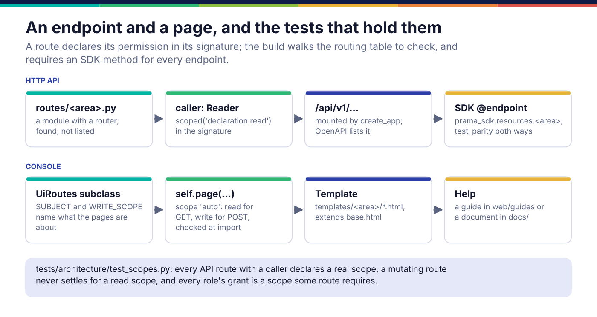
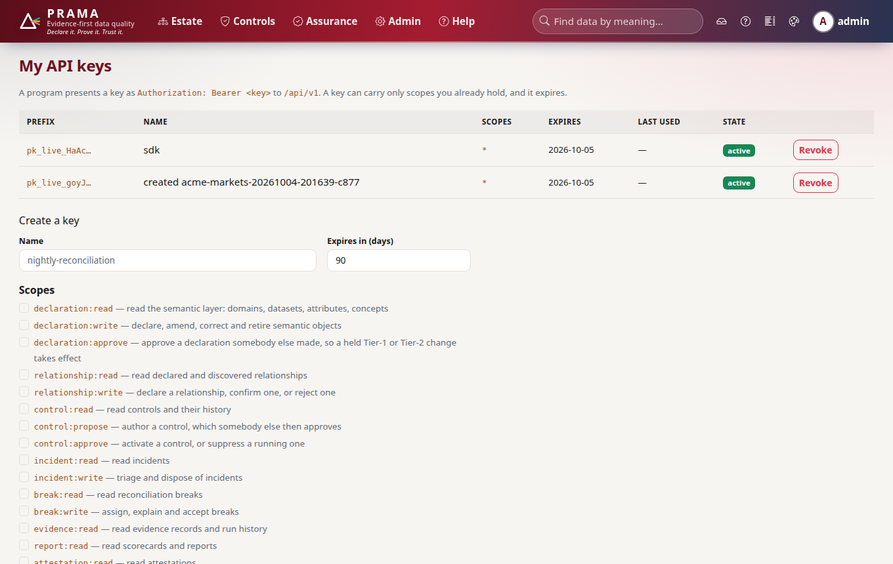
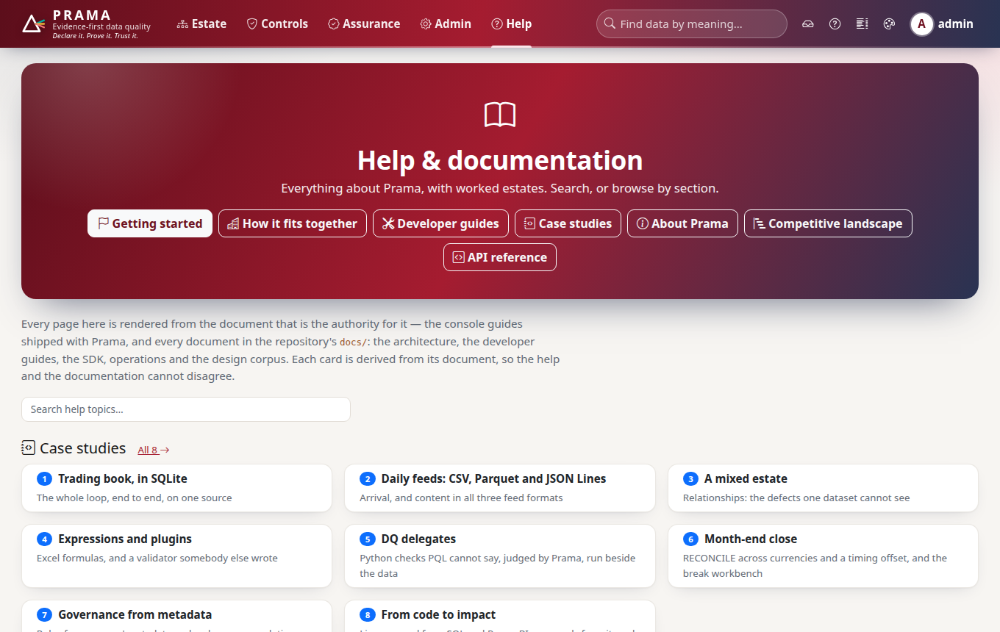

*Copyright © 2026 Ashutosh Sinha <ajsinha@gmail.com>. All rights reserved.*

---

# Adding an API route and a console page

Every capability Prama has is reachable three ways: the HTTP API under `/api/v1`, the console,
and the Python SDK. Adding one means a route that declares its permission in its signature, a
page registered through one call that enforces it, and an SDK method for the endpoint. The build
checks each of those. How a request travels from a key to a DAO is in
[Platform](../architecture/platform.md).

## When you would write one

- A new capability in a domain module that people or programs need to reach.
- A console page for something only the API or the CLI offers today.
- **Not** for logic: a route parses, authorises, calls a service with a unit of work, and returns
  what the service returned. Domain logic lives in the domain package, where the CLI can call it
  too.



## An API route

### The interface

A route module is any module in `src/prama/api/routes/` with a module-level `router`. Modules are
**found, not listed** (`discover()`, `src/prama/api/routes/__init__.py:22`): adding a file adds an
area of the API, mounted under `/api/v1`. A module whose name starts with `_` is skipped, and
`probes` is mounted at the root for `/livez` and `/readyz`.

The permission a route needs is declared **in its signature**, as the type of its `caller`:

```python
# src/prama/api/deps.py:211
def scoped(scope: str) -> Any:
    """A caller who additionally holds *scope*."""        # refuses a scope not in SCOPES

Reader = scoped("declaration:read")          # line 241
Writer = scoped("declaration:write")         # line 242
ControlReader = scoped("control:read")
ReportReader = scoped("report:read")
Administrator = scoped("admin")
# ... one annotation per scope in prama.security.scopes.SCOPES
Uow = Annotated[UnitOfWork, Depends(get_uow)]
```

`Caller` (an authenticated caller with no authorisation check) and `Holder` (a question a key
asks about itself) exist for the few routes that need them, and the architecture test treats
any other use of them as a missing scope.

### A worked example

`src/prama/api/routes/scorecards.py` is a complete area of the API in thirty lines:

```python
from fastapi import APIRouter

from prama.api.deps import ReportReader, Uow
from prama.evidence.service import observation
from prama.score import scorecard

router = APIRouter(prefix="/scorecards", tags=["scorecards"])


@router.get("")
async def scorecards(caller: ReportReader, uow: Uow) -> dict[str, Any]:
    """A card per dataset, the estate's card, and whether the breakdown is real."""
    return {
        **await scorecard.scorecards(uow, caller.tenant_id),
        "observation": await observation(uow, caller.tenant_id),
    }


@router.get("/{dataset}")
async def dataset(dataset: str, caller: ReportReader, uow: Uow) -> dict[str, Any]:
    """One dataset's card; not found when no control has evidence for it."""
    return await scorecard.for_dataset(uow, caller.tenant_id, dataset)
```

Three things to copy:

- **Every query is scoped to `caller.tenant_id`.** DAOs take the tenant on every method, and a
  route never invents one.
- **Errors are raised, not returned.** A service raises `NotFoundError`, `ValidationError` or
  `ForbiddenError` from the Prama taxonomy, each with a remedy; the API's error handler
  (`src/prama/api/errors.py`) maps it to a status and a body the SDK turns back into the same
  error class.
- **The docstring is the endpoint's description** in the OpenAPI document, so write it for an
  integrator.

A request body is a Pydantic model; a POST that changes something takes a write scope. A POST
that only reads (it takes a control's text in a body because that does not belong in a URL)
may take a read scope, and must be listed with its reason in `READ_ONLY_POSTS` in
`tests/architecture/test_scopes.py`.

### A new scope

Scopes are one vocabulary, `SCOPES` in `src/prama/security/scopes.py`, with a sentence each for
the audit log. A new one is added there, granted to the roles that should hold it in
`BUILTIN_ROLES` (`src/prama/security/accounts.py`), and given an annotation in
`src/prama/api/deps.py`. The architecture test checks both directions: no route requires a
scope no role can hold, and no role grants a scope no route requires. A key can carry only scopes
its holder already has, which the key page shows:



### The SDK method

Every endpoint needs an SDK method, or `tests/sdk/test_parity.py` fails the build. See
[SDK methods](sdk-methods.md).

## A console page

### The interface

A group of pages is a `UiRoutes` subclass; each page is registered through one call that applies
the permission check, so the next page cannot forget it:

```python
# src/prama/web/routes/base.py:24
class UiRoutes:
    SUBJECT = "declaration"             # what these pages are about: scope="auto" builds <subject>:read
    WRITE_SCOPE: str | None = None      # the scope a mutating page needs, when not "<subject>:write"

    def register(self) -> None: ...     # override: call self.page(...) for each page

    def page(self, path, handler, *, name, methods=None, scope="auto") -> None:   # line 57
        """Register one page. scope="auto" derives it from the HTTP method;
        None marks a page as genuinely anonymous (the sign-in flow and nothing else)."""
```

A derived scope that is not in `SCOPES` raises at import, so a page nobody could open fails in
five seconds rather than reading as a broken page in production. Pages are excluded from the
OpenAPI document.

### A worked example

`src/prama/web/routes/delegate_routes.py` registers three pages with three different scopes:

```python
class DelegateRoutes(UiRoutes):
    """Upload a delegate, see what vetting found, and approve with four eyes."""

    SUBJECT = "control"

    def register(self) -> None:
        post = ["POST"]
        self.page("/delegates", self.index, name="delegates", scope="control:read")
        self.page("/delegates/upload", self.upload, name="delegates_upload",
                  methods=post, scope="control:propose")
        self.page("/delegates/{upload_id}/decide", self.decide, name="delegates_decide",
                  methods=post, scope="control:approve")

    async def index(self, request: Request, uow: Uow, caller: Caller) -> Any:
        rows = await uow.delegate_uploads.all(caller.tenant_id)
        return render(request, "delegates/index.html", uploads=..., me=caller.principal_id)
```

To add a page group:

1. a `UiRoutes` subclass in `src/prama/web/routes/<area>_routes.py`;
2. the class in `ROUTE_CLASSES` in `src/prama/web/routes/__init__.py`, which is listed rather
   than discovered so the set of pages a build serves is readable in one place;
3. a template in `src/prama/web/templates/<area>/`, extending `base.html`, starting with the
   copyright line as a Jinja comment, and rendered with `render(request, "<area>/index.html", ...)`;
4. a link in `src/prama/web/templates/_nav.html` if it is a destination;
5. after a mutating page, `redirect_to(request, name, flash_message=...)`; on a refusal,
   `flash_error_and_log(request, "...", exc)`, so the remedy reaches the person.

### Help for the page

The help centre restates nothing: every entry points at a Markdown file that is already the
authority (`src/prama/web/help_catalog.py`). A console guide is
`src/prama/web/guides/<slug>.md`, added to the "Using the console" section with `_g(...)` in
`_sections()`; a document under `docs/` appears automatically in its folder's section, with a
card derived from its title and the summary its folder's README gives it. Link the page to its
guide.

### "About this page"

Every console page ends with a short **About this page** (`src/prama/web/page_help.py`): one
sentence on what the page is for, one to three tiles, and a *More in Help* link. Add an entry
keyed by the route's path template, or list the route in `EXEMPT` with a reason if it answers
with something other than a page (a download, an event stream). Do not write the last tile:
**Who can use this page** is derived from the scope the page was registered with, through
`PAGE_SCOPES` in `src/prama/web/routes/base.py`, and the built-in roles that grant it.
`tests/web/test_page_help.py` fails for a page with no entry, an entry with no page, a tile
too long to be a hint, or a *More in Help* slug that does not exist. Icons are checked against
the shipped font by `tests/web/test_icons.py`.



## Testing

- **Scopes.** `tests/architecture/test_scopes.py` walks the routing table: every API route with a
  caller declares a real scope, a route without one is in `ANONYMOUS` with a reason, a mutating
  route never settles for a read scope unless it is in `READ_ONLY_POSTS` with a reason.
  `tests/api/test_scopes.py` then calls routes with keys holding the wrong scope and expects 403.
- **Behaviour.** `tests/api/` drives the app in-process (`httpx.AsyncClient` over
  `ASGITransport(app=create_app(config, database=database))`); `tests/api/test_tenant_isolation.py`
  holds the rule that one estate never sees another's rows.
- **Pages.** `tests/web/` renders pages through the app; `tests/web/test_accessibility.py`
  checks structure, and `tests/web/test_axe.py` runs axe-core in Chrome when the `audit` extra is
  installed.
- **The counterfactual.** Annotate a new POST with `Reader` and `test_scopes.py` fails; annotate a
  route with plain `Caller` and it fails differently. Both are worth seeing once before relying
  on the guard.

## Checklist

- [ ] The route module has a `router`, a prefix and tags; handlers have integrator-facing docstrings.
- [ ] Every handler's `caller` is a scoped annotation; a read-only POST is listed with its reason.
- [ ] Every query uses `caller.tenant_id`; errors are raised from the taxonomy with a remedy.
- [ ] An SDK method for every new endpoint; `tests/sdk/test_parity.py` green.
- [ ] Pages registered through `self.page`; the class in `ROUTE_CLASSES`; the template carries the notice.
- [ ] A help entry the page links to, rendered from the file that is its authority.
- [ ] An "About this page" entry in `page_help.PAGES`; `tests/web/test_page_help.py` green.

---

<div align="center">
<br/>
<sub><b>PRAMA</b> — <i>Declare it. Prove it. Trust it.</i><br/>
Copyright © 2026 <b>Ashutosh Sinha</b> &lt;ajsinha@gmail.com&gt; · All rights reserved.<br/>
Proprietary and confidential. No licence is granted except by separate written agreement.<br/>
See <a href="../../LICENSE">LICENSE</a> and <a href="../../NOTICE">NOTICE</a>. Third-party names and marks are the property of their respective owners.</sub>
</div>
