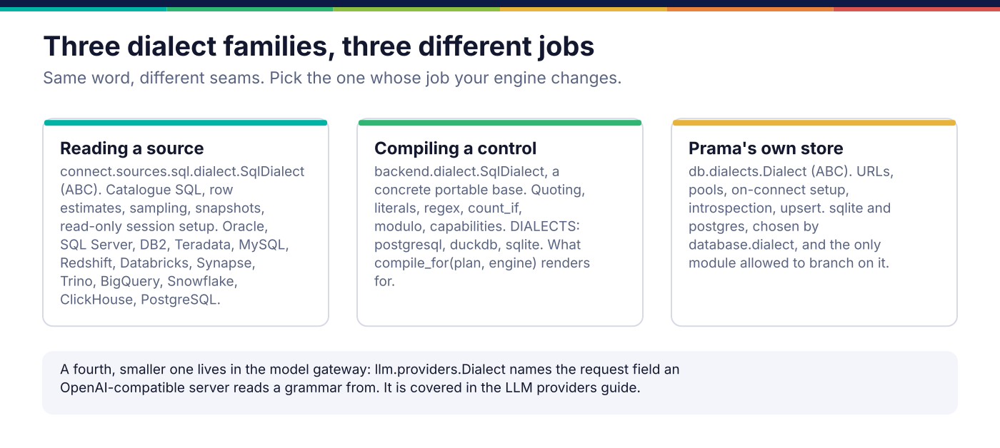
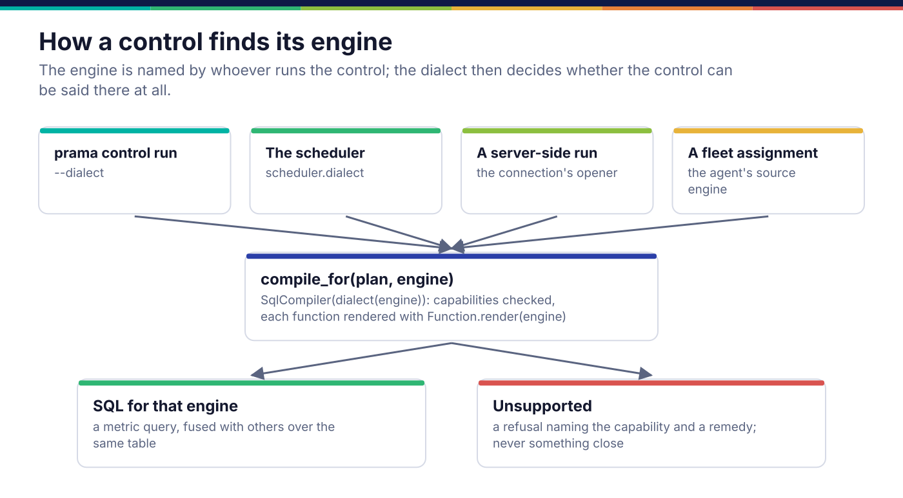
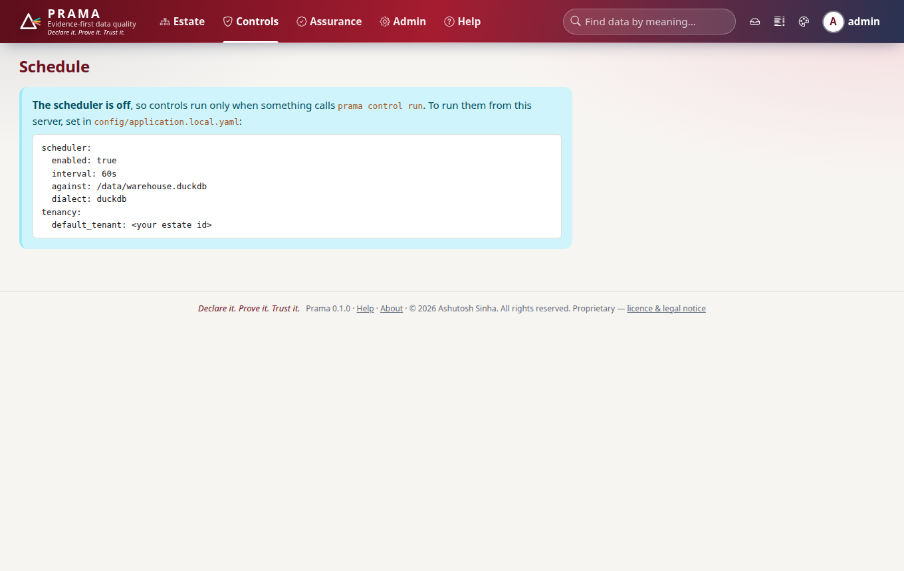

*Copyright © 2026 Ashutosh Sinha <ajsinha@gmail.com>. All rights reserved.*

---

# Backends and SQL dialects

Add a dialect when Prama must speak a new engine's SQL: to read a source, to run a compiled
control there, or to keep its own store on it. The word covers three different seams, and the
first job is picking the right one. How a run reaches an engine is in
[Execution](../architecture/execution.md); this page is how to teach Prama a new one.

## When you would write one

| You want to | Write | Seam |
|---|---|---|
| Discover, describe and read a relational database Prama has no connector for | a source dialect (and usually no connector at all) | `connect.sources.sql.dialect.SqlDialect` |
| Run compiled controls on a new engine, so the SQL that reaches it is that engine's | a compile dialect | `prama.backend.dialect.SqlDialect` |
| Keep Prama's own platform database on a third engine | a store dialect, **and** a third schema file | `prama.db.dialects.Dialect` |



## The interfaces

### Reading a source

```python
# src/prama/connect/sources/sql/dialect.py:32
class SqlDialect(ABC):
    """The database-specific half of a SQL connector."""

    name: str = "sql"
    capabilities: CapabilityMatrix = CapabilityMatrix.of(SQL, FILTER, AGGREGATION, PREDICATE_PUSHDOWN)
    snapshot_kind: SnapshotKind = SnapshotKind.WALL_CLOCK
    has_cheap_row_estimate: bool = False
    has_native_sampling: bool = False
    positional_placeholder: str = "$"

    @abstractmethod
    def list_objects_sql(self, *, include_views: bool) -> str:      # line 79
        """Return SQL yielding :data:`CatalogueRow` tuples."""

    @abstractmethod
    def describe_sql(self) -> str:                                   # line 83
        """Return SQL yielding :data:`ColumnRow` tuples for one object."""
```

Override as the engine allows: `estimate_rows_sql()` (a catalogue estimate, or `None`),
`snapshot_sql()` (a point-in-time marker), `sample_from()` (a real sampling clause), and
`session_setup_sql()` (read-only mode and a statement timeout imposed by the server, not by
Prama's good manners). A dialect plugs into a connector that subclasses `SqlConnector`; the
generic JDBC connector chooses among the dialects in `_dialects()`
(`src/prama/connect/sources/sql/jdbc.py:76`) by its `dialect` configuration key.

### Compiling a control

```python
# src/prama/backend/dialect.py:78
class SqlDialect:
    """One engine's SQL, for the handful of things engines disagree about.

    Concrete rather than abstract: the base is the *portable* dialect, and a
    subclass overrides only where its engine can do better."""

    name: str = "sql"
    capabilities: frozenset[str] = frozenset({FILTER, AGGREGATION, CROSS_OBJECT_JOIN})
    regex_flavour: str = "none"
    double_type: str = "DOUBLE PRECISION"
    has_aggregate_filter: bool = False
    has_ilike: bool = False
```

There is nothing abstract to implement; you override what your engine does differently:
`quote`, `literal`, `as_text`, `as_real`, `modulo`, `regex_match`, `count_if`,
`count_distinct`, `length`, `is_not_distinct_from`, `exists_in`, `limit`. A method returns
`Unsupported(capability, detail, remedy)` when the engine cannot say the thing at all. The
registry is a plain mapping:

```python
# src/prama/backend/dialect.py:420
DIALECTS: dict[str, SqlDialect] = {
    d.name: d for d in (PostgresDialect(), DuckDbDialect(), SqliteDialect())
}
```

### Prama's own store

```python
# src/prama/db/dialects.py:29
class Dialect(ABC):
    """Everything that differs between supported databases."""

    @abstractmethod
    def sync_url(self) -> URL:                                        # line 40
    @abstractmethod
    def async_url(self) -> URL:                                       # line 44
    @abstractmethod
    def engine_kwargs(self, *, is_async: bool) -> dict[str, Any]:     # line 48
    @abstractmethod
    def on_connect(self, dbapi_connection: Any) -> None:              # line 52
    # and list_tables, list_columns, list_indexes (introspection for `prama db verify`)
    # and upsert(table, columns, conflict)
```

It is the only module allowed to branch on `database.dialect`
(`tests/architecture/test_layering.py`, `test_no_module_outside_dialects_branches_on_the_dialect_name`).
A third engine also needs a third schema file, byte-identical to the other two below its header;
see [schema and DAOs](schema-and-daos.md).

## How a control finds its engine



The engine is named by whoever runs the control: `--dialect` on `prama control run`,
`scheduler.dialect` for the in-server scheduler, the opened connection for a run requested over
the API, and the source's engine for a fleet assignment. `compile_for(plan, engine)`
(`src/prama/backend/sql.py:602`) builds a `SqlCompiler` for `dialect(engine)`, checks the plan's
required capabilities against the dialect's, and renders every PQL function with
`Function.render(engine)`. What the engine cannot express is refused with a remedy, never
compiled to something close.

The console's schedule page shows the same choice from the operator's side:



## A worked example

**Compile dialect.** `DuckDbDialect` (`src/prama/backend/dialect.py:320`) is the pattern for
an engine that can do most things and one thing differently. DuckDB matches regular expressions
with RE2, which has no lookaround and no backreferences, so a pattern using them is refused
rather than run:

```python
class DuckDbDialect(SqlDialect):
    name = "duckdb"
    capabilities = frozenset({FILTER, AGGREGATION, REGEX, APPROX_DISTINCT, SAMPLING, CROSS_OBJECT_JOIN})
    regex_flavour = "re2"
    has_aggregate_filter = True
    has_ilike = True

    def regex_match(self, expression: str, pattern: str) -> str | Unsupported:
        if gap := re2_gap(pattern):
            return Unsupported(
                capability=REGEX,
                detail=f"DuckDB matches with RE2, which has no {gap}, so /{pattern}/ cannot be run here",
                remedy=f"Rewrite the pattern without {gap} — RE2 has none — or run this control on ...",
            )
        return f"regexp_matches({expression}, {self.literal(pattern)})"
```

Adding an engine, say Trino as a compile target, is then:

1. a `TrinoDialect(SqlDialect)` in `src/prama/backend/dialect.py`, overriding only what differs,
   with an honest `capabilities` set;
2. an entry in `DIALECTS`, and the engine's name in `ENGINES` in `src/prama/pql/functions.py`,
   so every function says whether it supports it;
3. for each catalogue function whose default SQL is wrong there, a `sql_by_engine` entry or an
   `unsupported_on` entry (see [PQL functions](pql-functions.md));
4. a runner for it in `tests/backend/conftest.py`, so the corpus runs there.

**Source dialect.** `TrinoDialect` in `src/prama/connect/sources/sql/dialects.py:628` is a
complete source dialect in forty lines: two catalogue queries, `estimate_rows_sql` returning
`None` because a federation layer's row count belongs to whatever is underneath, and a real
`TABLESAMPLE BERNOULLI`. It is reached through the JDBC connector with `dialect: trino`.

There is no runnable example file for this guide: every dialect is a change to a table in its
owning package, and the conformance corpus below is what proves it.

## Registration and configuration

| Seam | Registered in | Chosen by |
|---|---|---|
| Source dialect | the connector's `dialect` attribute, or `_dialects()` for JDBC | the connection's `config` (`dialect: trino`) |
| Compile dialect | `DIALECTS` in `src/prama/backend/dialect.py` | `--dialect`, `scheduler.dialect`, the connection, the agent source |
| Store dialect | `_DIALECTS` in `src/prama/db/dialects.py` | `database.dialect: sqlite \| postgres` in `config/application.yaml` |

The `"prama.backends"` entry-point group in `plugins.entry_point_groups` is read by nothing: an
engine ships in-tree.

## Testing

- **Compile dialect.** `tests/backend/test_engine_conformance.py` runs the corpus in
  `src/prama/backend/corpus.py` on every engine and on the reference interpreter, and requires
  the same verdict and the same metrics to nine decimal places, or a refusal. A wrong answer is
  the only failure; a refusal is a conforming outcome. Then `tests/pql/test_function_catalogue.py`
  runs every function on the new engine against its reference.
- **Source dialect.** `tests/connect/sql/test_dialects.py` checks each JDBC dialect's catalogue
  and sampling SQL and its refusals; a dialect with its own connector has its own module there, and
  a live test where a server can be reached (`tests/connect/sql/test_postgres_live.py`).
- **Store dialect.** `tests/db/test_schema.py` against the new schema file, and the whole suite
  with the new engine configured, as `PRAMA_TEST_POSTGRES_DSN` does for PostgreSQL.
- **The counterfactual.** Claim a capability the engine lacks (add `REGEX` to a dialect that
  cannot match) and watch the corpus's regex case fail at execution, which is exactly the
  failure the capability set exists to prevent at compile time.

## Checklist

- [ ] The right seam: reading a source, compiling a control, or the platform store.
- [ ] Capabilities claimed are capabilities the engine has; everything else is `Unsupported`.
- [ ] No `if engine == "..."` anywhere outside a dialect class.
- [ ] Compile dialect: in `DIALECTS` and `ENGINES`, the corpus and the function catalogue green on it.
- [ ] Source dialect: covered in `tests/connect/sql/`, `Verification` honest.
- [ ] Store dialect: a schema file byte-identical to the others below its header.

---

<div align="center">
<br/>
<sub><b>PRAMA</b> — <i>Declare it. Prove it. Trust it.</i><br/>
Copyright © 2026 <b>Ashutosh Sinha</b> &lt;ajsinha@gmail.com&gt; · All rights reserved.<br/>
Proprietary and confidential. No licence is granted except by separate written agreement.<br/>
See <a href="../../LICENSE">LICENSE</a> and <a href="../../NOTICE">NOTICE</a>. Third-party names and marks are the property of their respective owners.</sub>
</div>
