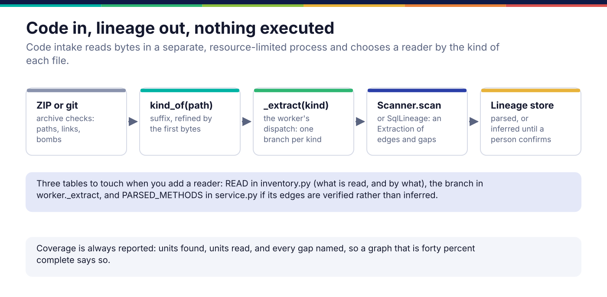

*Copyright © 2026 Ashutosh Sinha <ajsinha@gmail.com>. All rights reserved.*

---

# Adding a lineage reader for code

Code intake receives an application's code (a ZIP, or a git location) and reads column lineage out
of it without ever running it: SQL through sqlglot, stored procedures with their wrappers
stripped, PySpark, pandas and Airflow through the Python AST, Power BI models, and SSIS and
PowerCenter XML through a configurable mapping reader. Add a reader when an estate's
transformation logic lives in a format none of these reads. How lineage is stored, confirmed and
used is in [Lineage and code](../architecture/lineage-and-code.md).

## When you would write one

- A file kind code intake inventories but does not read: COBOL, JCL, shell, Scala, Java, a
  vendor ETL tool's export.
- A format that has never been an input: a source-to-target mapping workbook, a vendor's own
  lineage export.
- **Not** for lineage another catalogue already computed (Manta, Alation): that is an import,
  through `prama lineage import FILE --from manta` and `src/prama/importers/catalog.py`.

## The interface

```python
# src/prama/lineage/scan.py:117
class Scanner(abc.ABC):
    """Reads lineage out of one kind of legacy artefact."""

    name: ClassVar[str] = ""
    #: What this scanner has actually been tested against, in plain words.
    verified_against: ClassVar[str] = ""

    @abc.abstractmethod
    def scan(self, text: str, *, source: str = "") -> ScanResult:      # line 128
        """Extract what can be extracted, and report what could not."""
```

A `ScanResult` (line 45) carries an `Extraction` of `Edge`s and `Gap`s, how many units the
scanner recognised (`units_found`) and could not read (`units_unread`), and `misconfigured` when
it found the file and nothing in it that it could read. Its `coverage` is the share of units that
produced lineage, counted over units, not gaps.

- An `Edge` (`src/prama/lineage/graph.py:123`) is one column feeding another: `source` and
  `target` as `Column(dataset, name)`, a `Transform` (`identity`, `rename`, `derived`,
  `aggregated`, `filter`, `join_key`), the job that does it, and a fragment of the expression for
  a reader who wants to check.
- A `Gap` (`src/prama/lineage/sql.py:208`) is something not understood, named: its kind, a
  detail, and the unit it came from. Dynamic SQL, an unknown transform, an unparseable column.

**Coverage is always reported.** A reader that parsed forty percent of a package and says
nothing is worse than one that says so, because the graph looks complete and every impact
analysis built on it is confidently wrong.



## A worked example

**The real ones.** `ProceduralSqlScanner` in `src/prama/lineage/scan.py` strips the routine
wrapper from T-SQL, PL/SQL and DB2 SQL PL, sends the statements through the ordinary SQL
extractor, and reports every dynamic SQL construct (`EXEC(...)`, `sp_executesql`,
`EXECUTE IMMEDIATE`) as a gap, because that is where the interesting lineage hides.
`XmlMappingScanner` reads SSIS and PowerCenter XML with element and attribute names given as
configuration, and is declared unverified against a real export.

**A new one.** `docs/developer/examples/mapping_sheet_scanner.py` reads a source-to-target
mapping sheet, often the only lineage anybody has for a legacy feed:

```text
source,target,transform,job
raw.trades.acct,stg.trades.account_id,rename,load_trades
stg.trades.notional,mart.positions.exposure,aggregated,build_positions
```

```python
class MappingSheetScanner(Scanner):
    name: ClassVar[str] = "mapping_sheet"
    verified_against: ClassVar[str] = "sheets written by hand for tests/...; not a customer's workbook"

    def scan(self, text: str, *, source: str = "") -> ScanResult:
        reader = csv.DictReader(io.StringIO(text))
        header = [h.strip().lower() for h in reader.fieldnames or []]
        missing = [column for column in REQUIRED if column not in header]
        if missing:
            return ScanResult(scanner=self.name, source=source, extraction=Extraction(),
                              misconfigured=f"the sheet has no {' or '.join(missing)} column; ...")
        ...
        for line, raw in enumerate(reader, start=2):
            unit = f"{source or 'sheet'}:{line}"
            try:
                edge_from, edge_to = Column.parse(row["source"]), Column.parse(row["target"])
            except ValueError as exc:
                gaps.append(Gap(kind="unparsed", detail=str(exc), statement=unit))
                continue
            try:
                transform = Transform((row.get("transform") or "identity").lower())
            except ValueError:
                gaps.append(Gap(kind="unknown_transform", detail="... left out rather than guessed",
                                statement=unit))
                continue
            edges.append(Edge(source=edge_from, target=edge_to, transform=transform, ...))
        return ScanResult(scanner=self.name, source=source,
                          extraction=Extraction(edges=tuple(edges), gaps=tuple(gaps), statements=rows),
                          units_found=rows, units_unread=len(gaps))
```

An unknown transform is a gap, not a guess: an edge marked `identity` that was really an
aggregation makes every impact estimate built on it wrong. A sheet with the wrong header is
`misconfigured`, not an empty graph, because one is a bug and the other is a fact.

## Registration and configuration

Readers are dispatched by the kind of file, and adding one touches three tables in
`src/prama/codeintake/`:

1. `inventory.py`: map the suffix to a kind in `_BY_SUFFIX` (refine by the first bytes in
   `kind_of` if the suffix is shared, as Python files are split into pyspark, pandas and
   airflow), and add the kind to `READ` with the name of what reads it. A kind not in `READ` is
   inventoried and reported *not yet read*, which is the denominator a run's coverage is
   measured against.
2. `worker.py`: a branch in `_extract(kind, ...)` returning `(extraction, "code:<method>")`
   pairs. The worker runs in a separate process with CPU, memory and file limits, and reads
   bytes; it never imports, executes or renders what it was given.
3. `service.py`: add the method to `PARSED_METHODS` only if its edges are verified; otherwise
   they are stored as *inferred*, at `FALLBACK_CONFIDENCE`, waiting for a person to confirm them
   on the Lineage page. A new reader is inferred until it has met real inputs.

Bump `VERSION` in `worker.py` when reading logic changes: a unit is reused from the previous run
only when the file, the reader version and the dialect are all unchanged. The `codeintake:`
section of `config/application.yaml` sets the working directory, the reader's time limit and the
git hosts allowed; a reader adds no keys.

What was read shows up on the Code page as files read and edges found, and each edge on the
Lineage page names the reader that produced it and whether it is parsed or inferred:


## Testing

- **Real syntax, written by hand.** `tests/lineage/test_scan.py` (the procedural and XML
  scanners), `tests/lineage/test_sql.py` and `tests/lineage/test_pyspark.py` feed each reader text
  that exercises every construct it claims and every one it must report as a gap. `tests/codeintake/` runs
  the whole intake on fixture archives under `tests/fixtures/code/`.
- **Coverage arithmetic.** Assert `units_found`, `units_unread` and `coverage` on a sample with
  known gaps; QA finding LIN-059 was a coverage of -400%.
- **The counterfactual.** Feed a row the reader must not guess at (an unknown transform, an
  unqualified column) and assert it becomes a named gap and no edge; the example's test does.

## Checklist

- [ ] `name` and an honest `verified_against`.
- [ ] Every unreadable unit is a `Gap` with a kind, a detail and the unit it came from.
- [ ] `units_found` and `units_unread` set, so coverage is real.
- [ ] A wrong configuration is `misconfigured`, not an empty extraction.
- [ ] `_BY_SUFFIX`, `READ`, the `_extract` branch; `PARSED_METHODS` only once verified.
- [ ] Nothing in the reader executes, imports or renders its input.

---

<div align="center">
<br/>
<sub><b>PRAMA</b> — <i>Declare it. Prove it. Trust it.</i><br/>
Copyright © 2026 <b>Ashutosh Sinha</b> &lt;ajsinha@gmail.com&gt; · All rights reserved.<br/>
Proprietary and confidential. No licence is granted except by separate written agreement.<br/>
See <a href="../../LICENSE">LICENSE</a> and <a href="../../NOTICE">NOTICE</a>. Third-party names and marks are the property of their respective owners.</sub>
</div>
