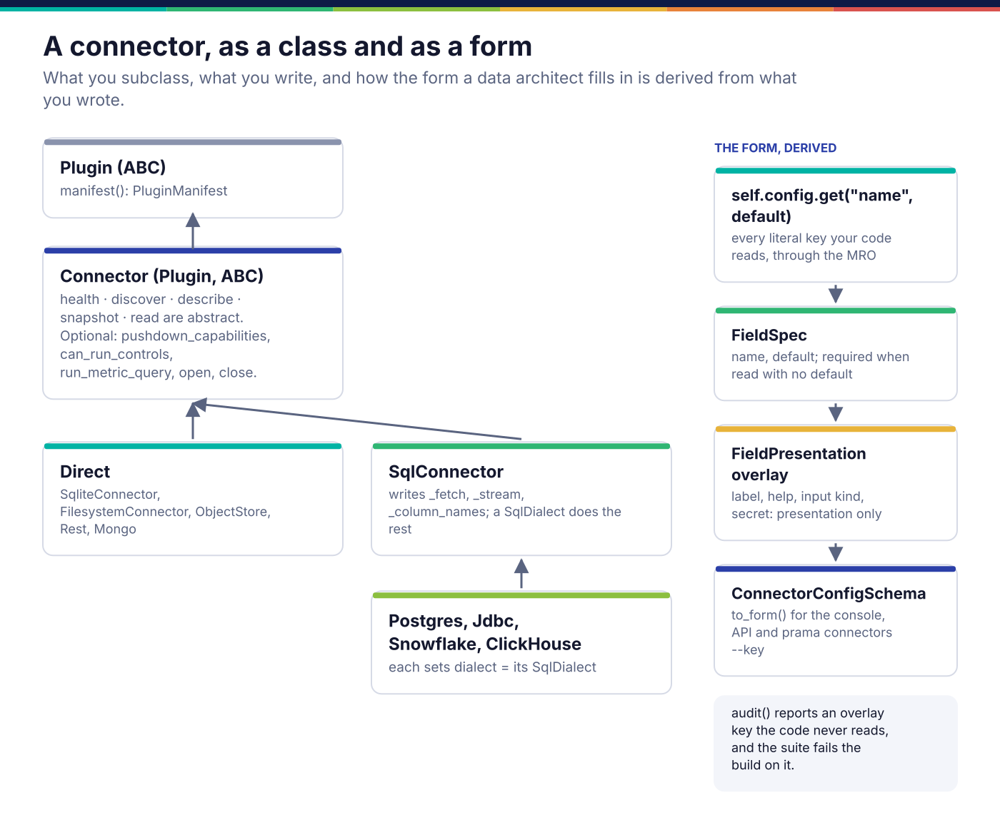
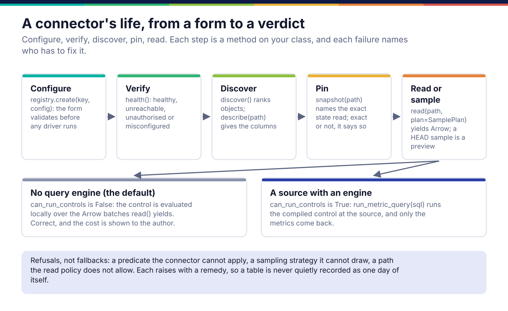
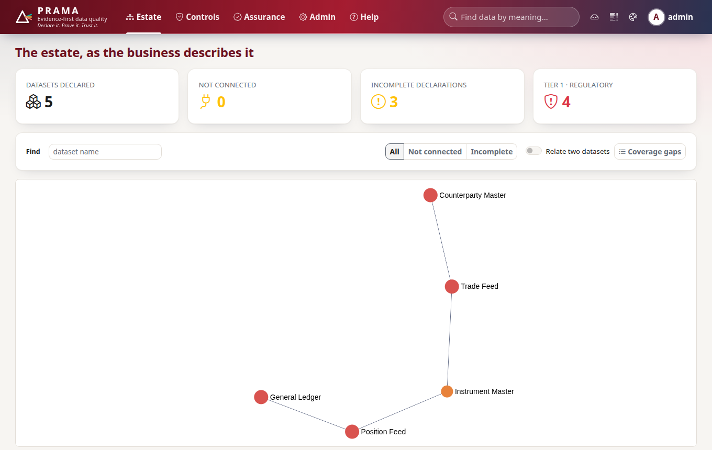

*Copyright © 2026 Ashutosh Sinha <ajsinha@gmail.com>. All rights reserved.*

---

# Writing a connector

A connector lets Prama reach one kind of source: list what it holds, describe an object, name the
exact state it is about to read, and stream rows as Arrow. Write one when an estate keeps data
somewhere no shipped connector reaches. What a connector is and where it sits in a run is in
[Execution](../architecture/execution.md#connectors-reaching-a-source); this page is how to write
one.

## When you would write one

- A source family Prama has no connector for: a document store, a SaaS API, a mainframe extract.
- A relational database with its own SQL: write a **dialect**, not a connector. The SQL connector
  base does the rest; see [backends and dialects](backends-and-dialects.md).
- A different way of reading a source that already has a connector (a faster driver, a
  different authentication mode): extend the existing connector's configuration instead.

## The interface

`prama.connect.spi.Connector` is a `Plugin` with five abstract methods. Everything else has a
correct default.

```python
# src/prama/connect/spi.py:381
class Connector(Plugin, ABC):
    """One source type. Constructed from a configuration, never from a URL."""

    source_kind: SourceKind = SourceKind.RELATIONAL
    credential_field: str = "password"

    def __init__(self, config: dict[str, Any], *, policy: ReadPolicy | None = None) -> None:

    @abstractmethod
    async def health(self) -> HealthReport:                                   # line 417
        """Can this source be reached, and may we read from it?"""

    @abstractmethod
    async def discover(self, path: tuple[str, ...] = ()) -> list[DiscoveredObject]:   # 421
        """What exists here, ranked for a business reader."""

    @abstractmethod
    async def describe(self, path: tuple[str, ...]) -> ObjectSchema:          # line 425
        """The physical shape of one object."""

    @abstractmethod
    async def snapshot(self, path: tuple[str, ...]) -> Snapshot:              # line 429
        """Name the exact state about to be read."""

    @abstractmethod
    def read(
        self, path: tuple[str, ...], *, plan: SamplePlan | None = None
    ) -> AsyncIterator[pa.RecordBatch]:                                       # line 433
        """Stream the object as Arrow record batches."""
```

The optional half, with the default that is correct for most sources:

| Member | Default | Override when |
|---|---|---|
| `open()` / `close()` (line 399) | nothing | the source needs a pool or a session |
| `pushdown_capabilities()` (line 472) | `()`: nothing can be pushed down | the source has a query engine whose behaviour you can state |
| `can_run_controls` (line 444) | `False`: controls run locally over `read` | the source can evaluate a compiled metric query |
| `run_metric_query(sql)` (line 455) | refuses, naming the alternative | `can_run_controls` is `True` |
| `describe_manifest(...)` (line 522) | builds the manifest, `verification=CODE_COMPLETE` | always call it from `manifest()` |

For a SQL database, subclass `SqlConnector` (`src/prama/connect/sources/sql/base.py:62`) instead
and write three driver primitives, `_fetch` (line 88), `_stream` (line 95) and `_column_names`
(line 103); a `SqlDialect` supplies the catalogue and sampling SQL, and the base class
implements all five contract methods from them.

## The connector, as a class and as a form



The form a data architect fills in is **derived from your code**, never written by hand.
`ConfigSchemaDeriver` (`src/prama/connect/config_schema.py:117`) parses the connector's source,
through its base classes, for every `self.config.get("name", default)` with a literal key:

- a key read **with** a default becomes an optional field with that default;
- a key read **without** one becomes a required field;
- a key read any other way (computed, looped over) is invisible, so read configuration only
  through `self.config.get` with a literal key.

An **overlay** of `FieldPresentation` adds only presentation: a label, help text, the input kind,
whether it is secret, its group and order. It may annotate a field the code reads and may not
invent one: `ConnectorRegistry.audit()` reports an overlay key the code never reads, and the
suite fails the build on it. The same form reaches the console's source picker, the API
(`GET /api/v1/connectors`) and the CLI:

```text
$ prama connectors --key sqlite
sqlite:
  [connection]
   * database_path            path
       Path to the .db or .sqlite file. It is opened read-only.
     include_views            boolean    (default True)
       Whether discovery offers views as well as tables.
  [advanced]
     busy_timeout_seconds     number     (default 5.0)
       How long to wait when another writer holds the database.
```

## The lifecycle



1. **Configure.** `ConnectorRegistry.create(key, config, policy=...)`
   (`src/prama/connect/registry.py:110`) validates the configuration against the derived form
   *before* constructing the connector, so a missing field is a message beside the input rather
   than a driver error twenty seconds into a connection. A stored connection's credential is
   resolved from its `credential_ref` and injected under the connector's `credential_field`.
2. **Verify.** `health()` answers in terms of who has to fix it: `UNREACHABLE` sends somebody
   to the network, `UNAUTHORISED` to whoever grants access, `MISCONFIGURED` back to the form.
   Write `detail` for a data architect, not an engineer.
3. **Discover.** `discover()` ranks objects for a person scanning a source (largest first), and
   `describe(path)` returns the columns. Both honour `self.policy.permits_path`.
4. **Pin.** `snapshot(path)` names the exact state about to be read. Say honestly whether it is
   exact: `FILE_DIGEST`, `LSN` or `TRANSACTION_ID` are; `WALL_CLOCK` and `OBJECT_LISTING` are
   not, and the evidence record carries the difference.
5. **Read or sample.** `read(path, plan=SamplePlan(...))` yields Arrow record batches. A
   `HEAD` sample is a preview, never representative. A predicate you cannot apply is refused
   with `self.require_predicate_support(plan)`, never silently widened to a full read.

## A worked example

**The real one.** `src/prama/connect/sources/sqlite.py` is the smallest complete connector in
the product: a SQLite file opened read-only, a snapshot from the file's size, nanosecond mtime
and page count, offset paging in a worker thread, and `can_run_controls = True` because SQLite
is a query engine. Read it beside this guide.

**A new one.** `docs/developer/examples/fixed_width_connector.py` reads a folder of fixed-width
text extracts, the format a mainframe or a vendor feed delivers with a copybook. It declares no
pushdown, so a control on one of its files is evaluated locally. The parts that matter:

```python
class FixedWidthConnector(Connector):
    plugin_key = "fixed_width"
    source_kind = SourceKind.FILESYSTEM

    @classmethod
    def manifest(cls) -> PluginManifest:
        return cls.describe_manifest(
            key="fixed_width",
            display_name="Fixed-width text extract",
            capabilities=CAPABILITIES.to_capabilities(),
            description="A folder of fixed-width files, read with a declared record layout.",
            verification=Verification.CODE_COMPLETE,     # nothing real has answered it yet
        )

    def __init__(self, config: dict[str, Any], **kwargs: Any) -> None:
        super().__init__(config, **kwargs)
        self._root = Path(str(self.config.get("root_path"))).expanduser()   # required
        self._suffix = str(self.config.get("suffix", ".txt"))               # optional
        self._encoding = str(self.config.get("encoding", "ascii"))          # optional
        self._layout_error = ""
        try:
            self._layout = parse_layout(str(self.config.get("layout") or ""))   # required
        except ValueError as exc:
            self._layout_error = str(exc)    # reported by health() as MISCONFIGURED
```

`__init__` never raises on bad configuration: the conformance suite constructs every connector
with an empty configuration, and a malformed layout belongs in `health()` as `MISCONFIGURED`,
which sends the reader back to the form. `read` refuses what it cannot do:

```python
    async def read(self, path, *, plan=None):
        file = self._file(path)                      # policy check, existence, remedy
        plan = plan or SamplePlan()
        self.require_predicate_support(plan)         # a predicate it cannot apply: refused
        if plan.strategy not in (SamplingStrategy.FULL, SamplingStrategy.HEAD):
            raise ConnectorError(
                f"a fixed-width file cannot be sampled by {plan.strategy.value}",
                code="CONNECT.NO_SAMPLING",
                remedy="Read it whole, or take a HEAD sample to preview its shape. ...",
            )
        ...                                          # yields pa.RecordBatch, blank -> None
```

Its overlay adds labels, help and input kinds for the four fields the code reads, and `register`
puts it in a registry. `tests/docs/test_developer_examples.py` runs it through the connector
contract: the derived form, health in each state, discovery, describe, an exact and stable
snapshot, a full read, a bounded `HEAD` sample, the read policy, and each refusal.

## Registration and configuration

**In the product.** Add the connector to `BUILTIN` in `src/prama/connect/builtin.py` (line 458),
with its capability matrix and its overlay. `register_builtin()` is what the CLI, the API and
the connectivity service call. Keep the overlay beside the other overlays in that file, so the
one hand-written part of every form is in one place.

**From another distribution.** The registry declares the `"prama.connectors"` entry-point group
and has a `discover()` method, but **nothing in the server calls it yet**, so a third-party
connector advertised there is not loaded. Until that is wired, a connector ships in-tree.

**Configuration a connector reads** is a connection's own `config` mapping, never
`config/application.yaml`:

```python
client.connections.create(
    "desk-extracts", "fixed_width",
    config={"root_path": "/data/landing/desk", "layout": "trade_id:1-6,ccy:7-9,amount:10-21"},
    credential_ref=None,          # env://, file:// or vault://; never the secret itself
)
```

A secret is never stored in the connection: the record is exported to Git and shown in the
console, and `validate` refuses a field marked `secret` that arrives with a value. The resolved
credential is injected under `credential_field` at the last moment, by the connectivity service.

Two settings in `config/application.yaml` decide where a connector is used: a run the server
performs over the API opens only the `sqlite`, `duckdb` and `files` kinds, confined to
`runs.roots` (`src/prama/connect/sources/confined.py`); any other connector serves
`prama connect test | discover | profile` and profiling, and runs its controls through an agent
or `prama control run` on a host that can reach it.

The effect in the console: a dataset bound to a connection that reaches its source stops counting
as *not connected*.



## Testing

- **The contract.** `tests/connect/test_conformance.py` runs every locally runnable connector
  through the same tests. Add the new key to its `COVERAGE` table with a fixture, or with `None`
  and a comment naming the integration test that proves it: `test_every_registered_connector_is_accounted_for`
  fails the build otherwise.
- **The claim.** A connector declaring `Verification.VERIFIED` must be listed in `LIVE_TESTS`
  with a test that reaches the real product. Until something real has answered it, it is
  `CODE_COMPLETE`, and its description says so in the source picker.
- **The form.** `ConnectorRegistry.audit()` must return nothing, and every connector must state
  its `credential_field`.
- **The counterfactual.** Break the property you claim and watch the test fail. The example's
  tests make a blank field come back as `""` instead of `None`, and the contract test fails; add
  an overlay key the code never reads, and `audit()` names it.

## Checklist

- [ ] Five abstract methods implemented; `__init__` does not raise on an empty configuration.
- [ ] Configuration read only through `self.config.get("literal", default)`.
- [ ] Overlay adds presentation only, and `audit()` is clean.
- [ ] `health()` distinguishes unreachable, unauthorised and misconfigured, in business language.
- [ ] `snapshot()` uses the most exact `SnapshotKind` the source offers, and no more exact.
- [ ] Unsupported predicates and sampling strategies are refused with a remedy.
- [ ] Capabilities declared, never probed; `can_run_controls` agrees with them.
- [ ] Added to `BUILTIN`, to `COVERAGE`, and to `LIVE_TESTS` only if verified.
- [ ] Blocking drivers run in `asyncio.to_thread` (or the concurrency package), never on the loop.
- [ ] Every new file carries the copyright line.

---

<div align="center">
<br/>
<sub><b>PRAMA</b> — <i>Declare it. Prove it. Trust it.</i><br/>
Copyright © 2026 <b>Ashutosh Sinha</b> &lt;ajsinha@gmail.com&gt; · All rights reserved.<br/>
Proprietary and confidential. No licence is granted except by separate written agreement.<br/>
See <a href="../../LICENSE">LICENSE</a> and <a href="../../NOTICE">NOTICE</a>. Third-party names and marks are the property of their respective owners.</sub>
</div>
