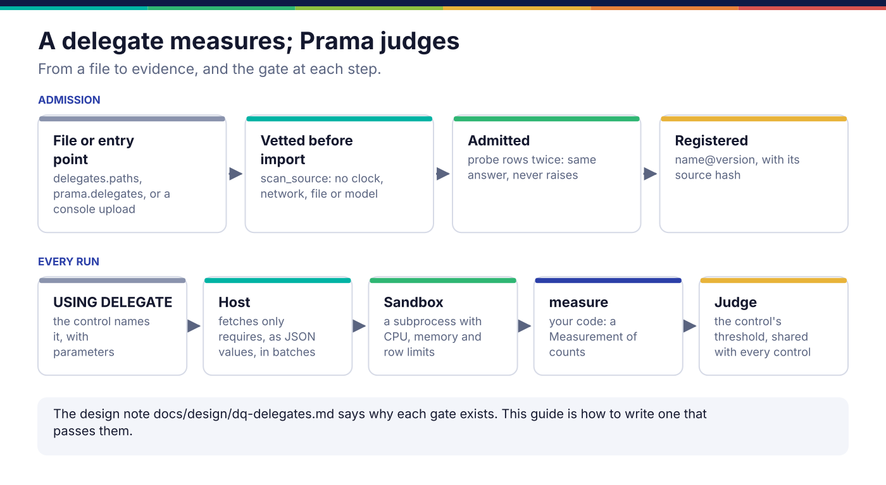
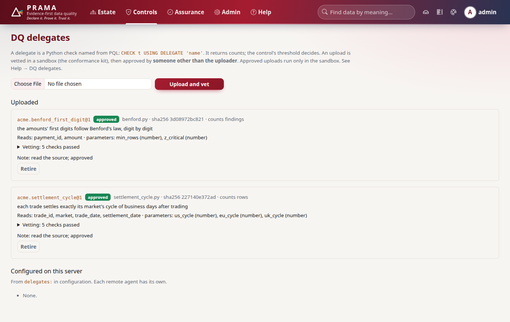

*Copyright © 2026 Ashutosh Sinha <ajsinha@gmail.com>. All rights reserved.*

---

# Writing a DQ delegate

A delegate is a data quality check written in Python, for what PQL cannot say: a comparison
across rows in order, a statistical test over a whole column, a rule that needs a market
calendar. A control names it with `USING DELEGATE 'acme.settlement_cycle'`; the delegate counts,
and the control's threshold decides. This guide is how to write, test and ship one. Why each
rule exists is in the design note, [DQ delegates](../design/dq-delegates.md), and the guide for
people uploading one through the console is
[the console's delegates guide](../../src/prama/web/guides/delegates.md); neither is repeated here.

## When you would write one

- The check needs rows in order or in groups: balance continuity, a sequence with no gaps, a
  settlement date that depends on a calendar.
- The check is a statistic over the column: Benford's first digits, a distribution test.
- **Not** for a row-level expression: a [PQL function](pql-functions.md) compiles to SQL and runs
  in the warehouse over every row. **Not** for one value's validity: that is a
  [validator](validators.md). A delegate moves the columns it needs out of the source, so it is
  the last resort, not the first.

## The interface

```python
# kernel/src/prama_kernel/delegates/spi.py:120
class DqDelegate(abc.ABC):
    """A data quality check written in Python, registered under a name."""

    name: ClassVar[str] = ""                    # USING DELEGATE 'acme.settlement_cycle'
    version: ClassVar[str] = "1"                # pinned as 'acme.settlement_cycle@2'
    requires: ClassVar[tuple[str, ...]] = ()    # the columns it reads; only these are fetched
    parameters: ClassVar[tuple[Parameter, ...]] = ()
    unit: ClassVar[str] = "rows"                # or "findings"
    summary: ClassVar[str] = ""

    @abc.abstractmethod
    def measure(self, rows: Iterable[Mapping[str, Any]], params: Mapping[str, Any]) -> Measurement:  # line 137
        """Count what is scanned and what violates. Must not raise on odd input."""
```

It is imported from `prama.delegates` on the server or `prama_kernel.delegates.spi` beside the
agent; `prama.delegates.spi` is an alias of the kernel module, so there is one copy of the code. A `Measurement` carries `scanned`, `violating`, named
`observations` (finite numbers, recorded and never judged), a few `samples`, a `note`, and
`established`, which is false when the rows could not establish anything: the verdict is then
indeterminate, never a pass. `Parameter(name, kind, default, required, doc)` declares what PQL may
pass, and `resolve` refuses an unknown, missing or mistyped one before `measure` runs.



## A worked example

**The real ones.** Case study 5 ships two, in `case-studies/05-dq-delegates/acme_delegates/`:
`settlement_cycle.py` checks that every trade settles on its market's business-day cycle, with
the calendars inside the file so a new holiday changes the delegate's source hash; `benford.py`
counts findings rather than rows.

**A new one.** `docs/developer/examples/delegates/balance_continuity.py`: each day's opening
balance for an account must equal the previous day's closing balance.

```python
class BalanceContinuity(DqDelegate):
    name = "example.balance_continuity"
    version = "1"
    requires = ("account_id", "as_of", "opening", "closing")
    parameters = (
        Parameter("tolerance", "number", default=0.005,
                  doc="The largest difference still counted as continuous, in the balance's units."),
    )
    unit = "rows"
    summary = "each day's opening balance equals the previous day's closing balance"

    def measure(self, rows, params):
        tolerance = float(params.get("tolerance") or 0.0)
        by_account, scanned, undated, samples = {}, 0, 0, []
        for row in rows:                       # one pass: Prama streams, a second pass sees nothing
            scanned += 1
            day = _day(row.get("as_of"))       # ISO text, or "" when it is not a date
            if not day:
                undated += 1                   # cannot be placed in the chain: a violation
                ...
                continue
            by_account.setdefault(str(row.get("account_id")), []).append((day, row))

        broken = 0
        for account in sorted(by_account):     # sorted: the same answer on every run
            days = sorted(by_account[account], key=lambda item: item[0])
            for (_, previous), (_, current) in pairwise(days):
                closed, opened = _amount(previous.get("closing")), _amount(current.get("opening"))
                if closed is None or opened is None or abs(opened - closed) > tolerance:
                    broken += 1
                    ...
        return Measurement(scanned=scanned, violating=broken + undated,
                           observations={"accounts": float(len(by_account)), "undated": float(undated)},
                           samples=tuple(samples), note=..., established=scanned >= 2)
```

What to copy: the rows are iterated **once**; odd input (`None`, `"2026-02-30"`, a string where
a number belongs) is counted, never raised on; every violation is a distinct row, so `violating`
never exceeds `scanned`; and one row establishes nothing.

## What Prama refuses, and when

| Rule | Checked | Why |
|---|---|---|
| No clock, network, filesystem, subprocess or model | By scanning the source **before import** | A verdict that depends on when or where it ran cannot be replayed |
| Same answer twice on the same probe rows | At admission | Hidden state makes evidence irreproducible |
| No exception on nulls, blanks or an empty dataset | At admission | The first blank in production would take the control down |
| Counts are whole numbers; violations never exceed the rows scanned | Every run | A measurement that cannot be judged is an error, not a verdict |
| Too many rows | Every run | Refused, never silently truncated |

Every evidence record names the delegate, its version and a **hash of its source**. If you edit
the delegate, the hash changes, so you can always tell what produced a verdict.

## Registration and configuration

A host runs only the delegates its own configuration admits, and there are three ways in:

| Way | How | When |
|---|---|---|
| A directory | `delegates.paths: [/opt/acme/delegates]`; every `.py` file is vetted before import | a team's own delegates, deployed with the host |
| An entry point | `[project.entry-points."prama.delegates"]` in a distribution, with `delegates.entry_points: true` | a package shipped to several hosts |
| A console upload | uploaded, vetted in the sandbox, approved by somebody other than the uploader | an estate's delegates, with four eyes |

```toml
# pyproject.toml of a distribution
[project.entry-points."prama.delegates"]
balance_continuity = "acme_delegates.balance:BalanceContinuity"
```

The settings, in `config/application.yaml`:

```yaml
delegates:
  enabled: true
  paths: []                         # directories of delegate .py files, vetted before import
  entry_points: true                # also load the prama.delegates entry point
  disabled: []                      # names to refuse even if installed
  sandbox: true                     # run in a resource-limited subprocess
  timeout: 120                      # CPU seconds per run
  memory_mb: 2048
  max_rows: 5000000                 # a larger dataset is refused, never truncated
  batch_rows: 10000                 # rows per batch streamed from the cursor to the delegate
```

A remote agent has its own `delegates:` section and its own directory; `prama delegate pull`
copies the estate's approved uploads into it.

The Delegates page lists uploads with what vetting found, the columns each reads and its
parameters, and what this server's configuration admitted:



## Testing

The conformance kit is what Prama runs at admission, plus your own expected answers; run it in
the delegate's own CI, before Prama ever sees it:

```python
from prama.delegates.testkit import Case, check_delegate

def test_balance_continuity_conforms() -> None:
    report = check_delegate(
        "delegates/balance_continuity.py",
        cases=[Case("one break and one undated row", rows=LEDGER, scanned=5, violating=2)],
    )
    assert report.ok, report.render()
```

or without Python: `prama delegate check delegates/ --cases cases.json`, which exits non-zero on
any failure. What it checks, and why each check exists, is in
[the design note](../design/dq-delegates.md#the-conformance-kit-pramadelegatestestkit). `prama delegate test acme.x --rows sample.csv` runs one
over a file exactly as a control would.

**The counterfactual.** A case whose expectation is wrong must fail the kit, and the example's
test has one; a kit that passed it would be a rubber stamp.

## Checklist

- [ ] `name` dotted, `version` set, `requires` lists only the columns needed.
- [ ] `measure` iterates its rows once, never raises on odd input, and returns whole-number counts.
- [ ] `established=False` when the rows cannot support the check.
- [ ] Nothing reads the clock, a file, the network or a model; nothing depends on set order.
- [ ] Parameters declared with kinds, defaults and a `doc` a control author can follow.
- [ ] `check_delegate` green in CI, with cases that include a violation and an empty input.

---

<div align="center">
<br/>
<sub><b>PRAMA</b> — <i>Declare it. Prove it. Trust it.</i><br/>
Copyright © 2026 <b>Ashutosh Sinha</b> &lt;ajsinha@gmail.com&gt; · All rights reserved.<br/>
Proprietary and confidential. No licence is granted except by separate written agreement.<br/>
See <a href="../../LICENSE">LICENSE</a> and <a href="../../NOTICE">NOTICE</a>. Third-party names and marks are the property of their respective owners.</sub>
</div>
