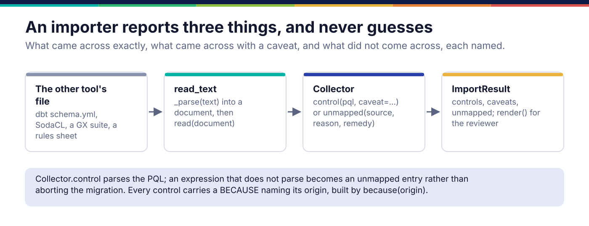

*Copyright © 2026 Ashutosh Sinha <ajsinha@gmail.com>. All rights reserved.*

---

# Writing a control importer

An importer brings another tool's checks across as PQL: dbt tests, SodaCL, a Great Expectations
suite. Its job is to report three things honestly: what came across exactly, what came across with
a difference worth stating, and what did not come across, each named. Where importers sit among
the ways controls are authored is in
[Controls and PQL](../architecture/controls-and-pql.md#importers-and-contracts).

## When you would write one

- An estate's existing checks live in a tool Prama does not read: a vendor's rule export, an
  in-house YAML format, a spreadsheet of rules.
- **Not** for a data contract: `prama contract` reads ODCS and its own JSON, through
  `src/prama/contract/`. **Not** for glossary or lineage exports from a catalogue: those go
  through `src/prama/importers/catalog.py`, which is a different shape.

## The interface

```python
# src/prama/importers/spi.py:125
class Importer(ABC):
    """Reads one tool's control definitions."""

    #: What this reads, as it would be named to a user.
    format_name: str = ""

    @abstractmethod
    def read(self, document: Any) -> ImportResult:          # line 132
        """Import an already-parsed document."""

    def read_text(self, text: str) -> ImportResult:          # line 135
        """Import from the file's own text."""
        return self.read(self._parse(text))

    def _parse(self, text: str) -> Any:                      # YAML by default
        import yaml
        return yaml.safe_load(text)
```

Build the result with a `Collector` (line 145), never by hand. It has two verbs:

- `control(pql, caveat="")` parses the PQL; an expression that does not parse is recorded as
  unmapped rather than aborting a migration of hundreds of controls;
- `unmapped(source, reason, remedy="", dataset="")` names something that did not come across.

An importer built around a collector cannot forget to report what it skipped, because skipping
means calling `unmapped` and there is nowhere else to put it. Two helpers keep the PQL valid:
`quote(value)` renders a literal, and `because(origin)` renders the whole `BECAUSE '...'`
clause, escaping quotes from somebody else's file.



## The rule: never guess

A construct whose meaning is not certain is reported unmapped, never approximated. An
approximated control passes review because it looks like the others, and then quietly checks
something else. A difference in meaning that is certain, such as dbt's `relationships` ignoring
nulls where Prama counts a null reference as a violation, comes across **with a caveat** that
says so.

## A worked example

**The real one.** `src/prama/importers/dbt.py` reads `schema.yml` tests: `not_null`, `unique`
(with a caveat when the declared grain is wider), `accepted_values`, `relationships`, and the
`dbt_utils` and `dbt_expectations` tests whose meaning is certain. Everything else is unmapped
with a reason.

**A new one.** `docs/developer/examples/rules_sheet_importer.py` reads the commonest legacy
estate of all, a spreadsheet of rules saved as CSV:

```text
dataset,column,rule,value
trades,trade_id,not null,
trades,trade_id,unique,
trades,ccy,one of,USD|EUR|GBP
trades,notional,minimum,0
trades,book,looks right,
```

```python
class RulesSheetImporter(Importer):
    format_name = "rules spreadsheet (CSV)"

    def _parse(self, text: str) -> Any:
        return list(csv.DictReader(io.StringIO(text)))

    def read(self, document: Any) -> ImportResult:
        out = Collector(self.format_name)
        for line, row in enumerate(document or [], start=2):
            ...
            origin = f"rules sheet row {line} ({dataset}.{column}: {rule or 'no rule'})"
            if not dataset or not column:
                out.unmapped(origin, "the row names no dataset or no column", dataset=dataset)
                continue
            self._rule(out, dataset, column, rule, value, origin)
        return out.result()

    def _rule(self, out, dataset, column, rule, value, origin) -> None:
        target = f"{dataset}.{column}"
        if rule in ("not null", "mandatory", "required"):
            out.control(f"CHECK {target} IS NOT NULL {because(origin)}")
        elif rule == "one of" and value:
            allowed = ", ".join(quote(v.strip()) for v in value.split("|") if v.strip())
            out.control(f"CHECK {target} IN ({allowed}) {because(origin)}", caveat=BLANKS)
        ...
        else:
            out.unmapped(
                origin,
                f"no Prama construct is certain to mean {rule!r} with value {value!r}",
                remedy="Write this control by hand in PQL; the rest of the import is unaffected.",
                dataset=dataset,
            )
```

`ImportResult.render()` is what a reviewer reads before signing the migration off; the gaps are
listed one by one, never summarised as a count:

```text
Imported 4 control(s) from rules spreadsheet (CSV).

3 came across with a difference worth knowing:
  CHECK trades HAS UNIQUE KEY (trade_id) BECAUSE 'Imported from rules sheet row 3 ...'
    ! The sheet says this column alone is distinct. If the dataset's declared grain is wider, ...
  ...

1 did not come across:
  rules sheet row 6 (trades.book: looks right): no Prama construct is certain to mean 'looks right' with value ''
    → Write this control by hand in PQL; the rest of the import is unaffected.
```

## Registration and configuration

Add the class to `IMPORTERS` in `src/prama/importers/__init__.py`, keyed by the name a person
would use for the tool. `importer(name)` looks it up (normalising `rules-sheet` to `rules_sheet`),
and `prama control import FILE --from NAME` offers every key as a choice. There is no entry point
and no configuration: an importer is a reader of a file format, and the format is named on the
command line.

```bash
prama control import schema.yml --from dbt
```

## Testing

- `tests/importers/test_importers.py` pins each shipped importer on real fixtures: the count that
  came across, each caveat, and each unmapped construct **by name**.
- Assert that every imported control parses and carries `BECAUSE 'Imported from ...'`.
- **The counterfactual.** Feed a construct the importer must refuse (an unknown rule, a
  `minimum` that is not a number) and assert it is unmapped with a reason, not imported as
  something close; the example's test does both.

## Checklist

- [ ] Every construct either becomes a control, a control with a caveat, or an unmapped entry; nothing is dropped.
- [ ] Every control carries `because(origin)` naming where it came from.
- [ ] Literals go through `quote`; nothing from the source file is interpolated raw.
- [ ] A difference in meaning is a caveat; an uncertain meaning is unmapped.
- [ ] Added to `IMPORTERS`; tests pin the unmapped list by name.

---

<div align="center">
<br/>
<sub><b>PRAMA</b> — <i>Declare it. Prove it. Trust it.</i><br/>
Copyright © 2026 <b>Ashutosh Sinha</b> &lt;ajsinha@gmail.com&gt; · All rights reserved.<br/>
Proprietary and confidential. No licence is granted except by separate written agreement.<br/>
See <a href="../../LICENSE">LICENSE</a> and <a href="../../NOTICE">NOTICE</a>. Third-party names and marks are the property of their respective owners.</sub>
</div>
