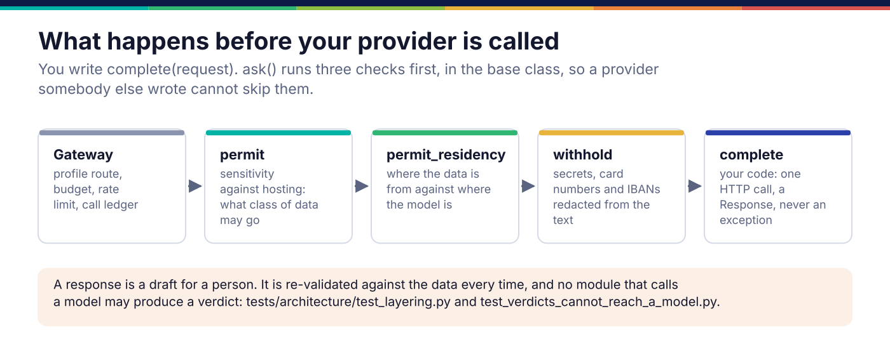
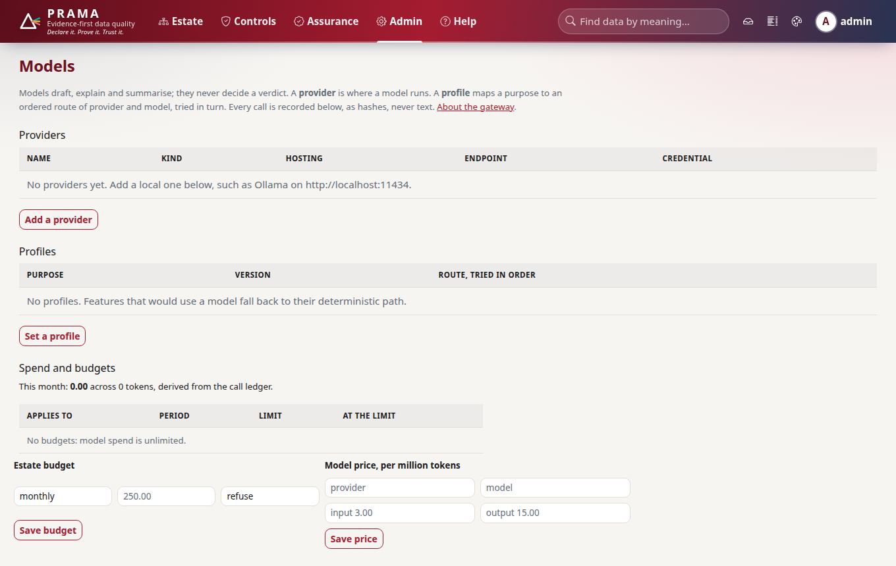

*Copyright © 2026 Ashutosh Sinha <ajsinha@gmail.com>. All rights reserved.*

---

# Adding a model provider to the LLM gateway

A provider is a model Prama can ask a question of: a self-hosted server, a vendor's API, a
vendor's model inside the customer's own cloud. Every model call goes through the gateway, which
routes it by purpose, budgets it, records it, and asks a provider. What the gateway does, and
the line models cannot cross, is in [Intelligence](../architecture/intelligence.md); this page is
how to add a provider without crossing it.

## When you would write one

- **A new server dialect** for an OpenAI-compatible server that reads a grammar from a field the
  shipped dialects do not name: one entry in `DIALECTS` in `src/prama/llm/providers.py`, no new
  class.
- **A new kind**: a server or a vendor whose API is not OpenAI-shaped, Anthropic-shaped or
  Bedrock's Converse. A `ModelProvider` subclass, an entry in `KINDS`, and a branch in `build`.
- **Not** to make a model decide anything about data. See *The boundary* below.

## The interface

```python
# src/prama/llm/spi.py:193
class ModelProvider(abc.ABC):
    """A model Prama can ask a question of."""

    name: ClassVar[str] = ""                          # the name used in configuration
    hosting: ClassVar[Hosting] = Hosting.HOSTED       # SELF_HOSTED, TENANT or HOSTED
    supports_grammar: ClassVar[bool] = False          # can it constrain decoding?

    @abc.abstractmethod
    def complete(self, request: Request) -> Response:                # line 204
        """Answer one request. Implementations do not enforce residency."""

    residency_gate: Gate | None = None
    residency_region: str = ""                        # a jurisdiction ("EU"), not a cloud region

    def ask(self, request: Request) -> Response:                     # line 218
        self.permit(request)                # sensitivity against hosting
        self.permit_residency(request)      # where the data is from against where the model is
        return self.complete(self.withhold(request))     # secrets and card numbers redacted
```

You implement `complete` and nothing else. Optional: `stream` (the default completes, then
yields once) and `embed_texts` (the default returns `None`, and callers fall back to their
non-model ranking). A `Request` carries the system text, the prompt, its sensitivity, an optional
`Grammar`, `max_tokens`, `temperature` (zero for anything that becomes a proposal) and `seed`;
its `fingerprint` hashes everything that decides the answer. A `Response` carries the text, the
model, the token counts, whether the grammar was enforced during decoding, and `incomplete` when
the provider declined or failed.



## The boundary a provider must respect

- **It never decides.** A response is a draft for a person: a proposed control, an explanation,
  a summary. It is re-validated against the data every time. No module that calls a model may
  produce a pass or fail verdict (`CON-007`): `tests/architecture/test_layering.py` refuses a
  module that both talks to a model and says *verdict*, and
  `tests/architecture/test_verdicts_cannot_reach_a_model.py` refuses any import chain from
  `prama.backend`, `prama.execute`, `prama.evidence` or `prama.ir` to `prama.llm`.
- **It never raises for an ordinary failure.** An unreachable model returns a `Response` with
  `incomplete` set; raising would turn a degraded feature into a failed run.
- **It does not enforce residency itself.** It sets `residency_gate` and `residency_region` and
  lets `ask` check them, so the rule lives in one place. A hosted provider with no gate is
  refused: undeclared is not unrestricted.
- **It is honest about hosting.** A vendor's API declared `SELF_HOSTED` would skip the residency
  check entirely; the shipped HTTP providers refuse that combination at construction.

## A worked example

**The real ones.** `OpenAiCompatibleProvider` in `src/prama/llm/providers.py` serves vLLM,
Ollama, llama.cpp, LM Studio, TGI and Azure; its `dialect` picks the request field a grammar goes
in:

```python
# src/prama/llm/providers.py:256
DIALECTS: dict[str, Dialect] = {
    "vllm": Dialect(grammar="guided_grammar", regex="guided_regex"),
    "llamacpp": Dialect(grammar="grammar"),
    "ollama": Dialect(),
    "lmstudio": Dialect(),
    "tgi": Dialect(),
    "openai": Dialect(),
    #: Unknown server: assume it enforces nothing, the safe side of the claim.
    "generic": Dialect(),
}
```

A server that enforces a grammar through a field not listed here is one line in this table.

**A new one.** `docs/developer/examples/generate_provider.py` speaks text-generation-inference's
native `POST /generate`, which takes a regular-expression grammar the OpenAI shape has no field
for:

```python
class GenerateProvider(ModelProvider):
    name: ClassVar[str] = "tgi_generate"
    hosting: ClassVar[Hosting] = Hosting.SELF_HOSTED
    supports_grammar: ClassVar[bool] = True

    def __init__(self, endpoint, *, model="", timeout=30.0, opener=None, gate=None, region=""):
        self._endpoint = endpoint.rstrip("/")
        self.model = model or "default"
        self._open = opener or _post          # injected in tests: nothing leaves the machine
        self.residency_gate = gate            # set, never checked here
        self.residency_region = region

    def complete(self, request: Request) -> Response:
        parameters = {"max_new_tokens": request.max_tokens, "details": True}
        if request.temperature > 0:
            parameters |= {"do_sample": True, "temperature": request.temperature}
        if request.seed is not None:
            parameters["seed"] = request.seed
        grammar = request.grammar.pattern if request.grammar else ""
        if grammar:
            parameters["grammar"] = {"type": "regex", "value": grammar}
        body = {"inputs": f"{request.system}\n\n{request.prompt}".strip(), "parameters": parameters}
        try:
            payload = json.loads(self._open(f"{self._endpoint}/generate", json.dumps(body).encode(), ...))
        except (OSError, ValueError) as exc:
            return Response(text="", model=self.model, provider=self.name,
                            request_fingerprint=request.fingerprint,
                            incomplete=f"{type(exc).__name__}: {exc}")
        details = payload.get("details") or {}
        return Response(text=str(payload.get("generated_text", "")), model=self.model,
                        provider=self.name, request_fingerprint=request.fingerprint,
                        output_tokens=int(details.get("generated_tokens") or 0),
                        grammar_enforced=bool(grammar), ...)
```

Its test calls `ask` with a prompt containing a card number and checks that the body the server
received has it redacted, which is the base class's work and not the provider's.

## Registration and configuration

Providers are stored in the database, not in YAML, and added on the console's Models page, with
`prama llm provider add`, or with `client.models.add_provider`:

```bash
prama llm provider add local --kind openai_compatible --hosting self_hosted \
    --dialect ollama --endpoint http://localhost:11434
prama llm profile set author --route local:qwen2.5-coder
```

A credential is a reference (`env://`, `file://`, `vault://`), resolved when a call is made,
never stored. To make a new kind available, in `src/prama/llm/kinds.py`:

1. add it to `KINDS` (line 45) with the sentence the console shows;
2. add a branch to `build` (line 87) that constructs the provider from a `ProviderSpec`, passing
   `gate` and `region`;
3. add the kind to the `networked` tuple in `build` if it makes a network call, so `llm.offline`
   refuses it unless it is self-hosted on a local or private address.

`config/application.yaml` holds only the gateway's policy: `llm.offline`,
`llm.per_principal_rpm`, `llm.audit.payloads` and `llm.eval.gate_activation`.



## Testing

- **Wire format without a network.** Inject the opener and assert the request body: the
  endpoint path, the grammar field, the redacted prompt. `tests/llm/` does this for every
  shipped provider.
- **The failure path.** An opener that raises gives a `Response` with `incomplete` set, not an
  exception.
- **Evaluation.** `prama llm eval run suite.yaml` grades a model with deterministic expectations
  before a profile version is activated, when `llm.eval.gate_activation` is on.
- **The counterfactual.** Change only `hosting` to `HOSTED` and leave the gate unset: `ask`
  raises `ResidencyRefused` and the opener is never called. The example's test asserts both.

## Checklist

- [ ] `complete` only: no residency, sensitivity or redaction logic of its own.
- [ ] `hosting` honest; a vendor endpoint is never `SELF_HOSTED`.
- [ ] `residency_gate` and `residency_region` accepted and set.
- [ ] Failures return `Response(incomplete=...)`; nothing raises for an unreachable model.
- [ ] `supports_grammar` true only where decoding is constrained, and `grammar_enforced` set per call.
- [ ] `KINDS`, `build` and the `networked` tuple updated; no secret accepted as a literal.
- [ ] Nothing that calls it produces a verdict.

---

<div align="center">
<br/>
<sub><b>PRAMA</b> — <i>Declare it. Prove it. Trust it.</i><br/>
Copyright © 2026 <b>Ashutosh Sinha</b> &lt;ajsinha@gmail.com&gt; · All rights reserved.<br/>
Proprietary and confidential. No licence is granted except by separate written agreement.<br/>
See <a href="../../LICENSE">LICENSE</a> and <a href="../../NOTICE">NOTICE</a>. Third-party names and marks are the property of their respective owners.</sub>
</div>
