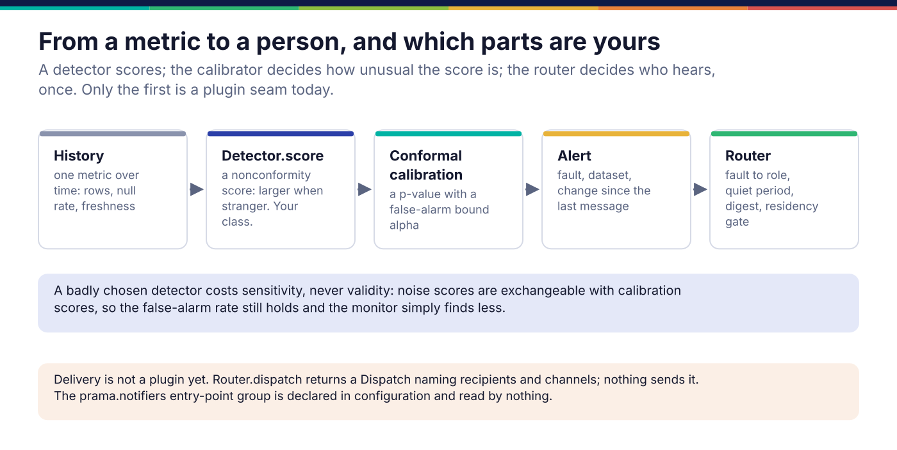

*Copyright © 2026 Ashutosh Sinha <ajsinha@gmail.com>. All rights reserved.*

---

# Monitors and notifiers

A monitor watches one metric over time (rows per day, a null rate, freshness) and says when an
observation is unusual enough to tell somebody; alert routing decides who that somebody is, and
whether they have already been told. Of the two, the **detector** is the extension point: the
calibration that turns a score into an alert, and the routing after it, are fixed on purpose.
Why monitoring is built this way is in
[Evidence and assurance](../architecture/evidence-and-assurance.md#calibration-and-monitoring).

## When you would write one

- A **detector**, when the shipped ones are blind to the shape your metric has: a series with a
  structure none of robust deviation, quantile distance, local outlier factor, forecast residual
  or shape distance captures.
- A **routing change**, when a new kind of fault needs a different owner: a member of `Fault`
  and its `route_to` role in `src/prama/alert/route.py`.
- A **notifier**: not yet possible as a plugin. See *Delivery* below.

## The interface

```python
# src/prama/monitor/detect.py:94
class Detector(abc.ABC):
    """Turns an observation and its history into a nonconformity score."""

    name: ClassVar[str] = ""
    good_at: ClassVar[str] = ""     # for the model card and the person choosing
    blind_to: ClassVar[str] = ""    # every detector is blind to something; say what

    def score(self, observation: float, history: Sequence[float]) -> Score | None:
        """The nonconformity score, or None when the history cannot support one."""
        return self.compute(observation, list(history[-MAXIMUM_CALIBRATION:]))

    @abc.abstractmethod
    def compute(self, observation: float, history: Sequence[float]) -> Score | None:   # line 124
        """Score against an already-windowed history. Subclasses override this."""
```

You implement `compute`. `score` caps the window once, so the observation and the calibration
points are scored against the same reference set, and `scores(history)` produces the
calibration scores leave-one-out. A `Score` (line 66) carries the value, the detector's name, an
explanation a person can read, and the expected and observed values for the chart.

**A detector produces a nonconformity score, never a verdict.** Its only contract is that a
stranger point scores higher, computed the same way for calibration and observation. How unusual
the score is, and whether that is enough to alert, is the conformal calibrator's question. That
split is why a badly chosen detector costs sensitivity and never validity: noise scores are
exchangeable with calibration scores, so the false-alarm rate still holds and the monitor simply
finds less.



## A worked example

**The real ones.** `RobustDeviation` in `src/prama/monitor/detect.py` is the simplest: distance
from the median in units of the median absolute deviation, returning `None` below
`MINIMUM_HISTORY`, and treating a constant history as spread 1 rather than dividing by zero.

**A new one.** `docs/developer/examples/trimmed_deviation_detector.py` measures distance from a
trimmed mean, discarding the most extreme tenth at each end first, so a few bad days in the
window do not widen the band the next bad day is judged against:

```python
class TrimmedDeviation(Detector):
    name: ClassVar[str] = "trimmed_deviation"
    good_at: ClassVar[str] = (
        "a level that has shifted, on a roughly symmetric series with occasional outliers"
    )
    blind_to: ClassVar[str] = (
        "a trend, and a bounded or skewed quantity such as a null rate, where a "
        "symmetric band spends half its width on the impossible side"
    )

    def compute(self, observation: float, history: Sequence[float]) -> Score | None:
        if len(history) < MINIMUM_HISTORY:
            return None
        ordered = sorted(history)
        cut = int(len(ordered) * TRIM)
        kept = ordered[cut : len(ordered) - cut] or ordered
        centre = sum(kept) / len(kept)
        spread = math.sqrt(sum((v - centre) ** 2 for v in kept) / len(kept)) or 1.0
        deviation = abs(observation - centre) / spread
        return Score(value=deviation, detector=self.name, expected=centre, observed=observation,
                     explanation=f"{observation:,.0f} against a trimmed mean of {centre:,.0f}, ...")
```

It is a function of the history as a *set*: sorting first means the order of the points does not
matter, which is what leave-one-out calibration assumes. A detector keyed on "the last value"
would not be, and the validity test below would catch it.

## Registration and configuration

There is no detector registry and no entry point: a detector is passed to the thing that uses it.

```python
from prama.monitor.detect import Ensemble, default_ensemble
from prama.monitor.fleet import Monitor, MetricKind

monitor = Monitor("trades", "rows", kind=MetricKind.VOLUME, detector=TrimmedDeviation())
ensemble = Ensemble(detectors=(*default_ensemble().detectors, TrimmedDeviation()))
```

`Monitor` (`src/prama/monitor/fleet.py:166`) chooses a default detector from the metric's kind
when none is given (`_default_detector`: quantile distance for a bounded quantity, forecast
residual for freshness, robust deviation otherwise). To make yours a default, change that
function. `Ensemble` scores and calibrates each detector apart and combines the p-values, never
the raw scores. A challenger can run in shadow and be promoted on measured precision through
`src/prama/monitor/tournament.py`.

The `"prama.monitors"` entry-point group in `plugins.entry_point_groups` is read by nothing.

## Alert routing

`Router` (`src/prama/alert/route.py:293`) takes an `Alert` and returns a `Dispatch`: who should
hear, immediately or in the digest, and whether anything changed since the last message. Routing
follows the **fault**, not the severity:

```python
# src/prama/alert/route.py:80
class Fault(enum.Enum):
    ARRIVAL = "arrival"              # -> Role.CUSTODIAN: runs the pipeline
    SCHEMA = "schema"                # -> Role.CUSTODIAN
    VALUE = "value"                  # -> Role.STEWARD: owns the meaning
    DEFINITION = "definition"        # -> Role.STEWARD
    RECONCILIATION = "reconciliation"  # -> Role.STEWARD
    CALIBRATION = "calibration"      # -> Role.CUSTODIAN: Prama's own problem
```

A new fault is a member here and a line in `route_to`; a test in `tests/alert/` that an alert of
that fault reaches the role you intend. Contacts, channels and channel regions are constructor
arguments, and a residency `Gate` is checked before an alert body quoting failing values leaves.

### Delivery

**There is no notifier interface.** `Router.dispatch` returns a `Dispatch` naming recipients
and channels (`email` by default), and nothing in the product sends it: no email, chat or pager
integration exists, and the `"prama.notifiers"` entry-point group is declared in configuration and
read by nothing. Neither `Monitor` nor `Router` is constructed by the server on a schedule yet;
both are libraries with their own tests. A notifier, when it is built, belongs behind an ABC that
consumes a `Dispatch` (or its `to_dict()`), registered and tested like every other plugin here.

## Testing

- **The contract**, as `tests/monitor/test_detect.py` applies it to every shipped detector: a
  stranger point scores higher; nothing is said on a history shorter than `MINIMUM_HISTORY`;
  `good_at` and `blind_to` are filled in; calibration scores are leave-one-out (an outlier
  planted in the history has the highest score of its own).
- **Validity.** Over a few hundred pure-noise series, the share of p-values at or below 0.10
  must stay near 0.10. This is the test that catches a detector that is not a symmetric function
  of its history.
- **Sensitivity.** `src/prama/monitor/benchmark.py` measures detection on stationary, seasonal,
  level-shift, regime-switch and bursty series; run it before claiming a detector is better.
- **The counterfactual.** The example's tests run all of the above on `TrimmedDeviation` in
  `tests/docs/test_developer_examples.py`; replace its trimmed centre with the most recent value
  and the leave-one-out test fails.

## Checklist

- [ ] `compute` returns `None` below `MINIMUM_HISTORY`, and never a verdict.
- [ ] The score is a symmetric function of the history, computed the same way for every point.
- [ ] `good_at` and `blind_to` say something a person choosing a detector can use.
- [ ] `explanation` reads as a sentence with the observed and expected values.
- [ ] The contract and validity tests pass; the benchmark run is attached to the PR.
- [ ] Wired where it is used: `Monitor(detector=...)`, an `Ensemble`, or `_default_detector`.

---

<div align="center">
<br/>
<sub><b>PRAMA</b> — <i>Declare it. Prove it. Trust it.</i><br/>
Copyright © 2026 <b>Ashutosh Sinha</b> &lt;ajsinha@gmail.com&gt; · All rights reserved.<br/>
Proprietary and confidential. No licence is granted except by separate written agreement.<br/>
See <a href="../../LICENSE">LICENSE</a> and <a href="../../NOTICE">NOTICE</a>. Third-party names and marks are the property of their respective owners.</sub>
</div>
