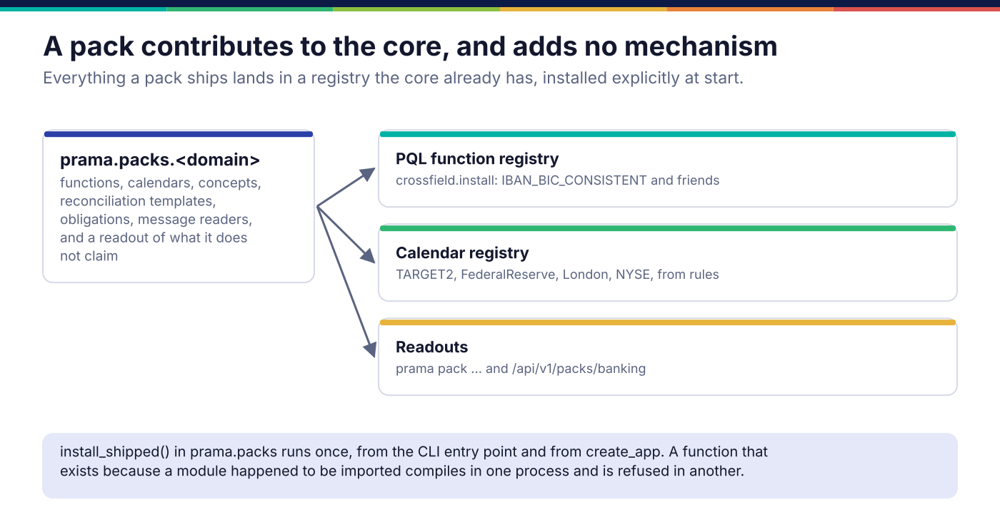

*Copyright © 2026 Ashutosh Sinha <ajsinha@gmail.com>. All rights reserved.*

---

# Authoring a domain pack

A domain pack is the part of Prama that knows one industry: its calendars, its cross-field
checks, its business concepts, its reference reconciliations, its regulatory obligations and
message formats. A pack adds **content**, not mechanism: everything it ships lands in a registry
the core already has. The banking pack, `src/prama/packs/banking/`, is the one shipped and the
worked example here. How the semantic layer that concepts extend is built is in
[The semantic layer](../architecture/semantic-layer.md); how controls are authored and compiled
is in [Controls and PQL](../architecture/controls-and-pql.md).

## When you would write one

- An industry whose identifiers, calendars and obligations recur across estates: insurance,
  payments, healthcare, energy trading.
- **Not** for one estate's rules: those are declarations and controls in that estate. A pack is
  what four banks whose warehouses agree about nothing still have in common.

## What a pack contributes

There is no pack base class; a pack is a package under `src/prama/packs/` whose modules each
feed one existing seam. The banking pack, module by module:

| Contribution | Banking module | Lands in |
|---|---|---|
| Cross-field checks, usable as `SATISFIES IBAN_BIC_CONSISTENT(iban, bic)` | `crossfield.py`: `BANKING_FUNCTIONS`, `install()` | `FUNCTIONS`, the PQL function catalogue ([PQL functions](pql-functions.md)) |
| Business calendars from rules, so `'06:30 TARGET2'` resolves | `calendars.py` (an alias of `prama_kernel.banking_calendars`): `SPECS`, `install()` | the calendar registry the schedule resolves through |
| Business concepts (Exposure, Position, Balance) and recognising them from columns | `concepts.py`: `concept()`, `recognise()` | the semantic layer's concept vocabulary |
| Reference reconciliations, with keys, tolerance and expected breaks | `reconciliations.py`: `template()`, `identities()` | reconciliation authoring |
| Obligations with citations, and the controls that discharge them | `obligations.py`, `regimes.py`, `regulatory.py` | proposals, and the claims readout |
| Message readers that name what is wrong with a message | `fix.py`, `iso8583.py`, `fpml.py`, `swift.py`, `iso20022.py`, `cobol.py` | `prama pack parse` and the API |
| One readout of all of it, for the CLI and the API | `readout.py`: `inventory()`, `claims()`, ... | `prama pack ...`, `/api/v1/packs/banking/...` |



### The interfaces it uses

Each contribution uses the interface of the seam it feeds. The two most packs need:

```python
# src/prama/packs/banking/crossfield.py:290
def install(registry: FunctionRegistry | None = None) -> FunctionRegistry:
    """Add the banking functions to a registry.

    Explicit, like the calendars and for the same reason: a function that exists
    because a module was imported is one whose availability depends on import
    order, and a control that compiles in one process and refuses in another is
    the worst kind of intermittent."""
    from prama.pql.library import FUNCTIONS

    target = registry if registry is not None else FUNCTIONS
    for function in BANKING_FUNCTIONS:
        target.register(function)
    return target
```

```python
# kernel/src/prama_kernel/banking_calendars.py:196
def install(registry: CalendarRegistry | None = None, *, first_year=FIRST_YEAR,
            last_year=LAST_YEAR, replace=False) -> CalendarRegistry:
    """Materialise every shipped calendar into a registry."""
```

A `CalendarSpec` is a name, a timezone, holiday **rules** (fixed dates with an observance, Easter
offsets, the nth weekday of a month) and any ad-hoc closures supplied by a person; it is
materialised for a range of years, never typed in as a list of dates.

## The discipline: claim only what is discharged

A pack's most important output is what it does **not** claim. The banking pack's obligations
include BCBS 239 principles 3, 4 and 5, because accuracy, completeness and timeliness are testable
properties of data; principles 1, 2 and 7 to 14 are governance and are listed as *supported, not
discharged*, rather than represented by a template that checks nothing. `prama pack claims`
prints both halves, and every obligation carries a citation that can be shown to an examiner,
marked unconfirmed until somebody has checked it against the source.

```text
$ prama pack list
Calendars
  TARGET2          Euro RTGS. Six closures; no national holidays.
  FederalReserve   US banking. Open on Good Friday, unlike the exchanges.
  London           England and Wales bank holidays, with rolled substitutes.
  NYSE             US equities trading. Closed Good Friday; open Columbus Day.

Cross-field checks (usable from PQL as SATISFIES ...)
  IBAN_BIC_CONSISTENT
  MINOR_UNITS_OK
  ...
Obligations: 20 across 9 regimes
```

## A worked example

`docs/developer/examples/insurance_pack.py` is the same shape in miniature for insurance: one
function and a claims readout.

```python
COVERED_ON = Function(
    name="COVERED_ON",
    summary="Whether a policy's cover, inception to expiry inclusive, includes a date.",
    arity=(3, 3),
    returns=BOOLEAN,
    argument_types=(TEMPORAL, TEMPORAL, TEMPORAL),
    # ISO-8601 dates compare correctly as text on every engine.
    sql="({0} <= {2} AND {2} <= {1})",
    evaluate=_covered_on,
)

FUNCTIONS: tuple[Function, ...] = (COVERED_ON,)


def install(registry: FunctionRegistry) -> FunctionRegistry:
    """Add the pack's functions to *registry*. Idempotent, and never run on import."""
    for function in FUNCTIONS:
        registry.register(function)
    return registry


def claims() -> dict[str, list[str]]:
    return {
        "discharged": ["a claim's loss date falls within its policy's cover"],
        "supported_not_discharged": ["reserving adequacy: an actuarial judgement, not a property of the data"],
        "not_claimed": ["Solvency II reporting templates"],
    }
```

As a real pack it would be a package of its own beside `src/prama/packs/banking/`, with
`crossfield.py`, `readout.py` and, as it grows, concepts and obligations, mirroring the banking
layout.

## Registration and configuration

A pack is installed by one function, called by `prama.plugins.bootstrap`, which the CLI and
`create_app` both call:

```python
# src/prama/packs/__init__.py
def install_shipped() -> None:
    ...
    from prama.packs.banking.calendars import install as install_calendars
    from prama.packs.banking.crossfield import install as install_functions

    install_functions()
    install_calendars(default_calendars(), replace=True)
    ...
```

Add the new pack's `install()` calls here. It is idempotent and runs once per process; installing
on import instead is how `prama pack list` once advertised eight cross-field checks that
`prama control check` then refused as unknown functions. A pack's readout reaches the API as a
route module under `src/prama/api/routes/` (see `src/prama/api/routes/packs.py`) with SDK methods
for each endpoint; see [API and console](api-and-console.md) and [SDK methods](sdk-methods.md).

A pack reads no configuration of its own. What an estate uses from it is chosen in that estate's
controls and declarations.

## Testing

- `tests/packs/` has a module per contribution: `test_banking_crossfield.py` pins each check's
  reference implementation and runs compiled controls that use it on DuckDB;
  `test_banking_calendars.py` pins closures computed from rules against published ones;
  `test_banking_regimes.py` and `test_banking_regulatory.py` pin what is and is not claimed.
- **The install, not just the module.** Assert that after `install_shipped()` a control using the
  pack's function compiles; a function registered only in a test proves nothing about production.
- **The counterfactual.** For a calendar, a rule that is a day off must fail against the published
  list; for a claim, an obligation added without a discharging control must show as
  *supported, not discharged*.

## Checklist

- [ ] Every contribution lands in an existing registry; no new mechanism.
- [ ] Registered by an explicit, idempotent `install()`, called from `install_shipped()`.
- [ ] Functions carry a reference implementation and pass the agreement check on every engine.
- [ ] Calendars are rules, with ad-hoc closures supplied rather than inferred.
- [ ] A claims readout that says what is not discharged, with citations.
- [ ] A readout module the CLI and the API both use, so neither restates the inventory.

---

<div align="center">
<br/>
<sub><b>PRAMA</b> — <i>Declare it. Prove it. Trust it.</i><br/>
Copyright © 2026 <b>Ashutosh Sinha</b> &lt;ajsinha@gmail.com&gt; · All rights reserved.<br/>
Proprietary and confidential. No licence is granted except by separate written agreement.<br/>
See <a href="../../LICENSE">LICENSE</a> and <a href="../../NOTICE">NOTICE</a>. Third-party names and marks are the property of their respective owners.</sub>
</div>
