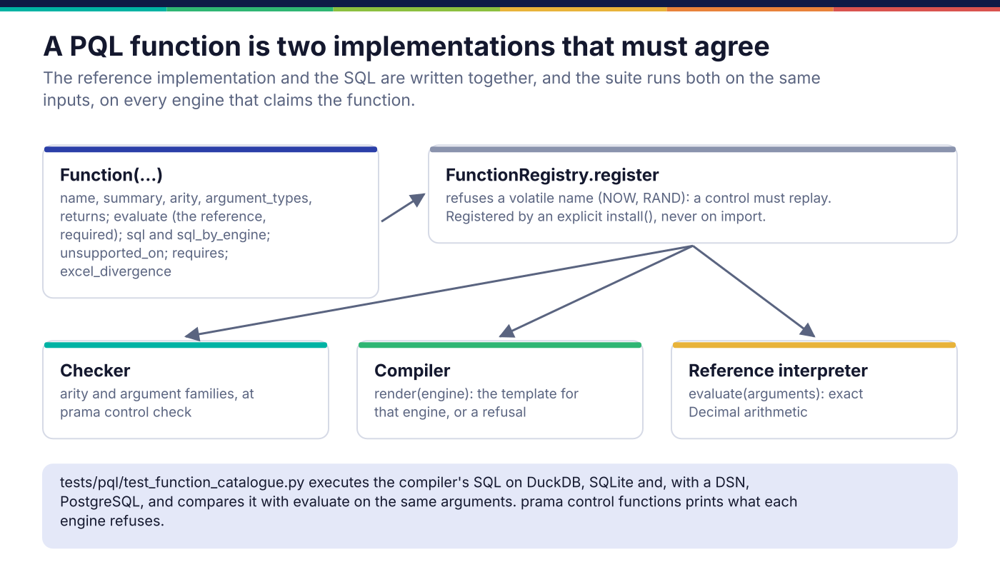

*Copyright © 2026 Ashutosh Sinha <ajsinha@gmail.com>. All rights reserved.*

---

# Adding a PQL function

A PQL function is a name a control can call inside an expression, such as a settlement lag or
a cross-field check. For example, `CHECK trades SATISFIES DAYS_BETWEEN(trade_date, settlement_date) <= 3`.
Each one is two implementations written together, a reference in Python and SQL for each engine,
and the suite requires them to agree. What the language is and how a control compiles is in
[Controls and PQL](../architecture/controls-and-pql.md).

## When you would write one

- A row-level calculation authors keep spelling out by hand, which reads better as a name.
- A domain check that compiles to plain SQL: the banking pack's `IBAN_BIC_CONSISTENT` is a
  function, not a validator, because it compares two columns of one row.
- **Not** for a check that needs arithmetic an engine cannot do faithfully (a check digit): that
  is a [validator](validators.md). **Not** for a check across rows in order: that is a
  [delegate](delegates.md). **Never** for anything that reads the clock or a random source:
  `FunctionRegistry.register` refuses `NOW`, `TODAY`, `RAND` and their kind, because a control
  has to replay.

## The interface

A function is a frozen dataclass, not a subclass:

```python
# src/prama/pql/functions.py:93
@dataclasses.dataclass(frozen=True, slots=True)
class Function:
    """One function, and everything that is true of it."""

    name: str
    summary: str
    arity: tuple[int, int]                 # (minimum, maximum); VARIADIC for unbounded
    returns: str                           # a family: TEXT, NUMBER, BOOLEAN, TEMPORAL
    argument_types: tuple[str, ...]        # expected family per position; the last repeats
    evaluate: Callable[[list[Any]], Any]   # the reference implementation. Required.
    sql: str = ""                          # the default for every engine: {0}, {1}, or {*}
    sql_by_engine: dict[str, str] = ...    # per-engine SQL where the default will not do
    unsupported_on: frozenset[str] = ...   # engines that cannot express it: refused there
    strict_unknown: bool = True            # an unknown argument makes the result unknown
    requires: frozenset[str] = ...         # pushdown capabilities the engine must declare
    separator_by_engine: dict[str, str] = ...
    excel_divergence: str = ""             # how this differs from a spreadsheet; printed by explain
```

A function with neither `sql` nor `sql_by_engine` does not construct. `render(engine, arguments)`
(line 144) returns the engine's template filled in, or raises with a remedy for an engine in
`unsupported_on`. The registry:

```python
# src/prama/pql/functions.py:196
class FunctionRegistry:
    def register(self, function: Function) -> None:   # line 208: refuses a volatile name
    def get(self, name: str) -> Function:             # case-insensitive; refuses unknown names
```

`FUNCTIONS` in `src/prama/pql/library.py` (line 578) is the catalogue every part of Prama
consults: the checker, the compiler, the reference interpreter, `control explain`, the language
server and the console.



## A worked example

**The real ones.** The shipped functions are in `src/prama/pql/library.py`, grouped as
`TEXT_FUNCTIONS`, `NUMBER_FUNCTIONS`, `LOGIC_FUNCTIONS` and `DATE_FUNCTIONS`. `MAX` shows a
per-engine spelling, because SQLite's scalar maximum is `MAX` and not `GREATEST`:

```python
Function(
    name="MAX",
    summary="The largest of several values.",
    arity=(2, VARIADIC),
    returns=NUMBER,
    argument_types=(NUMBER,),
    sql="GREATEST({*})",
    sql_by_engine={"sqlite": "MAX({*})"},
    evaluate=lambda a: _extreme(a, smallest=False),
),
```

**A new one.** `docs/developer/examples/days_between_function.py` adds `DAYS_BETWEEN(start, end)`,
the calendar days between two ISO-8601 dates. All three engines spell it differently:

```python
DAYS_BETWEEN = Function(
    name="DAYS_BETWEEN",
    summary="Calendar days from the first ISO-8601 date to the second; negative if earlier.",
    arity=(2, 2),
    returns=NUMBER,
    argument_types=(TEMPORAL, TEMPORAL),
    sql="(CAST({1} AS DATE) - CAST({0} AS DATE))",                 # PostgreSQL
    sql_by_engine={
        "duckdb": "DATE_DIFF('day', CAST({0} AS DATE), CAST({1} AS DATE))",
        "sqlite": "CAST(JULIANDAY({1}) - JULIANDAY({0}) AS INTEGER)",
    },
    evaluate=_days_between,        # date.fromisoformat on both; UNSET if either is not a date
    excel_divergence=(
        "Excel's DAYS takes the end date first, DAYS(end, start). This takes them in "
        "the order they happen, start then end, ..."
    ),
)


def install(registry: FunctionRegistry) -> FunctionRegistry:
    registry.register(DAYS_BETWEEN)
    return registry
```

Three things to copy from it:

- **The reference returns `UNSET`, not zero, when it cannot decide.** A date nobody can read
  makes the answer unknown, and unknown counts as a violation unless the control says
  `TREAT UNKNOWN AS PASS`.
- **Exact arithmetic.** The reference returns a `Decimal`; money summed in binary floating point
  manufactures exactly the small differences a control exists to find.
- **The divergence is written down.** `prama control explain` prints `excel_divergence` beside
  any control that uses the function, so an author learns it while writing, not from production.

## Pushdown, per engine

A function either renders on an engine or is refused there; there is no third outcome.
`prama control functions` publishes the result from the catalogue itself:

```text
$ prama control functions
33 function(s) in the catalogue.

  duckdb       33/33 (100%)
  postgresql   33/33 (100%)
  sqlite       32/33 (97%)
      refused: ROUND

A refused function is refused, never approximated: the same control
meaning two things on two engines is the failure this prevents.
```

Why `ROUND` is refused on SQLite is in
[troubleshooting](../operations/troubleshooting.md#a-control-refuses-to-compile-on-one-engine).
When you cannot make an engine agree with the reference, put it in `unsupported_on` rather than
shipping SQL that is nearly right. The control studio compiles for the engine chosen beside **Show the SQL**, and a
refused function is reported there before the control is saved:


## Registration and configuration

- **In the product:** add the `Function` to the right tuple in `src/prama/pql/library.py`;
  `default_registry()` registers them all.
- **From a domain pack:** keep the functions in the pack and register them from its `install()`,
  as `src/prama/packs/banking/crossfield.py` does; `install_shipped()` calls it at start. See
  [packs](packs.md).

There is no entry point for functions and no configuration key: a function is part of the
language a sealed plan was compiled against, so it ships with the code.

## Testing

- **Agreement on real engines.** `tests/pql/test_function_catalogue.py`,
  `TestEveryFunctionAgreesWithItsSql`, runs every function's SQL on DuckDB and SQLite (and on
  PostgreSQL when `PRAMA_TEST_POSTGRES_DSN` is set) and compares it with `evaluate` on the same
  arguments, including the values that break things: an empty string, a negative, a zero
  divisor, a decimal that rounds differently under half-even. A new function in the catalogue is
  picked up automatically.
- **Completeness.** The same file checks that every function renders on every engine it claims,
  has a summary, and that a volatile name cannot be registered.
- **The counterfactual.** `tests/docs/test_developer_examples.py` swaps the arguments in the
  SQLite lowering of `DAYS_BETWEEN`; it still renders and runs, and the agreement check names it.
  A test that only checked rendering would have passed.

## Checklist

- [ ] `evaluate` is exact, total, and returns `UNSET` when it cannot decide.
- [ ] `sql` or `sql_by_engine` for every engine in `ENGINES`, or the engine in `unsupported_on`.
- [ ] `strict_unknown` is `True` unless the function's job is to answer about unknowns, and says why.
- [ ] `excel_divergence` filled in wherever a spreadsheet user would expect something else.
- [ ] The catalogue test green on DuckDB and SQLite, and on PostgreSQL before a release.
- [ ] `prama control functions` shows the coverage you intended.

---

<div align="center">
<br/>
<sub><b>PRAMA</b> — <i>Declare it. Prove it. Trust it.</i><br/>
Copyright © 2026 <b>Ashutosh Sinha</b> &lt;ajsinha@gmail.com&gt; · All rights reserved.<br/>
Proprietary and confidential. No licence is granted except by separate written agreement.<br/>
See <a href="../../LICENSE">LICENSE</a> and <a href="../../NOTICE">NOTICE</a>. Third-party names and marks are the property of their respective owners.</sub>
</div>
