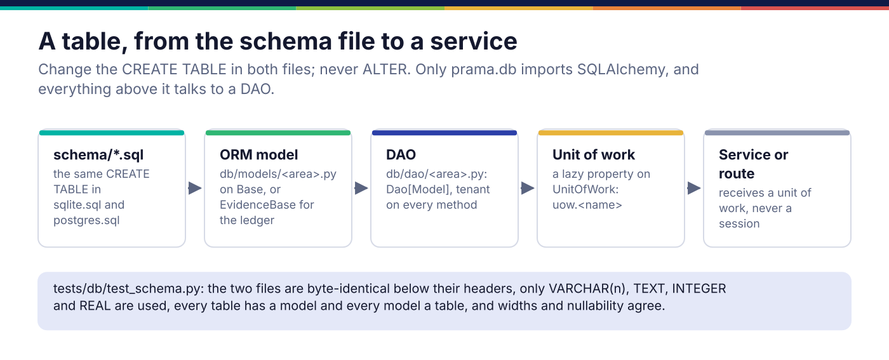

*Copyright © 2026 Ashutosh Sinha <ajsinha@gmail.com>. All rights reserved.*

---

# Adding a table: schema, model, DAO and unit of work

Prama's own store is described by two schema files that are the authority, mapped by ORM models,
reached only through DAOs, and handed to services in a unit of work. Adding a table touches each
of those four layers once. The rules behind them are hard rules 2 and 3 in `CLAUDE.md`; where the
store sits among the other parts is in [Platform](../architecture/platform.md).

## When you would write one

- A model needs a fact the store does not keep. First ask which table **owns** that fact: a new
  column belongs in the table that owns it, not in a side table invented to avoid touching it.
- A new kind of record with its own lifecycle (a comment thread, an upload awaiting approval):
  a new table.

## The four layers



### 1. The schema files

`schema/sqlite.sql` and `schema/postgres.sql` are byte-identical below their headers. A change is
an edit to a `CREATE TABLE`, in both files, in the same commit. **Never `ALTER`, never a
migration**: an existing database is recreated with `prama db init` on a fresh file, and
`prama db verify` fails loudly on a live schema that has drifted rather than repairing it.

Only four column types are permitted, because only these mean the same in both engines:
`VARCHAR(n)` (always with a width), `TEXT`, `INTEGER` (booleans as 0/1 with a `CHECK`) and
`REAL`. Timestamps are ISO-8601 UTC text in `VARCHAR(32)`; identifiers are ULIDs minted
client-side in `VARCHAR(26)`; every primary key declares `NOT NULL`; names follow `uq_`, `ix_`,
`ck_`; every statement is idempotent (`IF NOT EXISTS`).

### 2. The ORM model

A model in `src/prama/db/models/<area>.py`, on `Base` for the platform and semantic schema, or on
`EvidenceBase` for the evidence ledger (its own store, retention and immutability; no ledger
table references a platform table). Relationships are declared with `back_populates` and
`lazy="selectin"`. Import the model in `src/prama/db/models/__init__.py`.

### 3. The DAO

```python
# src/prama/db/dao/base.py
class Dao(Generic[M]):
    """Base for every DAO: one model, one session, one dialect."""

    model: type[M]

    def __init__(self, session: AsyncSession, dialect: Dialect) -> None: ...


class TenantScopedDao(Dao[M]):                       # line 103
    """A DAO whose every query is filtered by tenant."""
```

A DAO is named for its domain (`CommentDao`, never `GenericRepository`), takes the tenant on
every method, keeps domain logic beside the column it concerns (password hashing beside the hash),
and never swallows an exception or returns a sentinel meaning "something went wrong": the unit of
work translates database failures into the Prama error taxonomy and they propagate.

### 4. The unit of work

```python
# src/prama/db/session.py:89
class UnitOfWork:
    """One transaction, and the DAOs that act inside it."""

    @property
    def comments(self) -> CommentDao:
        from prama.db.dao.comment import CommentDao

        return self._dao("comments", CommentDao)  # type: ignore[no-any-return]
```

DAOs are created lazily and cached per unit of work. Services receive a unit of work, never a
session, which is what keeps SQLAlchemy inside `prama.db`.

## A worked example: comment threads

The `cm_comment` table is a recent, complete instance of all four layers.

**Schema** (`schema/sqlite.sql`, and the same text in `schema/postgres.sql`):

```sql
CREATE TABLE IF NOT EXISTS cm_comment (
    id            VARCHAR(26)   NOT NULL PRIMARY KEY,
    tenant_id     VARCHAR(26)   NOT NULL REFERENCES tenant (id) ON DELETE CASCADE,
    object_kind   VARCHAR(16)   NOT NULL,
    object_ref    VARCHAR(512)  NOT NULL,
    parent_id     VARCHAR(26)   REFERENCES cm_comment (id) ON DELETE CASCADE,
    author_id     VARCHAR(26)   NOT NULL,
    body          TEXT          NOT NULL,
    mentions_json TEXT          NOT NULL DEFAULT '[]',
    state         VARCHAR(16)   NOT NULL DEFAULT 'open',
    resolved_by   VARCHAR(26),
    resolved_at   VARCHAR(32),
    created_at    VARCHAR(32)   NOT NULL,
    CONSTRAINT ck_cm_comment_kind CHECK (object_kind IN
        ('dataset', 'attribute', 'control', 'term', 'incident')),
    CONSTRAINT ck_cm_comment_state CHECK (state IN ('open', 'resolved'))
);
CREATE INDEX IF NOT EXISTS ix_cm_comment_object ON cm_comment (tenant_id, object_kind, object_ref);
CREATE INDEX IF NOT EXISTS ix_cm_comment_open ON cm_comment (tenant_id, state);
```

**Model** (`src/prama/db/models/comment.py`): every column, width, nullability and constraint
name agrees with the file, and the test checks that they do.

```python
class CmComment(UlidPrimaryKey, Base):
    __tablename__ = "cm_comment"

    tenant_id: Mapped[str] = mapped_column(
        String(26), ForeignKey("tenant.id", ondelete="CASCADE"), nullable=False
    )
    object_kind: Mapped[str] = mapped_column(String(16), nullable=False)
    ...
    created_at: Mapped[str] = mapped_column(String(32), nullable=False)

    __table_args__ = (
        CheckConstraint(
            "object_kind IN ('dataset', 'attribute', 'control', 'term', 'incident')",
            name="ck_cm_comment_kind",
        ),
        CheckConstraint("state IN ('open', 'resolved')", name="ck_cm_comment_state"),
        Index("ix_cm_comment_object", "tenant_id", "object_kind", "object_ref"),
        Index("ix_cm_comment_open", "tenant_id", "state"),
    )
```

**DAO** (`src/prama/db/dao/comment.py`): the tenant on every signature, validation with a remedy,
and a read that cannot cross tenants.

```python
class CommentDao(Dao[CmComment]):
    model = CmComment

    async def post(self, tenant_id: str, *, object_kind: str, object_ref: str,
                   author_id: str, body: str, mentions: list[str],
                   parent_id: str | None = None) -> CmComment:
        if not body.strip():
            raise ValidationError("a comment needs some text", remedy="Write the comment.")
        ...
        self._session.add(row)
        await self._session.flush()
        return row

    async def one(self, tenant_id: str, comment_id: str) -> CmComment | None:
        row = await self._session.get(CmComment, comment_id)
        return row if row is not None and row.tenant_id == tenant_id else None
```

**Unit of work**: the `comments` property shown above. A service then reads
`await uow.comments.on(tenant_id, "dataset", "trades")` and never sees a session.

There is no runnable example file for this guide: a table is not an extension that can live
outside the schema files, and the schema tests below are what prove one.

## Registration and configuration

Nothing registers a table except the schema files and the model import. The engine is
`database.dialect: sqlite | postgres` in `config/application.yaml`, and only
`src/prama/db/dialects.py` may branch on it; see
[backends and dialects](backends-and-dialects.md#pramas-own-store). After changing a schema file:

```bash
prama db init                 # on a fresh database file: applies schema/<dialect>.sql
prama db verify               # the live schema against the file; fails loudly on drift
```

## Testing

- `tests/db/test_schema.py`: the two files are byte-identical below their headers; only the four
  portable types appear; every `VARCHAR` has a width; every primary key declares `NOT NULL`;
  every statement is idempotent; every ORM table is in the file and every file table has a model;
  columns, nullability and string widths agree; ledger tables are under `EvidenceBase` and
  reference no platform table; and a freshly built database verifies clean while a dropped table
  is reported as blocking drift.
- `tests/architecture/test_layering.py`: SQLAlchemy is imported only under `prama.db`; no DDL is
  emitted from ORM metadata; no migration tooling exists.
- A DAO test per DAO (`tests/db/test_dao.py` is the pattern) over the `started_database` and
  `tenant_id` fixtures, including the counterfactual that matters most here: a row written for
  one tenant is not returned for another.
- With `PRAMA_TEST_POSTGRES_DSN` set, the suite runs on PostgreSQL as well.

## Checklist

- [ ] The column is in the table that owns the fact; no side table to avoid an edit.
- [ ] The same `CREATE TABLE` in both schema files; only `VARCHAR(n)`, `TEXT`, `INTEGER`, `REAL`.
- [ ] Primary key `NOT NULL`; constraint and index names `uq_`, `ix_`, `ck_`; `IF NOT EXISTS`.
- [ ] Model on the right base, imported in `src/prama/db/models/__init__.py`.
- [ ] DAO named for its domain, tenant on every method, no swallowed exception.
- [ ] A lazy property on `UnitOfWork`; services take the unit of work.
- [ ] `tests/db/test_schema.py` green; `prama db init` on a fresh file and `prama db verify` clean.

---

<div align="center">
<br/>
<sub><b>PRAMA</b> — <i>Declare it. Prove it. Trust it.</i><br/>
Copyright © 2026 <b>Ashutosh Sinha</b> &lt;ajsinha@gmail.com&gt; · All rights reserved.<br/>
Proprietary and confidential. No licence is granted except by separate written agreement.<br/>
See <a href="../../LICENSE">LICENSE</a> and <a href="../../NOTICE">NOTICE</a>. Third-party names and marks are the property of their respective owners.</sub>
</div>
