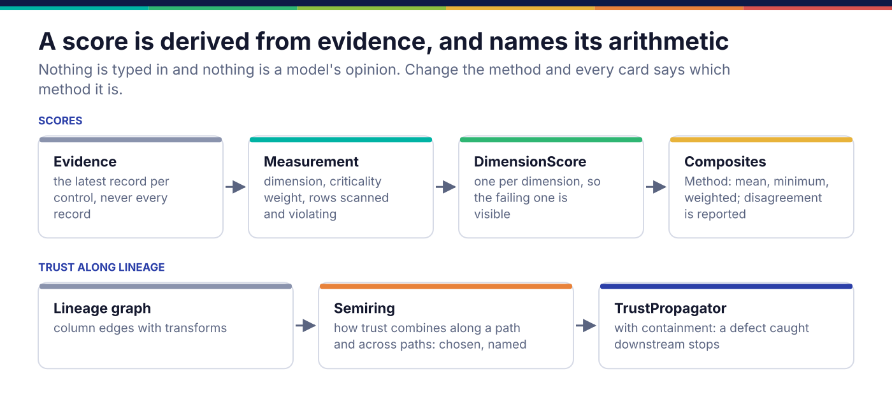
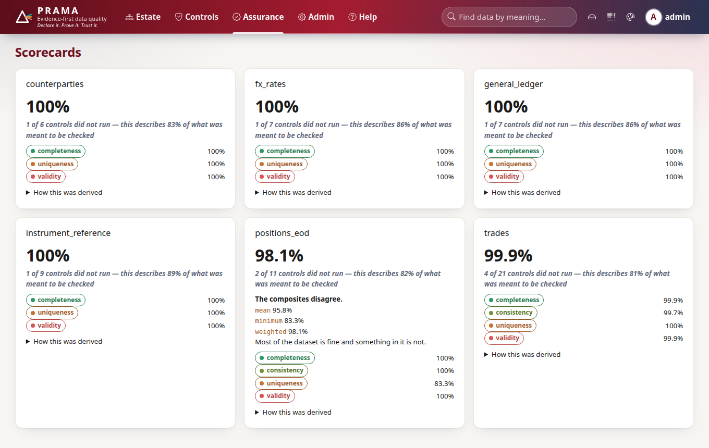

*Copyright © 2026 Ashutosh Sinha <ajsinha@gmail.com>. All rights reserved.*

---

# Changing how scores are computed

A score is derived from evidence: the latest record of each control, weighted by the criticality
of what it checks, broken down by dimension, and combined by methods that are named on the card.
Trust then flows along lineage under a combination rule somebody chose. **Scoring is not a
plugin.** There is no scorer base class and no registry; the methods are closed enums, changed in
place, with tests that pin what each one means. Why scores are built this way is in
[Evidence and assurance](../architecture/evidence-and-assurance.md#scores-are-derived-from-evidence).

## When you would change it

- A composite that answers a question the three shipped ones do not.
- A trust rule for a kind of lineage the four shipped semirings describe badly.
- Materiality weights an estate has agreed on, if Tier 1 counting sixteen times Tier 4 is wrong
  for it.
- **Never** to let a score be typed in, adjusted by hand, or produced by a model: a number that
  cannot be reconstructed from evidence is one nobody should act on.

## The seams

```python
# src/prama/score/composite.py:52
class Method(enum.Enum):
    """How dimension scores become one number."""

    MEAN = "mean"            # what does the average column look like
    MINIMUM = "minimum"      # is anything badly broken
    WEIGHTED = "weighted"    # are the things that matter fine

    @property
    def answers(self) -> str: ...      # the question, printed when composites disagree
```

`score(dataset, measurements)` (line 254) builds a `DimensionScore` per dimension, then every
composite into one mapping, and the card reports all of them; `methods_disagree` (line 195) is
true when they spread by more than ten points, and the card says so as a finding rather than
hiding it. `CRITICALITY_WEIGHT` (line 43) is the materiality table.

```python
# src/prama/score/trust.py:42
class Semiring(enum.Enum):
    """How trust combines along a path and across several."""

    ALL_INPUTS_MATTER = "all_inputs_matter"   # multiply along, worst across: the default
    REDUNDANT_SOURCES = "redundant_sources"   # multiply along, best across: asserted, never assumed
    WEAKEST_LINK = "weakest_link"             # minimum along and across
    PRODUCT_MEAN = "product_mean"             # multiply along, average across

    @property
    def along(self) -> Callable[[float, float], float]: ...
    @property
    def across(self) -> Callable[[Sequence[float]], float]: ...
    @property
    def explains(self) -> str: ...
```

`TrustPropagator` (line 226) applies a semiring over the lineage graph, attenuating by each
edge's transform, and stops propagating a defect past a downstream control that would have
caught it and passed (containment).



## A worked example

The shipped composites are three entries in one mapping, and adding a fourth is three edits in
`src/prama/score/composite.py`. Say an estate wants the *median* dimension, which answers "what
does a typical dimension look like" without the mean's sensitivity to one outlier:

1. a member `MEDIAN = "median"` in `Method`, and its sentence in `answers`;
2. the value in the `composites` mapping inside `score()`, beside `MEAN`, `MINIMUM` and
   `WEIGHTED`;
3. tests in `tests/score/test_composite.py` that pin it on a case where it differs from the mean.

Nothing else changes: `to_dict`, the card's "composites disagree" sentence, the API
(`/api/v1/scorecards`) and the console all iterate over the mapping. That is what "the
arithmetic is named" buys: a new method shows up everywhere with its name attached, and an old
card's number cannot quietly change meaning, because the method it was computed by is printed
beside it.

The effect on the console's scorecards: every card shows its dimensions and its coverage, and a
card whose composites disagree says which method says what.



## Registration and configuration

None: a method or a semiring is part of the code, and a score names the one that produced it.
The `"prama.scorers"` entry-point group listed in `plugins.entry_point_groups` is read by nothing;
do not ship a scorer that relies on it.

## Testing

- `tests/score/test_composite.py` pins each method on hand-built measurements, including the
  cases that broke before: a control that scanned nothing is excluded and counted, never scored
  100%; a score covering half its controls says so in `coverage`.
- `tests/score/test_trust.py` pins each semiring's along and across behaviour and containment.
- **Derive, never restate.** The card is computed from the latest record per control, not every
  record: a score over the whole ledger weights an hourly control sixty times a daily one.
  `src/prama/score/scorecard.py` is the only place that selection is made; reuse it.
- **The counterfactual.** For a new method, build measurements on which it differs from every
  existing method, and assert the difference; a method that agrees with `MEAN` on every test is
  one whose tests prove nothing.

## Checklist

- [ ] The method or semiring is named for the question it answers, and `answers` or `explains` says it.
- [ ] Computed from measurements derived from evidence, never from a typed-in or model-produced number.
- [ ] Tests pin it on a case where it differs from the others.
- [ ] Controls that did not run or scanned nothing are excluded and counted, not scored.

---

<div align="center">
<br/>
<sub><b>PRAMA</b> — <i>Declare it. Prove it. Trust it.</i><br/>
Copyright © 2026 <b>Ashutosh Sinha</b> &lt;ajsinha@gmail.com&gt; · All rights reserved.<br/>
Proprietary and confidential. No licence is granted except by separate written agreement.<br/>
See <a href="../../LICENSE">LICENSE</a> and <a href="../../NOTICE">NOTICE</a>. Third-party names and marks are the property of their respective owners.</sub>
</div>
