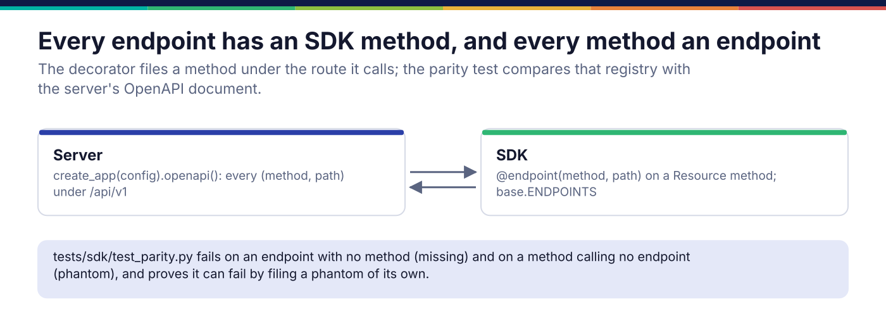

*Copyright © 2026 Ashutosh Sinha <ajsinha@gmail.com>. All rights reserved.*

---

# Adding an SDK method for an endpoint

The Python SDK is what a client installs: every endpoint of the HTTP API has a method, and every
method calls an endpoint. It is the `prama-sdk` package, imported as `prama_sdk`. A new route is not finished until its
method exists, because `tests/sdk/test_parity.py` fails the build otherwise. Using the SDK is
in [docs/sdk](../sdk/README.md); why it is a separate package that never imports the server is in
[Packages](../architecture/packages.md). This page is how to add to it.

## When you would write one

- Every time you add an API route ([API and console](api-and-console.md)): same pull request.
- When an endpoint's parameters change: the method's signature follows.

## The interface

```python
# sdk/src/prama_sdk/base.py:32
def endpoint(method: str, path: str) -> Callable[[F], F]:
    """File the decorated method under the endpoint it calls."""

# sdk/src/prama_sdk/base.py:46
def namespace(name: str) -> Callable[[R], R]:
    """Expose the decorated resource class as ``client.<name>``."""

class Resource:
    """A group of SDK methods sharing a transport."""
    def _get(self, path: str, **params: Any) -> Any: ...
    def _post(self, path: str, body: Any = None, **params: Any) -> Any: ...
    def _put(self, path: str, body: Any = None) -> Any: ...
    def _patch(self, path: str, body: Any = None) -> Any: ...
    def _delete(self, path: str, **params: Any) -> Any: ...

def seg(value: Any) -> str:          # one path segment, escaped: an id can contain a slash
def body(**fields: Any) -> dict:     # a request body without the fields left unset
```

`@endpoint(method, path)` files the method in `ENDPOINTS` under the path **template** exactly as
the server declares it (`/packs/banking/calendars/{name}`, without `/api/v1`). `@namespace`
exposes the class as `client.<name>` on both `Client` and `AsyncClient`; resource modules under
`prama_sdk.resources` are found, not listed, so a new area is a new module. One method serves
both clients: on `Client` it returns the decoded JSON, on `AsyncClient` a coroutine resolving to
it.



## A worked example

`sdk/src/prama_sdk/resources/packs.py` is the SDK side of `src/prama/api/routes/packs.py`:

```python
from prama_sdk.base import Resource, body, endpoint, namespace, seg


@namespace("packs")
class Packs(Resource):
    """The banking pack, and Prama's own SOC 2 readiness."""

    @endpoint("GET", "/packs/banking/calendars/{name}")
    def calendar(self, name: str, *, year: int | None = None) -> Any:
        """Closures of ``TARGET2``, ``FederalReserve``, ``London`` or ``NYSE`` for a year."""
        return self._get(f"/packs/banking/calendars/{seg(name)}", year=year)

    @endpoint("POST", "/packs/banking/parse")
    def parse(self, message: str, *, fmt: str | None = None) -> Any:
        """Parse one FIX, ISO 8583, FpML, SWIFT MT or ISO 20022 message; ``defects`` lists
        what is structurally wrong."""
        return self._post("/packs/banking/parse", body(message=message, format=fmt))
```

What to copy:

- **Path parameters through `seg`**, so a name with a slash does not become two segments.
- **Optional query parameters as keyword-only arguments defaulting to `None`**; `_get` drops the
  `None`s, and `body()` does the same for request bodies.
- **The docstring says what comes back**, and anything surprising about it ("no defects means no
  structural defect, not valid").
- **No server import.** The SDK has its own error classes (`prama_sdk.errors`), mapped from the
  server's error codes, so `except prama.NotFoundError` works in a client that never installed
  the server. A new error code on the server is added to that map.

## Registration and configuration

Nothing to register beyond the decorators: a method is in `ENDPOINTS` when its module is
imported, and `_load_resources()` imports every module under `prama_sdk.resources` (except those
starting with `_`). The SDK reads `server.host` and `server.port` from `config/application.yaml`
to find a server, with its own small reader; it reads nothing else.

Then document it: each namespace is described with worked examples on the page for its area in
`docs/sdk/`, and the table in [the SDK README](../sdk/README.md#the-namespaces) lists the
namespaces.

## Testing

- **Parity.** `tests/sdk/test_parity.py` compares `ENDPOINTS` with the server's OpenAPI document
  both ways: an endpoint with no method (missing) and a method calling no endpoint (phantom) both
  fail, and `test_the_parity_check_can_fail` files a phantom of its own to prove the comparison
  bites.
- **Behaviour, in process.** `AsyncClient(app=app)` drives the real application with every layer
  except the socket; `tests/sdk/conftest.py` signs in an administrator through the SDK's own token
  exchange. `tests/sdk/test_delegates_packs_connectors.py` is the pattern: call the method, assert
  on what the server did.
- **Standalone.** `tests/architecture/test_packages_standalone.py` runs the SDK with `prama` made
  unimportable and builds its wheel, so a server import slipped into a resource module fails.
- **The counterfactual.** Add a route and run the parity test before writing the method: it
  names the endpoint as missing. Misspell the template in `@endpoint` and it names a phantom.

## Checklist

- [ ] `@endpoint(METHOD, "/path/{template}")` exactly as the server declares it, without `/api/v1`.
- [ ] On a `@namespace` resource under `sdk/src/prama_sdk/resources/`.
- [ ] Path parameters through `seg`; optional parameters keyword-only, `None` by default.
- [ ] No import of `prama`; any new server error code mapped in `prama_sdk.errors`.
- [ ] An in-process test through `AsyncClient(app=app)`; `tests/sdk/test_parity.py` green.
- [ ] Documented on the area's page in `docs/sdk/`.

---

<div align="center">
<br/>
<sub><b>PRAMA</b> — <i>Declare it. Prove it. Trust it.</i><br/>
Copyright © 2026 <b>Ashutosh Sinha</b> &lt;ajsinha@gmail.com&gt; · All rights reserved.<br/>
Proprietary and confidential. No licence is granted except by separate written agreement.<br/>
See <a href="../../LICENSE">LICENSE</a> and <a href="../../NOTICE">NOTICE</a>. Third-party names and marks are the property of their respective owners.</sub>
</div>
