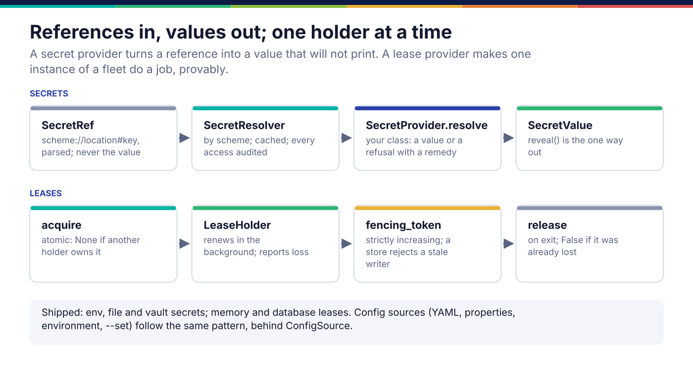

*Copyright © 2026 Ashutosh Sinha <ajsinha@gmail.com>. All rights reserved.*

---

# Secret providers, lease providers and configuration sources

Three small seams in the infrastructure underneath everything else. A **secret provider** turns a
reference such as `vault://secret/data/prama/db#password` into a value that will not print
itself. A **lease provider** makes exactly one instance of a fleet do a job, with a fencing token
a store can check. A **configuration source** contributes one layer of the merged configuration.
Where they sit in the platform is in [Platform](../architecture/platform.md).

## When you would write one

- A **secret provider** for a secret manager the estate already uses: AWS Secrets Manager, Azure
  Key Vault, CyberArk, a keyring. Prama reads what the estate's own secret management put there
  and never becomes a second place credentials live.
- A **lease provider** for a coordination service a deployment already runs (etcd, Redis, a
  cloud lock service), when holding leases in Prama's own database is not wanted.
- A **configuration source** for a format or a store the shipped ones do not read.



## Secret providers

### The interface

```python
# src/prama/secrets/spi.py:32
class SecretProvider(ABC):
    """Resolves references of one scheme."""

    scheme: str = ""          # the URI scheme it answers for, e.g. "env"
    description: str = ""     # shown when a reference names an unknown scheme

    @abstractmethod
    def resolve(self, reference: SecretRef) -> SecretValue:          # line 42
        """Return the secret, or raise :class:`SecretResolutionError`.

        Never returns an empty value for a missing secret."""

    def available(self) -> bool:            # usable in this deployment at all?
    def unavailable_remedy(self) -> str:    # what to do about it, in this provider's terms
```

Deliberately three methods: a provider that grew write, rotate and delete would make Prama a
secret *manager*. A `SecretRef` is `scheme://location#key`, where the fragment names a field of a
JSON document at that location. A `SecretValue` does not print itself: `reveal()` is the one way
out and the thing to audit, and its `origin` (the reference, never the value) is safe to log.
`SecretResolver` (`src/prama/secrets/resolver.py:69`) chooses the provider by scheme, caches the
value briefly, records every access with its purpose and principal, and refuses an empty value.

### A worked example

**The real ones.** `EnvironmentSecretProvider` and `FileSecretProvider` in
`src/prama/secrets/providers.py` (`env://NAME`, `file:///run/secrets/name`, with a warning for a
world-readable file), and `VaultSecretProvider` in `src/prama/secrets/vault.py` (KV v2, reads one
secret, never writes or lists).

**A new one.** `docs/developer/examples/dotenv_secret_provider.py` resolves `dotenv://NAME` from a
development machine's `.env` file:

```python
class DotenvSecretProvider(SecretProvider):
    scheme = "dotenv"
    description = "A NAME=value line in a .env file, for a development machine."

    def __init__(self, path: str | Path) -> None:
        self._path = Path(path).expanduser()

    def available(self) -> bool:
        return self._path.is_file()

    def unavailable_remedy(self) -> str:
        return f"There is no file at {self._path}. Create it, or reference this secret through env:// or vault:// instead."

    def resolve(self, reference: SecretRef) -> SecretValue:
        if reference.key:
            raise SecretResolutionError(f"{reference.render()} names a field, and a .env value has none",
                                        remedy=f"Reference it as dotenv://{reference.location}.", ...)
        for line in self._path.read_text(encoding="utf-8").splitlines():
            name, sep, value = line.strip().partition("=")
            if sep and name.strip().removeprefix("export ").strip() == reference.location:
                value = value.strip().strip('"').strip("'")
                if not value:
                    break                    # an empty secret is a missing one
                return SecretValue(value, origin=reference.render())
        raise SecretResolutionError(f"{self._path} has no value for {reference.location}",
                                    remedy=f"Add a line {reference.location}=… to {self._path}.", ...)
```

Every refusal has a remedy and none carries the value; the error is logged.

### Registration and configuration

`SecretResolver.register(provider)` adds a provider for its scheme. The resolver the product
builds is `default_resolver()` (`src/prama/secrets/resolver.py:231`): `env`, `file` and `vault`,
with `memory` deliberately absent. To ship a provider, add it there; callers that take a
`secrets=` resolver (`ConnectivityService`, the LLM wiring) can be handed one built with it.
There is no entry point.

A reference is what configuration holds, everywhere a credential is needed: a connection's
`credential_ref`, a model provider's credential, a git source's token. A value that is not a
reference is refused, not stored.

> **As built:** `default_resolver()` constructs `VaultSecretProvider()` with no address, token or
> transport, and no configuration key supplies them, so a `vault://` reference is always refused
> as "not usable in this deployment". Wiring Vault from configuration is open work.

## Lease providers

### The interface

```python
# src/prama/core/concurrency/leases.py:89
class LeaseProvider(ABC):
    """Storage-agnostic lease operations.

    Implementations must make ``acquire`` atomic with respect to other holders,
    and must reject ``renew``/``release`` from a holder that no longer owns the
    resource. Those two properties are the whole contract."""

    @abstractmethod
    async def acquire(self, resource: str, holder: str, ttl_seconds: float) -> Lease | None:   # 99
    @abstractmethod
    async def renew(self, lease: Lease, ttl_seconds: float) -> Lease | None:                   # 103
    @abstractmethod
    async def release(self, lease: Lease) -> bool:                                             # 107
    @abstractmethod
    async def inspect(self, resource: str) -> Lease | None:                                    # 111
```

A `Lease` carries a `fencing_token` that increases strictly with every acquisition of the same
resource across the fleet: a downstream store compares it to reject a write from a superseded
holder. `LeaseHolder` (from `provider.hold(resource)`) acquires, renews in a supervised background
task, reports loss, and releases on exit so a graceful shutdown hands over in milliseconds.

### A worked example

`MemoryLeaseProvider` (line 270) is correct for one process and useless across a fleet, which is
why it is not the default. `DatabaseLeaseProvider` (`src/prama/db/lease_provider.py:48`) holds
leases in the `lease` table with one conditional `INSERT ... ON CONFLICT DO UPDATE ... WHERE
expires_at <= now OR holder = excluded.holder`, which is what makes `acquire` atomic.

There is no lease conformance suite in the product, so the guides ship one:
`docs/developer/examples/lease_contract.py` runs a provider through each property and returns
the ones it broke, by name.

```python
async def check(provider: LeaseProvider, resource: str = "contract.check") -> list[str]:
    first = await provider.acquire(resource, "holder-a", TTL)
    if await provider.acquire(resource, "holder-b", TTL) is not None:
        broken.append("a second holder acquired a resource that was already held")
    ...
    second = await provider.acquire(resource, "holder-b", TTL)     # after release
    if second.fencing_token <= first.fencing_token:
        broken.append("the fencing token did not increase between holders")
    if await provider.release(first) is not False:
        broken.append("a superseded holder released somebody else's lease")
    if await provider.renew(first, TTL) is not None:
        broken.append("a superseded holder renewed somebody else's lease")
```

`tests/docs/test_developer_examples.py` runs it against both shipped providers, the database one
on a real SQLite store, and against a deliberately careless provider that grants everything,
which it catches.

### Registration and configuration

`Database.lease_provider()` (`src/prama/db/__init__.py`) returns the database provider, and the
scheduler, the steward protocol and the LLM budget take their leases from it.

> **As built:** `concurrency.lease` in `config/application.yaml` (`provider: database | memory`,
> `ttl`, `renew_interval`, `clock_skew_allowance`) is read by nothing; the provider is always the
> database one, and each caller passes its own TTL. A new provider today means changing
> `Database.lease_provider()`; making the setting real is open work.

## Configuration sources

```python
# src/prama/core/config/sources.py:44
class ConfigSource(ABC):
    """Contributes a nested mapping of configuration values."""

    name: str = "source"            # shown in provenance and `prama config show`

    @abstractmethod
    def load(self) -> dict[str, Any]:                   # line 51
        """Return this source's contribution. May be empty; may not be None."""
```

The shipped sources are a mapping (built-in defaults), YAML and `.properties` files, `PRAMA_*`
environment variables (`__` between path segments) and `--set` overrides, merged weakest to
strongest by `ConfigurationBuilder` (`src/prama/core/config/configuration.py:298`), which records
which layer set each key for `prama config show --provenance`. The builder has a `with_*` method
per source and no public way to add an arbitrary one, so a new source is a `ConfigSource`
subclass plus a `with_*` method on the builder. Whatever it reads, secrets stay out of tracked
files: `security.session_secret` is empty in `config/application.yaml` on purpose.

## Testing

- **Secrets.** Resolve through a `SecretResolver`, not the provider alone, so the cache, the
  audit and the empty-value refusal are exercised; assert the value does not appear in `repr` and
  every refusal carries a remedy. `tests/secrets/` holds the shipped providers' tests.
- **Leases.** Run the lease contract above, and the multi-process cases in
  `tests/core/test_concurrency.py` and `tests/soak/test_chaos.py` for anything fleet-wide.
- **The counterfactual.** The careless provider in the example's test: if the contract check
  passed it, the check would be worthless.

## Checklist

- [ ] Secret provider: one `scheme`, three methods, no write path; never returns an empty value.
- [ ] Every refusal has a remedy and carries the reference, never the value.
- [ ] Lease provider: atomic `acquire`, refusal to a superseded holder, a strictly increasing fencing token.
- [ ] The lease contract green against the new provider, on the real backing service.
- [ ] Configuration source: `load` never returns `None`; provenance names it.

---

<div align="center">
<br/>
<sub><b>PRAMA</b> — <i>Declare it. Prove it. Trust it.</i><br/>
Copyright © 2026 <b>Ashutosh Sinha</b> &lt;ajsinha@gmail.com&gt; · All rights reserved.<br/>
Proprietary and confidential. No licence is granted except by separate written agreement.<br/>
See <a href="../../LICENSE">LICENSE</a> and <a href="../../NOTICE">NOTICE</a>. Third-party names and marks are the property of their respective owners.</sub>
</div>
