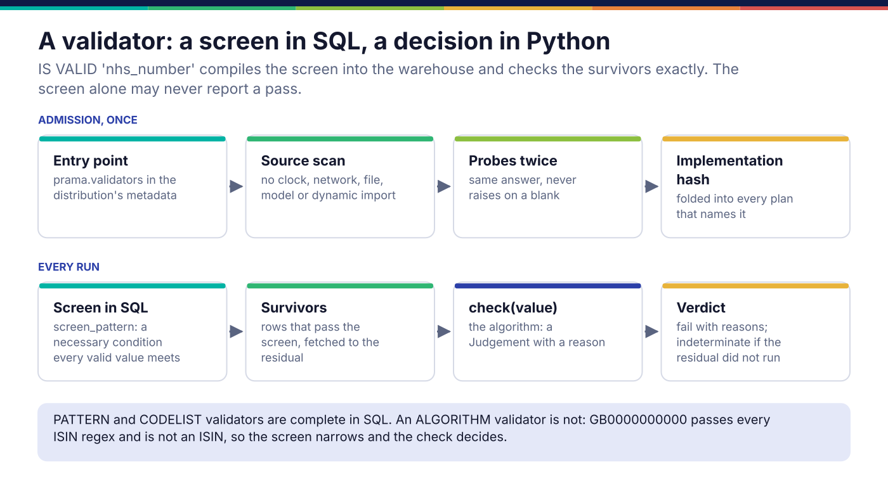
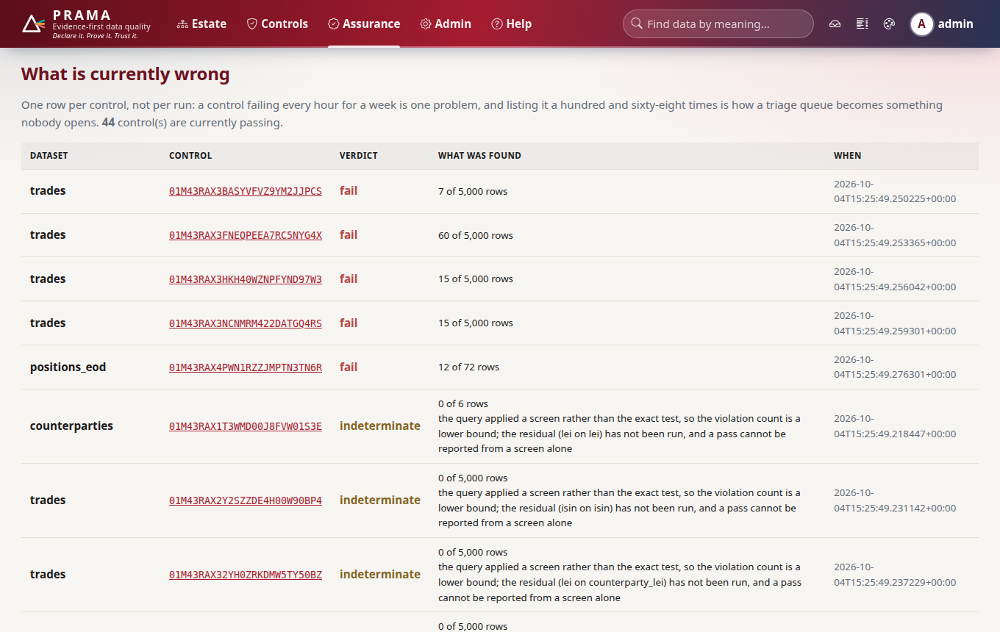

*Copyright © 2026 Ashutosh Sinha <ajsinha@gmail.com>. All rights reserved.*

---

# Writing a semantic-type validator

A validator decides whether one value is a well-formed member of a semantic type: an ISIN, an
LEI, an IBAN, a bank's own book code. A control names it as `IS VALID 'isin'`, and an attribute
declared as that type gets the control derived for it. Write one when an identifier has a check
that a regular expression cannot express. Where validators sit in compilation is in
[Controls and PQL](../architecture/controls-and-pql.md).

## When you would write one

- A national or proprietary identifier with a check digit: an NHS number, a CPF, a tax id.
- A code whose validity is arithmetic over the whole string, not its shape.
- **Not** for a shape alone: a `PatternValidator` subclass with only `screen_pattern` set is
  enough, and it is complete in SQL. **Not** for membership of a list: that is a code list.
  **Not** for anything comparing two columns: that is a [PQL function](pql-functions.md).

## The interface

```python
# src/prama/classify/validators.py:80
class SemanticValidator(abc.ABC):
    """A named, deterministic test for membership of a semantic type."""

    name: ClassVar[str] = ""            # what PQL says after IS VALID
    label: ClassVar[str] = ""           # how a person refers to it
    authority: ClassVar[str] = ""       # the standard, quoted in the generated control's reason
    expressibility: ClassVar[Expressibility] = Expressibility.ALGORITHM
    screen_pattern: ClassVar[str] = ""  # a necessary condition every valid value satisfies
    beyond_shape: ClassVar[str] = "a value of the right shape can still fail it"

    @abc.abstractmethod
    def check(self, value: str) -> Judgement:            # line 152
        """Validate a value already known to pass the screen."""
```

`judge(value)` (line 127) is the template around it, and you do not override it: a `None` or a
blank is *valid* (missing is a completeness question, answered by the attribute's optionality),
a value failing the screen gets `failed_screen=True` and a reason, and only a value that passes
the screen reaches your `check`. Return `VALID`, or `Judgement(valid=False, reason=...)` with a
reason a steward can act on in ten seconds: "check digit is 8, should be 9", not "invalid".

`Expressibility` says how much of the check a database can do. `PATTERN` and `CODELIST` are
complete in SQL; `ALGORITHM` is not, so its screen narrows in the warehouse and the rows that
survive are checked exactly in Python. **The screen alone may never report a pass.**



## A worked example

**The real ones.** `IsinValidator`, `LeiValidator` and `IbanValidator` in
`src/prama/classify/validators.py` are the shipped `ALGORITHM` validators. A validator written
outside Prama, the way a bank would, is in case study 4:
`case-studies/04-expressions-and-plugins/acme_validators.py` defines `AcmeBookCode`, a desk code
with a mod-23 check character, and its `pyproject.toml` advertises it as an entry point.

**A new one.** `docs/developer/examples/nhs_number_validator.py`, an NHS number: ten digits, the
last a modulus-11 check over the first nine.

```python
class NhsNumberValidator(SemanticValidator):
    """An NHS number: ten digits, the last a modulus-11 check digit over the first nine."""

    name: ClassVar[str] = "nhs_number"
    label: ClassVar[str] = "NHS number"
    authority: ClassVar[str] = "NHS Data Dictionary"
    expressibility: ClassVar[Expressibility] = Expressibility.ALGORITHM
    screen_pattern: ClassVar[str] = r"^[0-9]{10}$"
    beyond_shape: ClassVar[str] = "the modulus-11 check digit is part of the standard"

    def check(self, value: str) -> Judgement:
        total = sum(
            int(digit) * weight for digit, weight in zip(value[:9], range(10, 1, -1), strict=True)
        )
        expected = 11 - total % 11
        if expected == 11:
            expected = 0
        if expected == 10:
            return Judgement(valid=False, reason="this body has no valid check digit")
        actual = int(value[9])
        if actual == expected:
            return VALID
        return Judgement(valid=False, reason=f"check digit is {actual}, should be {expected}")
```

The module imports only `typing` and `prama.classify.validators`. That is not style: admission
scans it, as below.

## Admission: what is checked before a validator is usable

`PluginRegistry.admit` in `kernel/src/prama_kernel/plugins.py` (line 405) refuses a validator
unless all of these hold, and names the guarantee it tripped:

| Check | Refused for |
|---|---|
| **Source scan**, the validator's module and the sibling modules it imports | `time`, `random`, `secrets`, `socket`, `http`, `urllib`, `requests`, `httpx`, `subprocess`, `os`, `pathlib`, `builtins`, `openai`, `anthropic`, `prama.llm`, `prama.agent`, `prama.db`; calls to `now()`, `today()`, `utcnow()`, `monotonic()`, `gmtime()` and the like; `eval`, `exec`, `compile`, `__import__`, `import_module`; reaching interpreter internals such as `__subclasses__` |
| **Probes, twice** | raising on any of `""`, `" "`, `"0"`, `"ABC123"`, a 256-character string, `"é"`; giving two answers for one input |
| **Identity** | a class whose source cannot be read, because its SHA-256 is folded into the plan id of every control that names it |

The hash is the point of the last row: edit a validator's algorithm and every control using it
changes identity, instead of last month's evidence silently meaning something else. `datetime`
is allowed (a date-format validator parses dates); asking it what time it is is not.

## Registration and configuration

**From a distribution**, which is how a bank ships its own:

```toml
# pyproject.toml of the distribution
[project.entry-points."prama.validators"]
nhs_number = "acme_validators.nhs:NhsNumberValidator"
```

Install it into the environment the server runs in, and restart. `prama.plugins.bootstrap` calls `load_entry_points` at start, in the CLI and the server alike; each entry point's class is
instantiated, admitted and registered in `REGISTRY`, and a refused one is logged with the reason
while the rest still load. Switch one off by entry-point name in configuration:

```yaml
# config/application.local.yaml
plugins:
  disabled: [nhs_number]
```

**In the product**, add the instance to the tuple in `default_registry()` in
`src/prama/classify/validators.py` (line 771). Shipped validators are not admitted through the
plugin path, so hold them to the same rules by review.

The registry is case-insensitive (`IS VALID 'NHS_NUMBER'` finds it) and refuses two different
classes claiming one name, so a control means exactly one thing on every node.

## What it looks like when it runs

A control over an `ALGORITHM` validator whose residual has not run is **indeterminate**, never a
pass: the screen ran in the warehouse, the violation count is a lower bound, and the incidents
page says so in words.



## Testing

- **Your own cases.** A valid value, a wrong check digit with its reason, a value failing the
  screen (`failed_screen`), `None` and a blank as valid, and `screen_is_complete` false for an
  `ALGORITHM` validator.
- **Admission.** `PluginRegistry().admit(validator)` in a test, as
  `tests/docs/test_developer_examples.py` does; it runs the same scan and probes the server will.
  `tests/classify/test_plugins.py` holds the refusal cases for the scanner itself.
- **The counterfactual.** The example's test writes a copy of the validator with one extra line,
  `import time`, and admission refuses it with "reading the clock makes a control unreplayable".

## Checklist

- [ ] `name`, `label`, `authority`, `screen_pattern` and `beyond_shape` set.
- [ ] `expressibility` honest: `ALGORITHM` unless the pattern is the whole check.
- [ ] `check` returns a reason naming the expected value, and never raises.
- [ ] Imports nothing that can read a clock, a file, the network or a model, directly or through a helper.
- [ ] Admitted in a test with `PluginRegistry().admit`.
- [ ] Shipped as an entry point under `"prama.validators"`, or added to `default_registry()`.

---

<div align="center">
<br/>
<sub><b>PRAMA</b> — <i>Declare it. Prove it. Trust it.</i><br/>
Copyright © 2026 <b>Ashutosh Sinha</b> &lt;ajsinha@gmail.com&gt; · All rights reserved.<br/>
Proprietary and confidential. No licence is granted except by separate written agreement.<br/>
See <a href="../../LICENSE">LICENSE</a> and <a href="../../NOTICE">NOTICE</a>. Third-party names and marks are the property of their respective owners.</sub>
</div>
