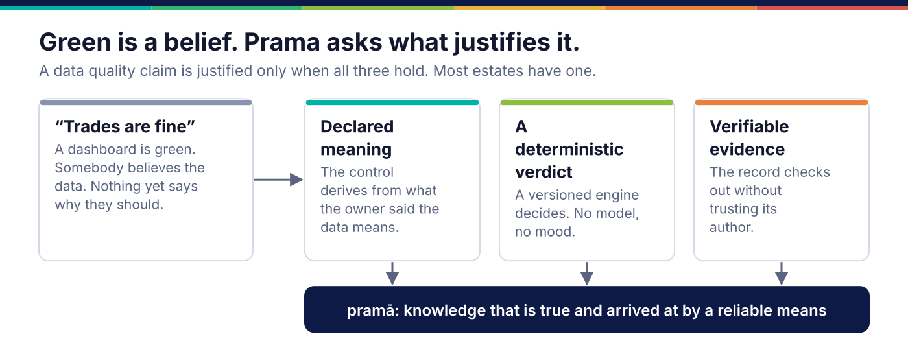
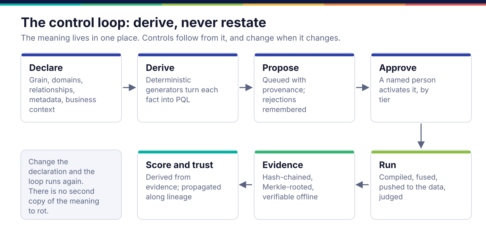
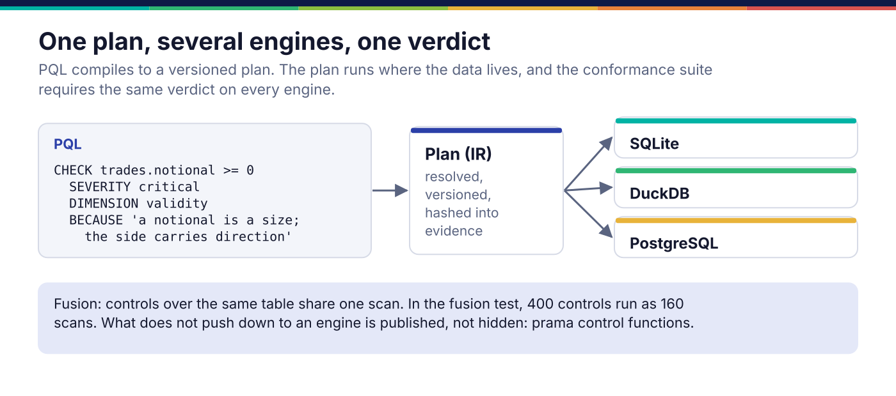
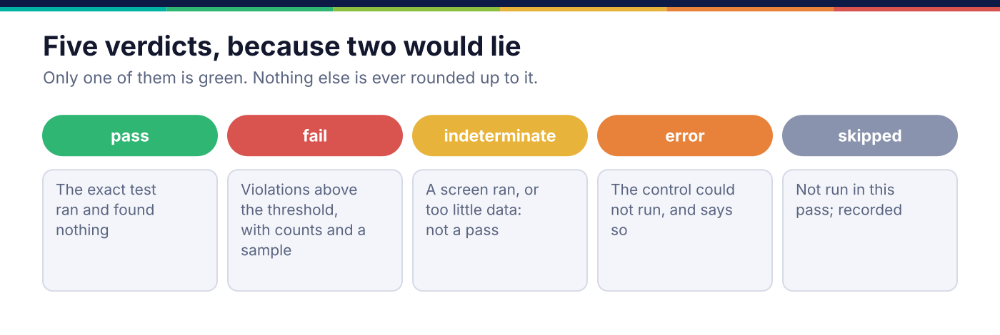
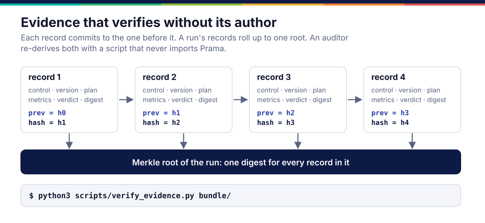
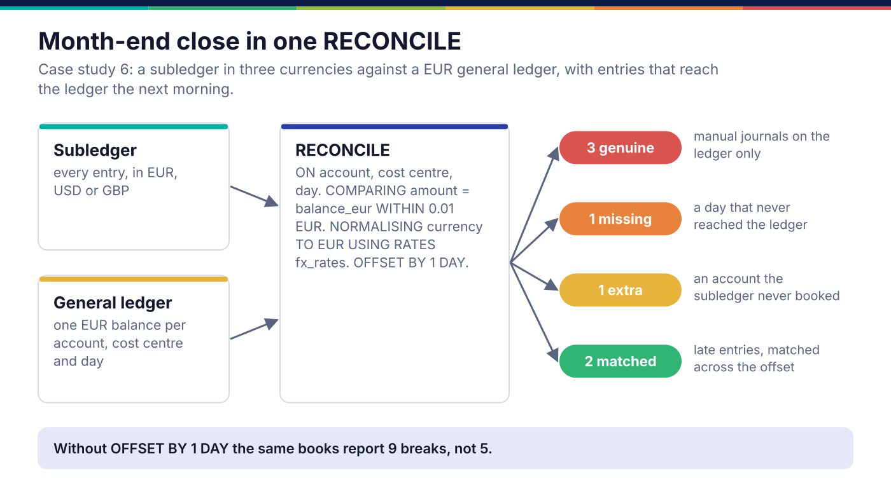
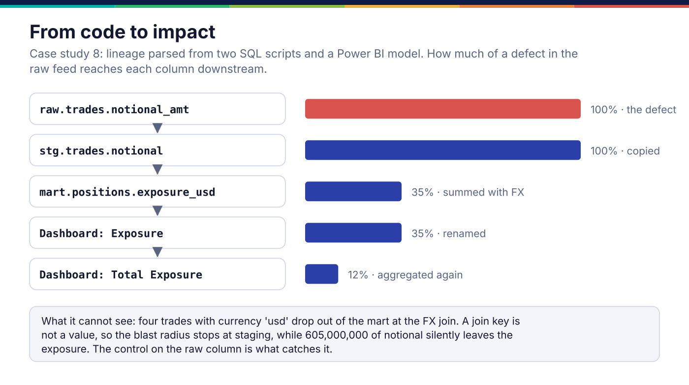
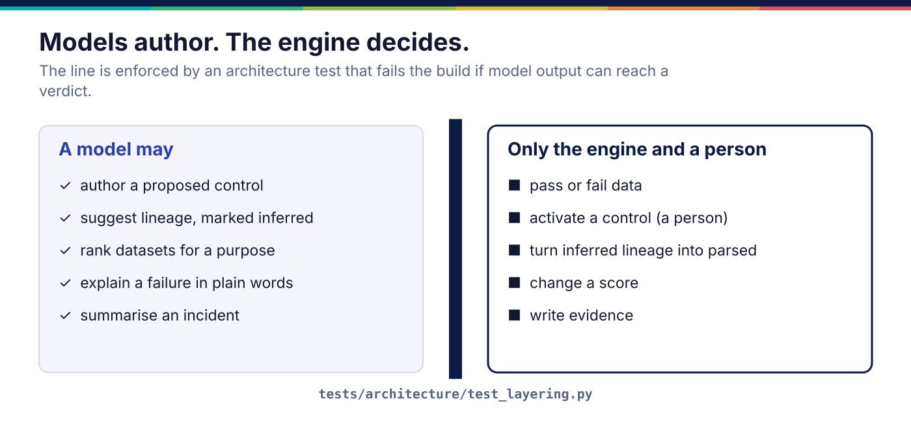

# Your dashboard is green. Can you prove it?

### Nine design ideas behind Prama, an evidence-first data quality control plane, and what building it taught us

*Ashutosh Sinha · September 2026 · about a 25-minute read*

---

Every organisation that reports a number eventually meets somebody who asks how it knows the
number is right. A regulator asks it about a capital ratio. An auditor asks it about a
reconciled balance. A board asks it about an exposure. A model risk team asks it about the
training data behind a credit score.

The honest answer, in most places, is a feeling. The checks passed. The dashboard is green.
The vendor tool said so.

None of those is a proof. A green dashboard means that no failure somebody thought to look for
has turned up. It does not show that anything is right. A verdict you cannot recompute without
trusting the tool that issued it is an assertion, not evidence.

I have spent the last months building **Prama**, a data quality control plane designed around
that gap. This article is about the ideas in it rather than the feature list. Some of them are
borrowed, some are new, and a few were forced on us by the system finding its own bugs. Where a
number appears, it comes from a test, a benchmark run or a case study that runs in the test
suite. Where something is not built, I say so.


*A data quality claim is justified only when three things hold. Most estates have one.*

---

## The idea in one word

The name is Sanskrit. ***Pramā*** (प्रमा) is valid cognition: knowledge that is both **true**
and **arrived at by a reliable means**. Indian epistemology is strict about the second half. A
belief that happens to be true, reached by luck, is not *pramā*.

That distinction is exactly the one between *"our dashboard is green"* and *"we can prove this
number is right"*. It gives three requirements, and the rest of this article is how each one
shapes the design:

1. **A control must derive from a declaration.** The check comes from what the owner said the
   data means. It is not a second, separately edited copy of that meaning.
2. **A verdict must come from a deterministic engine.** It is versioned and repeatable. No
   model decides.
3. **Evidence must verify without its author.** An auditor can check the record without
   trusting, or even installing, the system that wrote it.

The slogan is the same three things, shorter: **Declare it. Prove it. Trust it.**

---

## 1. Derive, never restate

Here is the failure mode I have seen most often. The meaning of a column lives in a wiki. The
check for it lives in a YAML file. Two different people edit them, at different times, and they
drift apart. They drift, always, in the flattering direction: the check gets looser, the
documentation stays confident, and nobody notices, because nothing connects the two.

Prama's answer is a **business semantic layer**. The data owner declares what they already
know, in business terms. None of it is a quality rule, and all of it implies some:

| An owner declares | For example | Which implies |
|---|---|---|
| Grain | *one row per trade* (`trade_id`) | uniqueness and duplication controls |
| Value domain | currency in ISO 4217; notional ≥ 0 | validity controls |
| Mandatory, critical | `account_id` is a critical data element | completeness, and weight in the score |
| Relationship | `trades.account_id` → `accounts` | referential integrity |
| Equivalence | positions agree with the ledger | a reconciliation |
| Rhythm | daily, by 06:30 on TARGET2 business days | arrival and freshness |

Deterministic generators turn each declared fact into a control. The control quotes its reason.


*The meaning lives in one place. Controls follow from it, and change when it changes.*

### Design idea: proposals are the only way anything changes

Controls are derived, but they are not switched on automatically. **Every source of a new
control produces a proposal:**

- the declarations;
- data mining (keys, functional dependencies);
- metadata an owner fills in;
- lineage;
- correlation across datasets;
- a language model.

A named person accepts or rejects each proposal, and higher-tier changes need approval.

Two small details matter more than they look:

- **A rejection is remembered by content hash.** Regenerating the controls does not refill the
  queue with the same proposal somebody already said no to. A proposal queue that forgets its
  rejections trains people to click "accept" to make it stop.
- **Two sources proposing the same rule become one corroborated proposal,** and it ranks higher.
  If the declaration says `trade_id` is the key and mining finds that `trade_id` is unique in
  the data, that agreement is information.

### Design idea: name the uncovered remainder

Coverage is usually reported as a percentage that rounds towards comfort. Prama reports **which
critical data elements are not covered, and why**. One of the suite's acceptance tests states a
finding that surprised me: a dataset's declaration alone cannot cover its own critical data
elements, because some checks need a second dataset. Declaring the relationships closes the
gap. Both facts are tests, so neither can quietly change.

### Rules that grow from metadata

Catalogues ask owners to fill in fields. Prama lets a metadata field *carry a rule*, so filling
the field in proposes a check. The literal is typed and quoted by the engine, never pasted into
SQL:

| Field on an attribute | Value | Proposed control |
|---|---|---|
| mandatory | yes | `CHECK t.col IS NOT NULL DIMENSION completeness` |
| unique | yes | `CHECK t.col IS UNIQUE DIMENSION uniqueness` |
| allowed values | RETAIL, SME, CORPORATE | `CHECK t.col IN ('RETAIL', 'SME', 'CORPORATE') DIMENSION validity` |
| minimum | 0 | `CHECK t.col >= 0 DIMENSION validity` |

Then **correlation** looks across datasets. `customers.lei` and `accounts.customer_lei` are
both bound to the glossary term *LEI*. The customers' column is declared unique, so it owns that
meaning, and Prama proposes:

```pql
CHECK accounts.customer_lei REFERENCES customers.lei DIMENSION integrity
```

It also reports what a check cannot settle: the same identifier is marked as personal data in
one dataset and not in the other. That is a finding for a steward, not a check, because which
side is right is a business decision.

In case study 7, three datasets are declared with **no rules at all**, only names, descriptions
and metadata. All four planted defects are found, by controls nobody wrote by hand.

---

## 2. A language a data owner can read

Controls are written in **PQL**. It is small and declarative, and every statement ends with its
reason:

```pql
CHECK trades.notional >= 0 SEVERITY critical DIMENSION validity
  BECAUSE 'a notional is a size; the side carries direction'
CHECK trades HAS UNIQUE KEY (trade_id) BECAUSE 'one row per trade'
CHECK trades.account_id REFERENCES accounts.account_id
  BECAUSE 'every trade is booked to an account we hold'
```

The reason is part of the control, not a comment beside it. So Prama can read the control back
to the person who owns the data. This is the actual output of `prama control explain`:

```text
· In trades, every notional is at least 0. No violations are allowed. A failure is critical.
  This exists because: a notional is a size; the side carries direction.
· In trades, there is at most one row for each combination of trade_id. A failure is major.
  This exists because: one row per trade.
· In trades, every account_id exists in accounts.account_id. No violations are allowed.
  A failure is major. This exists because: every trade is booked to an account we hold.
```

If that sentence is not what the owner meant, the control is wrong. That review takes an owner
thirty seconds, and it is the cheapest quality control there is.

### Design idea: one plan, several engines, and assert the verdict

PQL compiles to a versioned, hashed **plan** (the intermediate representation). The plan
compiles to SQL for SQLite, DuckDB or PostgreSQL, and runs where the data lives. The data does
not come to Prama.



The easy thing to test in a compiler is that it emits plausible SQL. That test is almost
worthless: SQL can look right and be wrong on NULLs, on empty tables, or on one engine's
integer division. Prama's **conformance suite** runs the same plan on each engine, against the
same data, and requires **the same verdict**. It asserts the executed answer, not the text.

### Design idea: fuse the scans

Thirty controls over one table should not be thirty passes over the data. Prama groups them.
This is the real output of `prama control compile --fuse` on the three controls above:

```sql
-- 3 control(s) in 1 scan(s) — 2 fewer passes over the data than running them separately.
SELECT COUNT(*) AS "c0__scanned_rows",
       COUNT(*) FILTER (WHERE NOT COALESCE(("notional" >= 0), FALSE)) AS "c0__violating_rows",
       COUNT(DISTINCT "trade_id") FILTER (WHERE "trade_id" IS NOT NULL) AS "c1__distinct_keys",
       COUNT(*) FILTER (WHERE COALESCE(("trade_id" IS NULL), FALSE)) AS "c1__null_key_rows",
       COUNT(*) FILTER (WHERE NOT COALESCE((EXISTS (SELECT 1 FROM "accounts"
         WHERE "accounts"."account_id" = "trades"."account_id")), FALSE)) AS "c2__violating_rows"
FROM "trades"
```

In the fusion test, 400 controls run as 160 scans.

Notice the `COALESCE(…, FALSE)`. A NULL comparison is *unknown*, and unknown is counted as a
violation. That is not a SQL accident; it is the next design idea.

---

## 3. Verdicts that do not round up

Most tools have two outcomes, pass and fail. Two outcomes force a lie whenever the truth is
"we don't know".



Prama has five:

- **pass:** the exact test ran and found no violation. This is the only green.
- **fail:** violations above the threshold, with counts and a sample.
- **indeterminate:** the question was not settled. Either a cheap screen ran instead of the
  exact test (zero violations from a lower bound is not a pass), or there was too little data
  to establish anything.
- **error:** the control could not run. It checked nothing, and it says so.
- **skipped:** it was not run in this pass, and that is recorded.

Nothing is ever rounded up to *pass*. An empty table does not pass a check with an absolute
threshold, because nothing was examined.

**Unknown counts against you by default.** An account whose customer reference is NULL does not
reference a customer. If that is acceptable, you write `TREAT UNKNOWN AS PASS` in the control,
with a reason, where a reviewer can see it. The permissive choice is a visible decision, not a
default.

---

## 4. Evidence that verifies without its author

A verdict is worth what its record is worth. Most tools overwrite last night's results. Their
history, if they keep one, can only be read through their own interface.

Every run in Prama writes evidence to its own store, with its own retention and immutability,
separate from the platform's tables. Each record holds:

- which plan ran, which control and which version;
- the engine, binding and parameters;
- the metrics (rows scanned, rows violating) and the verdict;
- a digest of the sampled failing rows, rather than the rows themselves.

And each record commits to the one before it.



The records form a **hash chain**: removing or editing one breaks every hash after it. A run's
records roll up into a **Merkle root**, one digest for the whole run. Bundles are sealed, and
optionally signed with Ed25519 for an air-gapped host.

The important part is the verifier. `scripts/verify_evidence.py` uses only Python's standard
library. **It does not import Prama.** An auditor can run it on their own machine, against a
bundle you handed them, without installing or trusting the system under audit. Evidence that can
be checked only by the tool that produced it is a claim, not evidence.

---

## 5. A reconciliation is one statement

Finance closes the month when the subledger agrees with the general ledger. That sounds like one
join. In practice it is five hard problems:

- matching on a composite key;
- summing many entries into one balance;
- converting currencies at the treasury's closing rates;
- allowing for entries that reach the ledger the next morning;
- a materiality threshold.

In Prama it is one statement:

```pql
RECONCILE subledger AGAINST general_ledger
  ON (account, cost_centre, posting_date)
  COMPARING amount = balance_eur WITHIN 0.01 EUR
  NORMALISING currency TO 'EUR' USING RATES fx_rates
  OFFSET BY 1 DAY
  SEVERITY critical DIMENSION accuracy
```



A few design choices are worth pulling out:

- **The rates are a dataset,** checked like any other, not a hidden lookup table.
- **A break needs both bounds breached** when you give an absolute and a relative tolerance.
  `WITHIN 1 EUR OR 0.1%` means a 0.50 difference on a large balance is not a break.
- **Breaks are classified** as genuine, missing or extra. Each one lands in a break workbench
  with an owner, who explains it, accepts it or fixes it.
- **The counterfactual is part of the case study.** The same books reconciled without
  `OFFSET BY 1 DAY` report **9** breaks instead of **5**. Each late entry becomes one missing
  row and one extra row. The timing allowance removes noise, and nothing real.

### What building it found

The first run of that case study reported **23** unexpected breaks, all on the USD and GBP
accounts. The data generator converted each entry to euros, rounded it, and summed. The engine
converts each day's total and rounds once. The two conventions differ by a few cents, which is
more than the one-cent tolerance.

That is a real difference between two systems, and finance teams meet it. The fix was not to
widen the tolerance until the number went away. The study now uses the ledger's convention, and
says so. If your ledger rounds per entry, declare that. Do not assume it away.

---

## 6. Lineage read from code, and what it cannot see

Hand-drawn lineage is out of date by the time the workshop ends. Prama reads lineage from the
code that moves the data:

- SQL, with `sqlglot`;
- T-SQL, PL/SQL and DB2 procedures;
- PySpark, pandas and Airflow, from their syntax trees;
- Power BI models;
- warehouse query history.

A repository or ZIP is extracted into quarantine, parsed in a separate process, and deleted.
**Nothing in it is ever executed.** A test plants code that would write a marker file if it
ran, and fails if the file appears.

Every edge is marked **parsed** or **inferred**, and the difference is never blurred. Anything
the parsers could not read (including anything a model suggests) is inferred, and an inferred
edge cannot turn into a parsed one by being popular.

### Design idea: impact that attenuates

A defect upstream does not reach everything downstream at full strength. The **blast radius**
follows the edges and attenuates at each transform: a copy carries the whole defect, and an
aggregation dilutes it.



In case study 8, two SQL scripts and a Power BI model yield 12 parsed column edges. A defect in
`raw.trades.notional_amt` reaches the dashboard's *Total Exposure* measure four hops later, at
12% strength.

### Design idea: a control is owed by every faithful copy

If `stg.trades.notional` is a straight copy of `raw.trades.notional_amt`, then whatever holds
for the source should hold for the copy. So lineage proposes:

- the source column's control, **propagated** to the copy;
- a **referential** check that every copied key exists at its source;
- a **reconciliation** between the copy and its source.

Each proposal is held while the edge it rests on is only inferred.

**Building the case study found two bugs in exactly this feature.** The proposed reconciliation
had no tolerance, and the engine (rightly) refuses to run a reconciliation with no stated
bound. And the staging SQL keeps only booked trades, so reconciling it against the raw feed
reported all 118 cancelled trades as breaks. Both are fixed. A copy is now reconciled exactly
(`WITHIN 0`), and a reconciliation across a filtered copy is held, with the reason. Each fix has
a test that fails on the old code.

### And the honest limit

The same study plants four trades with currency `'usd'` in lower case. Three of them are staged.
The mart joins FX rates on currency, finds no rate for `'usd'`, and drops those trades. There is
no error and no NULL. **605,000,000 of notional simply leaves the exposure.**

Column lineage follows values, and a join key is not a value. So the blast radius stops at
staging. What catches the defect is the control on the raw column, which finds 4 rows, and its
propagated copy on staging, which finds 3. That is the design: **lineage carries a control
downstream; it does not replace the control at the source.**

---

## 7. When the language cannot say it

Some checks are not properties of rows. Benford's law is a property of a whole distribution: in
naturally occurring amounts, about 30% begin with a 1 and under 5% with a 9. Invented amounts
pile up just under an approval limit.

PQL will never express that, and it should not try. Prama has two contained escape hatches.

**`CHECK … CUSTOM SQL`** allows one read-only `SELECT` returning `violating_rows` and
`scanned_rows`. The SQL is the author's. The verdict is still the engine's.

**DQ delegates** are Python classes behind an interface. Here is an excerpt of the one in case
study 5:

```python
class BenfordFirstDigit(DqDelegate):
    name = "acme.benford_first_digit"
    version = "1"
    requires = ("payment_id", "amount")
    parameters = (
        Parameter("min_rows", "number", 300, doc="Fewer amounts than this establish nothing."),
        Parameter("z_critical", "number", 3.29, doc="3.29 is two-sided 99.9%."),
    )
    unit = "findings"

    def measure(self, rows, params) -> Measurement:
        ...
        if n < int(params["min_rows"]):
            return Measurement(scanned=len(kept), violating=0,
                               note=f"{n} amounts cannot establish a first-digit distribution",
                               established=False)
```

It is named from PQL:

```pql
CHECK payments USING DELEGATE 'acme.benford_first_digit'
```

Look at `established=False`. The delegate **measures**; it does not judge. It returns counts,
and "I could not establish anything" is a first-class answer. Prama applies the threshold and
reaches the verdict, so too few rows give *indeterminate*, not *pass*.

Around delegates, Prama also provides:

- **a separate worker process,** with large inputs streamed to the delegate in batches;
- **uploads through the console,** which go through checks and an approval step;
- **a test kit** that authors run in their own CI;
- **remote agents** that run delegates beside the data.

One caveat, stated plainly: the worker is a separate process, not yet a hardened sandbox. It
has no network namespace.

---

## 8. Models author. The engine decides.

This is the rule I would defend hardest.



Language models are good at drafting, ranking and explaining. They are bad at being repeatable,
and repeatability is what a control is. An LLM that says *"this data looks fine"* is persuasive
and unreproducible. In a control, persuasion is the defect.

So in Prama:

- **Models author:** a proposed control from a policy document or an example, which a person
  then reviews.
- **Models suggest:** lineage for code no parser could read, always marked inferred.
- **Models rank and explain:** *which dataset is fit for this purpose?* and *why did this fail?*
- **Models never adjudicate.** No model output may reach a pass or fail verdict, activate a
  control, or change a score.

That last line is not a policy document. **It is a test.**
`tests/architecture/test_layering.py` scans the code and fails the build if model output can
reach a verdict. A guard wired into no test is a guard somebody forgets.

### One gateway for every call

Every model call goes through one gateway:

- **Purposes:** author, explain, summarise, lineage, curate, discover and embed. Each has an
  ordered route of provider and model.
- **Providers:** OpenAI-compatible endpoints (including a local Ollama or vLLM), Anthropic,
  Bedrock, Azure OpenAI and Vertex.
- **Call ledger:** every call is recorded in a hash chain, and `prama llm verify` recomputes it.
- **Evaluation gate:** where one is configured, a route activates only after its evaluation
  suite passes.
- **Redaction:** secrets, card numbers (Luhn-checked), IBANs (mod-97-checked) and email
  addresses are withheld from prompts and answers alike.

**With nothing configured, the default is a mock provider.** Prama works, and says plainly that
no model is present. A product that fails to boot without an API key has made AI a dependency of
data quality. It should be an assistant to it.

### Which dataset is fit for a purpose?

Ask *"who is the customer and where are they registered, for sanctions screening"*. Prama ranks
datasets by what their owners wrote: names, descriptions, business context, metadata and
glossary terms.

- It uses embeddings when a model is configured for the purpose `embed`, and BM25 relevance when
  not. The answer always says which ranking it used.
- Each result carries evidence: the attributes whose own text best matches the question. In
  case study 7 that question returns *Customers*, matching `legal_name`, `customer_id` and
  `lei`.
- Nothing in the search reads the data, and nothing touches a score.

The better owners describe their data, the better search works. The incentive points the right
way.

---

## 9. An alert level that means what it says

Every monitoring product has a sensitivity dial. Almost none can tell you what the number on it
means. Turn it to "high" and you get more alerts; that is the whole contract. Stewards learn to
ignore the alerts, and then miss the one that mattered.

Prama's monitors use **conformal p-values**:

```text
p = (1 + #{ i : sᵢ ≥ s }) / (n + 1)
```

If the data are exchangeable, the probability that a normal point alerts at level α is at most
α. This holds exactly, in finite samples, with no assumption about the distribution. The dial
finally means something: set α = 0.05 and you are declaring a false-alarm budget of 5%.

**The `1 +` and the `n + 1` are the guarantee, not rounding.** Drop them and a point more extreme
than everything seen gets p = 0, which rejects at any level at all. The false-alarm rate then
becomes 1/n instead of α. It is right about 95% of the time on 20 calibration points, which is
exactly the kind of wrong that ships.

Said out loud, as the code's own documentation does:

- **The guarantee is marginal, not conditional.** It holds over the whole stream, not within
  every segment.
- **Drift breaks exchangeability.** Weighted and adaptive variants trade exactness for
  robustness, and say by how much.
- **Before there is history, a monitor starts from priors** (semantic type, declared rhythm,
  sibling datasets). It labels every verdict as prior-based until there is enough history to
  calibrate, and announces the switch.

Scores follow the same rule as everything else. **A dataset's score is derived from its
evidence,** weighted by criticality, and never typed in. Trust propagates along lineage, so a
report's trust reflects its weakest input. Usage signals from query history rank what to control
next (most used, least controlled), but they are **never** an input to a score. Popularity is
not correctness.

---

## How we test the thing that tests data

A data quality tool is itself a set of controls, and the same standard applies to it: a control
that cannot fail is worth nothing.

**Eight case studies, planted against found.** Each one fabricates a realistic banking estate,
plants known defects, declares the estate in business terms, lets Prama derive the controls,
runs them, and prints what was planted against what was found. The list includes the defects it
did not find. They run in the test suite, against the application's own database, under a fresh
tenant each time.

| Study | Result |
|---|---|
| Feeds in CSV, Parquet and JSON Lines | 9 negative amounts and 5 unknown statuses found |
| Month-end close | 5 breaks; 9 without the timing offset |
| Governance from metadata | 4 of 4 found, with no rule written by hand |
| From code to impact | 12 edges; the defect traced to the dashboard |

**A benchmark that reports bounds and ablations, not a league table.** `prama bench run --seed
42` plants 28 defects across six families, from structural to semantic, and reports bounds and
single-technique ablations:

| Baseline | Found | Precision | Recall | Blind to |
|---|---|---|---|---|
| alert on everything (bound) | 28/28 | 0.08 | 1.00 | nothing |
| schema only | 2/28 | 0.67 | 0.07 | five of six families |
| patterns only | 5/28 | 0.83 | 0.18 | four families |
| statistics only | 7/28 | 0.88 | 0.25 | relational defects |

**It does not yet score Prama's own detector, and it runs none of the fifteen competitors it
names.** Configuring a competitor is a job for someone incentivised to make it look good. What
the table does show is the argument for layering: every single technique has blind spots, and a
blind spot does not appear in an aggregate F1 at all.

**Guards as tests, not guidelines.** The build fails when any of these is broken:

- model output can reach a verdict;
- a mutating route lacks a write scope;
- an outbound call is undeclared;
- the two schema files (SQLite and PostgreSQL, byte-identical apart from their headers) drift
  apart;
- a document names a module that does not exist.

**A paper that audits itself.** The accompanying research paper marks every formal claim with
the test that carries it. Its claims register counts **45 claims that run, 11 that run in part,
9 that are not built, and 5 stated but not executed**. The negative results are in the body, not
an appendix.

---

## What Prama does not do

- **It does not decide what is true.** It establishes whether what you declared holds, and proves
  that it checked.
- **It does not repair data.** A defect is fixed at its source by its owner. Prama records that
  it was.
- **It does not let a model judge.** Not as a fallback, not above a confidence threshold, not at
  all.
- **It does not read mainframe code.** Lineage covers SQL, procedures, Python jobs, Airflow and
  Power BI, not COBOL or JCL.
- **It does not discharge a regulation.** It supplies evidence. `prama pack claims` lists what
  the banking pack does *not* claim.

---

## The one idea to take away

If you take one thing from this, take the habit rather than the product. **Assert the rendered
artefact, not the intent.**

- Test the executed verdict, not the plausible SQL.
- Verify the evidence without its author.
- Reconcile the counterfactual as well as the case.
- Check the slide as rendered, not as estimated. (The deck for this project has a rendered
  audit, because the estimate-based one passed a slide with its last line printed on the
  footer.)

The failure mode of this whole class of system is artefacts that build, validate and look right
while being wrong. The cure is always the same: look at the thing itself, and write the test
that would fail if it were wrong.

That, in the end, is all *pramā* asks. It is not enough to be right. You have to know how you
know.

---

*Prama is proprietary software by Ashutosh Sinha. The design corpus, a 39-page paper
(**Data Quality as Justified Belief: Derived Controls, Deterministic Verdicts, and Evidence
that Verifies Without Its Author**) and a 45-slide deck accompany the code. Figures in this
article come from the test suite, `prama bench run --seed 42`, and the case studies' own runs.*

---

<sub><b>PRAMA</b> — <i>Declare it. Prove it. Trust it.</i><br/>
Copyright © 2026 <b>Ashutosh Sinha</b> &lt;ajsinha@gmail.com&gt;. All rights reserved.<br/>
Proprietary and confidential. No licence is granted except by separate written agreement.</sub>
